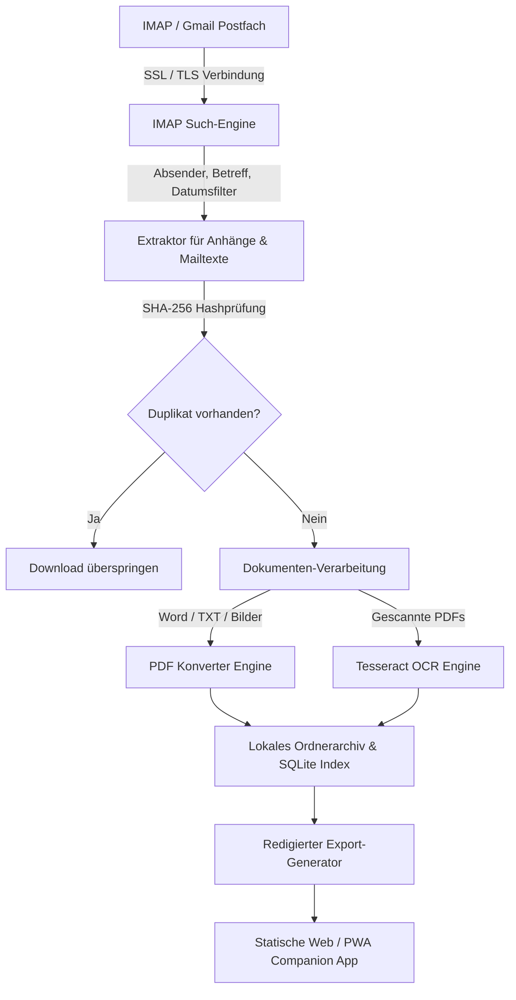
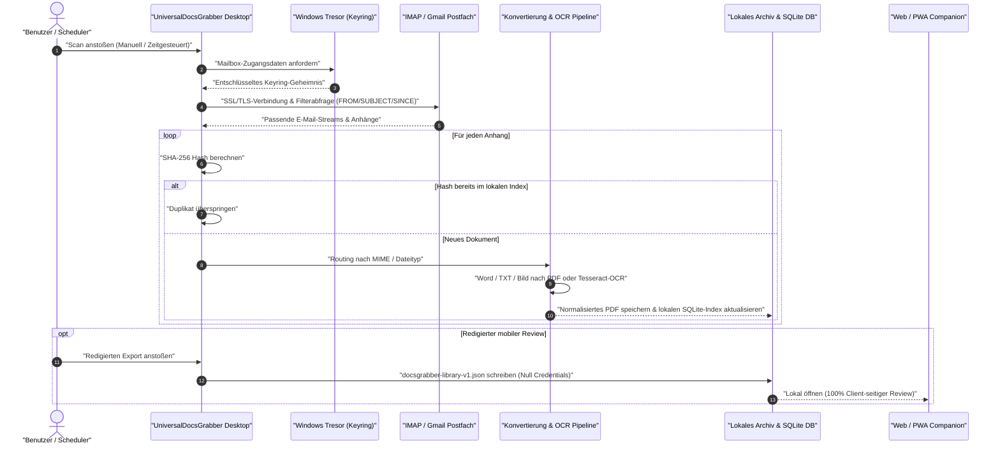

# UniversalDocsGrabber

**Automatischer Download und Verwaltung von Dokumenten aus IMAP-E-Mails**

UniversalDocsGrabber ist ein lokaler E-Mail-Anhang-Downloader und
Dokumenten-Organizer für Windows. Das Tool verbindet sich mit IMAP- oder
Gmail-kompatiblen Postfächern, lädt PDF-, Office-, Bild- und Mail-Body-Dokumente
herunter, konvertiert sie bei Bedarf nach PDF, erkennt Duplikate per
SHA-256-Hash und hält den Dokumentindex auf dem eigenen Rechner.

> **English documentation:** [README.md](README.md)

[](https://github.com/doc-bricks/UniversalDocsGrabber/actions/workflows/ci.yml)
[](tests/)
[](LICENSE)
[](https://github.com/doc-bricks/UniversalDocsGrabber)
[](https://www.python.org/)
[](llms.txt)
[](README-DE.md#datenschutzmodell)
[](SECURITY.md)
[](https://github.com/doc-bricks)
[](https://github.com/open-bricks)

| [⚡ Schnellstart](#einstieg) | [🏗️ Architektur & Datenfluss](#systemarchitektur--datenfluss) | [🔄 Lebenszyklus-Ablauf](#end-to-end-dokumenten-lebenszyklus) | [🔒 Datenschutz & Sicherheit](#datenschutzmodell) | [📱 Web/PWA-Companion](#plattform-strategie) | [🧩 Geschwister-Tools](#ökosystem--geschwister-tools) | [🛡️ Sicherheitsrichtlinie](SECURITY.md) | [🤖 LLM-Kontext](llms.txt) |

Aktueller Contract-Readback (2026-08-21): 65 Pytest-Tests und 32 Node-Tests des
Web-Companions sind grün (97 Contract-Tests gesamt, 100% bestanden). Installation,
Offline-Start und Lesbarkeit auf Android/iOS bleiben getrennte Geräte-/Emulator-
Gates. Die plattformübergreifende Statusmatrix steht in
[`PORTIERUNGSPLAN.md`](PORTIERUNGSPLAN.md).

Das Badge `97 bestanden` zählt die 65 Python- und 32 Node-Contract-Tests;
vollständige CI-Matrix-Tests auf Windows, Ubuntu und macOS laufen bei jedem Commit.

> [!NOTE]
> **KI / LLM Integration & Lokales Datenschutzmodell**: UniversalDocsGrabber arbeitet 100 % lokal. Zugangsdaten liegen sicher im Windows Credential Vault. Der statische Web/PWA-Companion nutzt ein redigiertes Exportformat (`docsgrabber-library-v1.json`), das Zugangsdaten, E-Mail-Texte und PDF-Inhalte strikt ausschließt — ideal für mobilen Review oder KI-gestützte Dokumenten-Audits. Das vollständige KI-Schema ist in [`llms.txt`](llms.txt) und [`EXPORTFORMAT.md`](EXPORTFORMAT.md) beschrieben.


## Einstieg

| Bedarf | Einstieg |
|--------|----------|
| Wiederkehrende Rechnungs-, Versicherungs-, Steuer-, Vertrags- oder Versanddokumente aus Postfächern sammeln | `python UniversalDocsGrabberV1.py` |
| Eine redigierte Dokumentbibliothek auf einem anderen Gerät prüfen, ohne Mail-Zugangsdaten offenzulegen | `web_companion/index.html?demo=1` |
| Das Companion-Exportformat integrieren oder prüfen | [EXPORTFORMAT.md](EXPORTFORMAT.md) |
| Am Projekt mitwirken | [CONTRIBUTING.md](CONTRIBUTING.md) |

## Überblick

UniversalDocsGrabber ist eine PySide6-Desktop-Anwendung für den Download, die Konvertierung und die Ablage von Dokumenten aus IMAP-Postfächern.

Typische Einsätze sind Rechnungsablage, Vertragsarchiv, Versicherungs- und
Steuerpost, Bewerbungsunterlagen, Versandnachweise und andere wiederkehrende
Mailbox-zu-Ordner-Workflows.

## Warum UniversalDocsGrabber

- **Für Mailbox-Dokumente gebaut:** IMAP-Profile, Gmail-Raw-Queries,
  Absender-/Betreff-/Datumsfilter, Anhang-Download, PDF-Konvertierung, OCR und
  Kategorisierung liegen in einem Desktop-Workflow.
- **Privat voreingestellt:** Kontoeinstellungen und Dokumentmetadaten bleiben
  lokal; Exporte für den Web/PWA-Companion sind redigiert und enthalten keine
  Credentials, Mail-Body-Volltexte oder Dokumentdateien.
- **Auch mobil prüfbar:** Der statische Web/PWA-Companion öffnet einen
  redigierten `docsgrabber-library-v1.json`-Export für Suche, Statuskontrolle
  und Review, ohne den Browser zum Mail-Client zu machen.

## Kernfunktionen

- Multi-Account IMAP Support
- Suchprofile mit Filtern für Absender, Betreff und Zeitraum
- Download von PDF, DOCX, DOC, JPG, PNG und weiteren Dokumenttypen
- Automatische Konvertierung nach PDF
- OCR für PDFs ohne Textebene
- Hash-basierte Duplikate-Erkennung
- Scheduler für wiederkehrende Scans von 15 Minuten bis 24 Stunden
- Auto-Kategorisierung mit Standard- und benutzerdefinierten Regeln
- Drag&Drop-Sortierung von Profilen und Batch-Läufe für alle aktiven Profile
- Gmail-Raw-Queries werden auf Servern mit `X-GM-RAW` mit Absender-,
  Betreff- und Datumsfiltern kombiniert; andere IMAP-Server fallen sauber auf
  klassische `FROM`/`SUBJECT`/`SINCE`-Suchen zurück
- Lokale Speicherung von Kontoeinstellungen und Dokumentmetadaten
- Redigierter Export `docsgrabber-library-v1.json` für den lokalen Web/PWA-Companion
- Klarer beschriftete Tabs, Löschaktionen und Tooltips verringern
  Fehlbedienungen bei Profilen, Konten und Download-Pfaden

## Systemarchitektur & Datenfluss



### End-to-End Dokumenten-Lebenszyklus



## Datenschutzmodell


UniversalDocsGrabber läuft lokal auf dem Windows-Rechner. Mail-Zugangsdaten werden, sofern verfügbar, im Betriebssystem-Keyring gespeichert; Projekt- und Dokumentmetadaten liegen im Benutzerprofil. Die Anwendung enthält keine Telemetrie, keinen Cloud-Dienst und kein gehostetes Backend.

## Installation

### Voraussetzungen

- Python 3.8+
- Microsoft Word für Word-zu-PDF-Konvertierung via `win32com` unter Windows
  oder `docx2pdf`, wenn verfügbar
- Optional: Tesseract OCR
- Optional: Poppler

### Basis-Setup

```bash
pip install -r requirements.txt
```

### Optional: Poppler

1. Download: <https://github.com/oschwartz10612/poppler-windows/releases>
2. Nach `C:\Program Files\poppler\` entpacken
3. Falls nötig `POPPLER_PATH` in `UniversalDocsGrabberV1.py` anpassen

### Optional: Tesseract

1. Download: <https://github.com/UB-Mannheim/tesseract/wiki>
2. Nach `C:\Program Files\Tesseract-OCR\` installieren
3. Zum `PATH` hinzufügen

## Nutzung

```bash
python UniversalDocsGrabberV1.py
```

oder `START.bat` per Doppelklick.

## Typischer Workflow

1. IMAP-Konto im Tab `Konten` anlegen
2. Suchprofil mit Gruppe, Filtern und Zielordner erstellen
3. Zeitfilter setzen
4. Einzelprofil starten oder alle aktiven Profile mit `START` scannen
5. Dokumente im Tab `Dokumente` durchsuchen
6. Über `Einstellungen -> Companion-Export -> Redigierten Export speichern...`
   einen redigierten Bibliotheks-Snapshot erzeugen
7. Optional `web_companion/index.html` lokal öffnen oder per `?demo=1` den
   Companion ohne echten Export prüfen

## Funktionen im Detail

### Suchprofile

- Gruppen für thematische Sortierung
- Drag&Drop-Sortierung zwischen Gruppen
- Profil-spezifische Override-Einstellungen
- Zeitfilter pro Lauf

### Konvertierung

- Word zu PDF via Windows-`win32com`, mit `docx2pdf` als unabhängigem Fallback,
  wenn verfügbar
- TXT zu PDF via `reportlab`
- Bilder zu PDF via Pillow
- OCR für PDFs ohne Textebene

### Scheduler & Auto-Kategorisierung

- Wiederkehrende Scans von 15 Minuten bis 24 Stunden
- Läufe werden übersprungen, wenn bereits ein Scan aktiv ist
- Batch-Ausführung verarbeitet alle aktiven Profile accountweise gruppiert
- Regelbasierte Auto-Kategorisierung für Rechnungen, Versand, Verträge, Kündigungen, Steuer, Versicherung, Bewerbungen und Bank

### Deduplizierung

- SHA-256 Hash-Check
- Optional pro Profil aktivierbar

## Lokale Daten

- `%USERPROFILE%\.univ_docs_grabber\config_v1.json`
- `%USERPROFILE%\.univ_docs_grabber\documents.json`
- `%USERPROFILE%\Downloads\UnivDocs\`

Diese Dateien bleiben absichtlich außerhalb von Git, weil sie Kontoangaben, lokale Pfade, Dokumentmetadaten und heruntergeladene Dokumente enthalten können.

## Bekannte Grenzen

- OCR benötigt Tesseract und Poppler
- Word-Konvertierung benötigt Microsoft Word über Windows-`win32com` oder
  `docx2pdf`; wenn kein Pfad verfügbar ist, wird Office-Konvertierung mit klarer
  Logmeldung übersprungen
- Ein LibreOffice-basierter Office-zu-PDF-Fallback für macOS/Linux ist derzeit noch nicht umgesetzt
- Die Suche arbeitet bewusst konservativ mit begrenzter Mail-Menge pro Profil

## Plattformstrategie

Die Windows-Desktop-App bleibt die Vollversion für IMAP-Zugriff, OCR,
Konvertierung, Scheduler und lokale Dateiablage. macOS und Linux sind durch
Source-Smokes abgedeckt. Web, Android und iOS nutzen den lokalen
Web/PWA-Companion mit redigiertem `docsgrabber-library-v1.json`-Export.
Der statische Companion unter `web_companion/` bietet bereits lokalen Import,
Suche, Profil-/Kategorienansichten und mobile Dokumentkontrolle, nicht jedoch
einen nativen Mail-Abruf.

Der Export enthält Profile, Kategorien, Dokumentmetadaten, Profilstatistiken und
redigierte Pfadhinweise, aber keine Credentials, Dokumentinhalte oder
Mail-Body-Volltexte.

Siehe [EXPORTFORMAT.md](EXPORTFORMAT.md).

Den Companion kannst du lokal mit `web_companion/index.html?demo=1` im
Demo-Modus öffnen oder den Ordner für PWA-Tests über einen einfachen lokalen
HTTP-Server ausliefern.

Manifest, Service Worker und iOS-Quellanforderungen sind durch Node-Tests
abgesichert. Das belegt noch keine Installation oder einen Offline-Start auf
Android/iOS; diese Geräte- oder Emulator-Smokes bleiben ausdrücklich offen.
Der Austausch bleibt einseitig: Der Desktop erzeugt den redigierten Export, der
Companion liest ihn lokal, schreibt aber keine Änderungen zurück und erzeugt
keinen Cloud-Sync.

Die reproduzierbaren Source-Smokes für macOS/Linux liegen jetzt in
`tests/source_platform_smoke.py` und `.github/workflows/source-platform-smoke.yml`.
Geprüft werden Offscreen-Start, temporäre Config-Persistenz, klares Verhalten
bei fehlenden Office-Konvertern, der `docx2pdf`-Fallback ohne `win32com` sowie
die klare OCR-Rückmeldung bei fehlendem Tesseract-/Poppler-Stack.

## Projektstruktur

```text
REL-PUB_UniversalDocsGrabber/
|-- UniversalDocsGrabberV1.py
|-- START.bat
|-- requirements.txt
|-- README.md
|-- README-DE.md
`-- README/screenshots/main.png
```

## Entwicklung

```bash
python tests/source_platform_smoke.py
python -m pytest -q
python -m py_compile UniversalDocsGrabberV1.py
```

## Ökosystem & Verwandte Werkzeuge

UniversalDocsGrabber ist Teil der [doc-bricks](https://github.com/doc-bricks) Dokumenten-Suite und des [open-bricks](https://github.com/open-bricks) Desktop-Ökosystems:

### doc-bricks — Dokumenten- & Mail-Werkzeuge
| Tool | Beschreibung |
|------|--------------|
| [MailProcessor](https://github.com/doc-bricks/MailProcessor) | System-Tray-Launcher und Koordinator für alle Universal Mail Tools |
| [UniversalMailCleaner](https://github.com/doc-bricks/UniversalMailCleaner) | Regelbasierter IMAP-Cleaner mit sicherem Vorschau-Modus |
| [UniversalInvoiceMail](https://github.com/doc-bricks/UniversalInvoiceMail) | Rechnungen, Quittungen und Belege automatisch aus Mails extrahieren |
| [CleanMarkdown](https://github.com/doc-bricks/CleanMarkdown) | Markdown-Hygiene, Dialekt-Linting und AST-Bereinigungsengine |
| [PDFtoPDFocr](https://github.com/doc-bricks/PDFtoPDFocr) | Batch-OCR-Engine zur Durchsuchbarmachung gescannter PDFs |
| [MediaBrain](https://github.com/doc-bricks/MediaBrain) | Lokaler Multiformat-Medien-Organizer und Metadaten-Extraktor |

### file-bricks & dev-bricks — Desktop-Dateimanager & Entwickler-Tools
| Tool | Beschreibung |
|------|--------------|
| [WinStorePackager](https://github.com/file-bricks/WinStorePackager) | MSIX-Paketierung und Windows Store Release-Vorbereitung |
| [ProFiler](https://github.com/file-bricks/ProFiler) | Schnelle Multikriterien-Dateisuche und Deduplizierungs-Suite |
| [ExplorerPro](https://github.com/file-bricks/ExplorerPro) | Lokaler Zweifenster-Dateimanager für Windows |
| [DevCenter](https://github.com/dev-bricks/DevCenter) | Entwickler-Workspace-Hub und Befehls-Launcher |
| [WikiStub-Seed](https://github.com/dev-bricks/WikiStub-Seed) | Markdown-Wiki-Gerüstbau, Stub-Generierung und Struktur-Linting |

### ellmos-ai — Autonome Agenten & MCP-Infrastruktur
| Tool | Beschreibung |
|------|--------------|
| [ellmos-filecommander-mcp](https://github.com/ellmos-ai/ellmos-filecommander-mcp) | Produktionsreifer 47-Tool MCP-Server für Dateisystem, OCR und Safe-Mode-Routing |
| [ellmos-codecommander-mcp](https://github.com/ellmos-ai/ellmos-codecommander-mcp) | Code-Intelligenz, AST-Refactoring, JSON-Reparatur und strukturelle MCP-Tools |
| [n8n-manager-mcp](https://github.com/ellmos-ai/n8n-manager-mcp) | Workflow-Orchestrierung, Zugangsdaten-Governance und Lifecycle-MCP-Server |
| [system-explorer](https://github.com/ellmos-ai/system-explorer) | Evidenzbasierte Berechtigungsauflösung, Capability-Binding und Schema-Audits |
| [workflowhooker-provenance](https://github.com/ellmos-ai/workflowhooker-provenance) | Agentische Pre-Execution Briefings, Drift-Warnungen und Closing-Gates |
| [lock-master](https://github.com/ellmos-ai/lock-master) | Multi-Agenten Team-Locks, Datei-Sperren und Schlichtung von Parallelzugriffen |
| [build-your-users-mind](https://github.com/ellmos-ai/build-your-users-mind) | Lokale Benutzer-Präferenzmodellierung und kognitive Zustandserfassung |

## Suchbegriffe

`E-Mail-Anhang-Downloader`, `IMAP Dokumente herunterladen`, `Gmail Anhänge
archivieren`, `Rechnungen aus E-Mails extrahieren`, `lokales
Dokumentenmanagement`, `Windows OCR Dokumenten-Organizer`, `PySide6 Mail-Tool`,
`Offline-PWA Dokumentenprüfung`.

## Suche & Abgrenzung

Nutze bei der Suche den exakten Namen **UniversalDocsGrabber** oder den
Repository-Pfad `doc-bricks/UniversalDocsGrabber`. Das Projekt ist ein
E-Mail-Dokumenten-Downloader mit lokalem Archiv-Companion, kein generischer
Dokumentenviewer, RAG-Parser, Cloud-OCR-Dienst oder Dokumentationsgenerator.

Maschinenlesbarer Projektkontext für Crawler und LLM-Tools steht in
[llms.txt](llms.txt).

## Lizenz

[MIT](LICENSE) - Lukas Geiger
