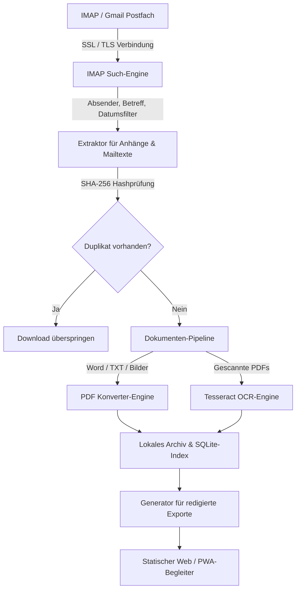
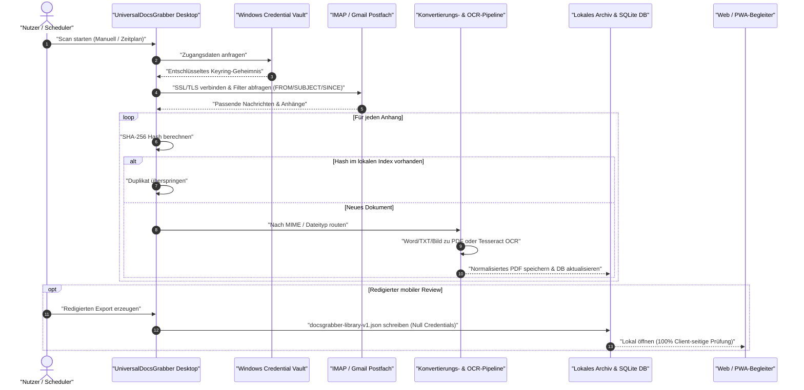

# UniversalDocsGrabber

**Automatischer Download und Verwaltung von Dokumenten aus IMAP-E-Mails**

UniversalDocsGrabber ist ein lokaler E-Mail-Anhang-Downloader und
Dokumenten-Organizer für Windows. Das Tool verbindet sich mit IMAP- oder
Gmail-kompatiblen Postfächern, lädt PDF-, Office-, Bild- und Mail-Body-Dokumente
herunter, konvertiert sie bei Bedarf nach PDF, erkennt Duplikate per
SHA-256-Hash und hält den Dokumentindex auf dem eigenen Rechner.

> **English documentation:** [README.md](README.md)

[](pyproject.toml)
[](https://github.com/doc-bricks/UniversalDocsGrabber/actions/workflows/ci.yml)
[](tests/)
[](LICENSE)
[](https://github.com/doc-bricks/UniversalDocsGrabber)
[](https://www.python.org/)
[](llms.txt)
[](README-DE.md#datenschutzmodell)
[](SECURITY.md)
[](SECURITY.md)
[](THIRD_PARTY_LICENSES.md)
[](MARKETING-LOG.txt)
[](https://github.com/doc-bricks)
[](https://github.com/open-bricks)
[](llms.txt)

| [⚡ Schnellstart](#einstieg) | [🏗️ Architektur & Datenfluss](#systemarchitektur--datenfluss) | [🔄 Lebenszyklus-Ablauf](#end-to-end-dokumenten-lebenszyklus) | [📋 Governance- & Laufzeit-Invarianten](#governance--und-laufzeit-invarianten) | [✨ Funktionen im Detail](#funktionen-im-detail) | [⚙️ Installation & Einrichtung](#installation--einrichtung) | [🔄 Typischer Arbeitsablauf](#typischer-arbeitsablauf) | [🔒 Datenschutz & Sicherheit](#datenschutzmodell) | [📱 Web/PWA-Begleiter](#plattform-strategie) | [🧩 Geschwister-Werkzeuge](#ökosystem--geschwister-tools) | [⚖️ Vergleichsmatrix](#vergleichsmatrix-gegenüber-alternativen) | [🎯 Zielgruppen](#marketing--zielgruppen) | [📜 Drittanbieter-Lizenzen](#drittanbieter-lizenzen--transparenz) | [⚠️ Bekannte Einschränkungen](#bekannte-einschränkungen) | [🛡️ Sicherheitsrichtlinie](SECURITY.md) | [🤖 LLM-Kontext](llms.txt) |

Aktueller Contract-Readback (2026-09-14): 78 Pytest-Tests und 32 Node-Tests des
Web-Companions sind grün (110 Contract-Tests gesamt, 100% bestanden). Installation,
Offline-Start und Lesbarkeit auf Android/iOS bleiben getrennte Geräte-/Emulator-
Gates. Die plattformübergreifende Statusmatrix steht in
[`PORTIERUNGSPLAN.md`](PORTIERUNGSPLAN.md).

Das Badge `110 bestanden` zählt die 78 Python- und 32 Node-Contract-Tests;
vollständige CI-Matrix-Tests auf Windows, Ubuntu und macOS laufen bei jedem Commit.

> [!NOTE]
> **KI / LLM Integration & Lokales Datenschutzmodell**: UniversalDocsGrabber arbeitet 100 % lokal. Zugangsdaten liegen sicher im Windows Credential Vault. Der statische Web/PWA-Companion nutzt ein redigiertes Exportformat (`docsgrabber-library-v1.json`), das Zugangsdaten, E-Mail-Texte und PDF-Inhalte strikt ausschließt — ideal für mobilen Review oder KI-gestützte Dokumenten-Audits. Das vollständige KI-Schema ist in [`llms.txt`](llms.txt) und [`EXPORTFORMAT.md`](EXPORTFORMAT.md) beschrieben.


## Einstieg

| Bedarf | Einstieg |
|--------|----------|
| Wiederkehrende Rechnungs-, Versicherungs-, Steuer-, Vertrags- oder Versanddokumente aus Postfächern sammeln | `python UniversalDocsGrabberV1.py` |
| Eine redigierte Dokumentbibliothek auf einem anderen Gerät prüfen, ohne Mail-Zugangsdaten offenzulegen | `web_companion/index.html?demo=1` |
| Das Companion-Exportformat integrieren oder prüfen | [EXPORTFORMAT.md](EXPORTFORMAT.md) |
| Am Projekt mitwirken | [CONTRIBUTING.md](CONTRIBUTING.md) |

## Überblick

UniversalDocsGrabber ist eine PySide6-Desktop-Anwendung für den Download, die Konvertierung und die Ablage von Dokumenten aus IMAP-Postfächern.

Typische Einsätze sind Rechnungsablage, Vertragsarchiv, Versicherungs- und
Steuerpost, Bewerbungsunterlagen, Versandnachweise und andere wiederkehrende
Mailbox-zu-Ordner-Workflows.

## Warum UniversalDocsGrabber

- **Für Mailbox-Dokumente gebaut:** IMAP-Profile, Gmail-Raw-Queries,
  Absender-/Betreff-/Datumsfilter, Anhang-Download, PDF-Konvertierung, OCR und
  Kategorisierung liegen in einem Desktop-Workflow.
- **Privat voreingestellt:** Kontoeinstellungen und Dokumentmetadaten bleiben
  lokal; Exporte für den Web/PWA-Companion sind redigiert und enthalten keine
  Credentials, Mail-Body-Volltexte oder Dokumentdateien.
- **Auch mobil prüfbar:** Der statische Web/PWA-Companion öffnet einen
  redigierten `docsgrabber-library-v1.json`-Export für Suche, Statuskontrolle
  und Review, ohne den Browser zum Mail-Client zu machen.

## Kernfunktionen

- Multi-Account IMAP Support
- Suchprofile mit Filtern für Absender, Betreff und Zeitraum
- Download von PDF, DOCX, DOC, JPG, PNG und weiteren Dokumenttypen
- Automatische Konvertierung nach PDF
- OCR für PDFs ohne Textebene
- Hash-basierte Duplikate-Erkennung
- Scheduler für wiederkehrende Scans von 15 Minuten bis 24 Stunden
- Auto-Kategorisierung mit Standard- und benutzerdefinierten Regeln
- Drag&Drop-Sortierung von Profilen und Batch-Läufe für alle aktiven Profile
- Gmail-Raw-Queries werden auf Servern mit `X-GM-RAW` mit Absender-,
  Betreff- und Datumsfiltern kombiniert; andere IMAP-Server fallen sauber auf
  klassische `FROM`/`SUBJECT`/`SINCE`-Suchen zurück
- Lokale Speicherung von Kontoeinstellungen und Dokumentmetadaten
- Redigierter Export `docsgrabber-library-v1.json` für den lokalen Web/PWA-Companion
- Klarer beschriftete Tabs, Löschaktionen und Tooltips verringern
  Fehlbedienungen bei Profilen, Konten und Download-Pfaden

## Systemarchitektur & Datenfluss



### End-to-End Dokumenten-Lebenszyklus



## Governance- und Laufzeit-Invarianten

Die Software unterliegt zehn verbindlichen Architektur- und Betriebsregeln:

| ID | Invariante | Beschreibung & Architekturgrenze | Durchsetzung & Nachweis |
|---|---|---|---|
| `INV-LOCAL-01` | **Local-First & Zero-Egress** | 100% Offline-Dokumentenverarbeitung, OCR und PDF-Generierung. Keine Netzwerk-Telemetrie. | Keine externen HTTP-Verbindungen beim Ingestion-Lauf; air-gap-fähig |
| `INV-SEC-02` | **RunAsInvoker-Privilegiengrenze** | Läuft strikt im unprivilegierten Benutzerkontext. Fordert niemals Administrator-Rechte an. | Unprivilegiertes Ausführungsprofil |
| `INV-CRED-03` | **Betriebssystem-Keyring** | Passwörter und OAuth-Tokens werden verschlüsselt im Windows Credential Vault abgelegt; kein Klartext. | `keyring`-Integration |
| `INV-REDACT-04` | **Sanitisiertes Export-Schema** | Mobiler Export `docsgrabber-library-v1.json` schließt Zugangsdaten, Tokens und Mail-Texte strikt aus. | `test_export_format.py` & JSON-Schemavalidierung |
| `INV-HASH-05` | **SHA-256 Duplikatsprüfung** | Kryptografischer Inhalts-Hash verhindert mehrfaches Herunterladen und Speichern identischer Dokumente. | `hashlib.sha256`-Prüfung |
| `INV-FALL-06` | **Robuste Fallbacks** | Saubere Protokollierung und Weiterführung, wenn optionale Module (Word, Poppler, Tesseract) fehlen. | `tests/source_platform_smoke.py` |
| `INV-PWA-07` | **Abhängigkeitsfreie PWA** | Statischer Begleiter nutzt native Browser-APIs, Service Worker und 0 externe CDN/NPM-Pakete. | `web_companion/package.json` (0 Dependencies) |
| `INV-LIC-08` | **100% Zulässige Open-Source** | MIT-Basis mit transparenter dynamischer LGPLv3-Verlinkung und Ersetzungsfreiheit für Qt-Bibliotheken. | `THIRD_PARTY_LICENSES.md` |
| `INV-SLA-09` | **48h Sicherheits-SLA** | Eingangsbestätigung von Sicherheitsmeldungen binnen 48h; Triage binnen 5 Werktagen. | `SECURITY.md` Richtlinie |
| `INV-PAR-10` | **Zweisprachige Vertragsparität** | Vollständige Symmetrie zwischen deutscher und englischer Dokumentation, Ankern und Vertragstests. | `tests/test_metadata.py` Verifikation |

## Funktionen im Detail

### Suchprofile

- Gruppenbasierte Strukturierung
- Drag&Drop zwischen Gruppen
- Profilspezifische Einstellungen
- Datumsfilter je Lauf

### Konvertierung

- Word nach PDF über Windows `win32com` mit `docx2pdf` als unabhängigem Fallback
- TXT nach PDF über `reportlab`
- Bilder nach PDF über Pillow
- OCR für gescannte PDFs ohne Textebene

### Scheduler & Auto-Kategorisierung

- Wiederkehrende Läufe von 15 Minuten bis 24 Stunden
- Läufe werden übersprungen, wenn bereits ein Scan aktiv ist
- Batch-Verarbeitung gruppiert aktive Profile nach Konten
- Regelbasierte Kategorisierung für Rechnungen, Versand, Verträge, Kündigungen, Steuern, Versicherungen, Bewerbungen und Bankdokumente

### Duplikate-Erkennung

- SHA-256-Hash-Prüfung
- Pro Profil konfigurierbar

<a name="installation--einrichtung"></a>
## Installation & Einrichtung

### Voraussetzungen

- Python 3.8+
- Microsoft Word für Word-nach-PDF-Konvertierung über `win32com` auf Windows,
  oder `docx2pdf` falls verfügbar
- Optional: Tesseract OCR
- Optional: Poppler

### Einrichtung

```bash
pip install -r requirements.txt
```

### Optional: Poppler

1. Download: <https://github.com/oschwartz10612/poppler-windows/releases>
2. Nach `C:\Program Files\poppler\` entpacken
3. Bei Bedarf `POPPLER_PATH` in `UniversalDocsGrabberV1.py` anpassen

### Optional: Tesseract

1. Download: <https://github.com/UB-Mannheim/tesseract/wiki>
2. Installation nach `C:\Program Files\Tesseract-OCR\`
3. Zu `PATH` hinzufügen

## Start

```bash
python UniversalDocsGrabberV1.py
```

oder Doppelklick auf `START.bat`.

## Typischer Arbeitsablauf

1. IMAP-Konto im Tab `Konten` anlegen
2. Suchprofil mit Gruppe, Filtern und Zielordner erstellen
3. Zeitraum einstellen
4. Einzelnes Profil oder alle aktiven Profile mit `START` ausführen
5. Ergebnisse im Tab `Dokumente` prüfen
6. Über `Einstellungen -> Companion-Export -> Redigierten Export speichern...` einen Bibliotheks-Snapshot erzeugen
7. Optional `web_companion/index.html` oder `?demo=1` öffnen, um den Export lokal im Browser-Companion zu prüfen

<a name="datenschutzmodell"></a>
## Datenschutzmodell & Lokale Daten

UniversalDocsGrabber läuft lokal auf Ihrem Rechner. Mail-Zugangsdaten werden über den Betriebssystem-Schlüsselspeicher abgelegt, Metadaten im Benutzerprofil. Es gibt keine Telemetrie, keine Cloud-Synchronisation und kein Backend.

- `%USERPROFILE%\.univ_docs_grabber\config_v1.json`
- `%USERPROFILE%\.univ_docs_grabber\documents.json`
- `%USERPROFILE%\Downloads\UnivDocs\`

Diese Dateien werden von Git ignoriert, da sie Kontonamen, lokale Pfade, Dokumentmetadaten und heruntergeladene Dokumente enthalten können.

<a name="plattform-strategie"></a>
## Plattform-Strategie & Web/PWA-Begleiter

Die Windows-Desktop-App bleibt die Vollversion für IMAP-Zugriff, OCR,
Konvertierung, Scheduling und lokale Dateiablage. Für macOS und Linux existiert
eine Source-Smoke-Abdeckung. Web, Android und iOS nutzen den lokalen
PWA-Companion in `web_companion/` auf Basis eines redigierten
`docsgrabber-library-v1.json`-Exports statt eines nativen Mail-Clients.

Der Export enthält Profile, Kategorien, Dokumentmetadaten, Profilstatistiken
und redigierte Pfadhinweise, aber keine Credentials, Dokumenttexte oder
PDF-Inhalte.

Siehe [EXPORTFORMAT.md](EXPORTFORMAT.md).

Der aktuelle Companion unterstützt lokalen Import, Suche, Profil- und
Kategorieübersicht, Dokument-Statusfilter und eine PWA-fähige Offline-Shell.
Manifest-, Service-Worker- und iOS-Anforderungen sind durch Node-Tests
abgedeckt; die eigentliche Installation und der Offline-Start auf Android/iOS
bleiben eine separate Prüfung auf realen Geräten oder Emulatoren.

Der Datenaustausch ist bewusst einseitig: Der Desktop erzeugt den redigierten
Export, der Companion liest ihn lokal. Es gibt keinen Rückimport und keinen
Cloud-Sync.

Der Companion lässt sich lokal über `web_companion/index.html?demo=1` mit einer
Demo-Bibliothek öffnen oder über einen einfachen lokalen HTTP-Server für
PWA-Tests bereitstellen.

Source-Smoke-Abdeckung für macOS/Linux wird in
`tests/source_platform_smoke.py` und `.github/workflows/source-platform-smoke.yml`
nachgehalten. Sie prüft den Offscreen-Start, Config-Roundtrips im temporären
Verzeichnis, sauberes Verhalten ohne Office-Konverter, den `docx2pdf`-Fallback
ohne `win32com` und klare Statusmeldungen bei fehlendem Tesseract/Poppler.

## Entwicklung

```bash
python tests/source_platform_smoke.py
python -m pytest -q
python -m py_compile UniversalDocsGrabberV1.py
```

## Ökosystem & Geschwister-Tools

UniversalDocsGrabber ist Teil der Dokumenten- und Desktop-Ökosysteme von
[doc-bricks](https://github.com/doc-bricks) und [open-bricks](https://github.com/open-bricks):

### doc-bricks — Dokument- & Mail-Werkzeuge
| Werkzeug | Beschreibung |
|---|---|
| [MailProcessor](https://github.com/doc-bricks/MailProcessor) | System-Tray-Starter und Orchestrator für alle Universal Mail Tools |
| [UniversalMailCleaner](https://github.com/doc-bricks/UniversalMailCleaner) | Regelbasierte IMAP-Postfachbereinigung mit sicherem Vorschaumodus |
| [UniversalInvoiceMail](https://github.com/doc-bricks/UniversalInvoiceMail) | Extraktion von Rechnungen, Belegen und Finanzdokumenten |
| [CleanMarkdown](https://github.com/doc-bricks/CleanMarkdown) | Markdown-Hygiene, Dialekt-Linting und AST-Bereinigung |
| [PDFtoPDFocr](https://github.com/doc-bricks/PDFtoPDFocr) | Batch-OCR-Werkzeug zur Ergänzung von Textebenen in gescannten PDFs |
| [MediaBrain](https://github.com/doc-bricks/MediaBrain) | Lokale Medienorganisation und Metadatenextraktion |

### file-bricks & dev-bricks — Desktop- & Entwickler-Werkzeuge
| Werkzeug | Beschreibung |
|---|---|
| [WinStorePackager](https://github.com/file-bricks/WinStorePackager) | MSIX-Paketierung und Bereitstellung für den Windows Store |
| [ProFiler](https://github.com/file-bricks/ProFiler) | Schnelle Datei-Suche nach mehreren Kriterien mit Duplikaterkennung |
| [ExplorerPro](https://github.com/file-bricks/ExplorerPro) | Lokaler Zwei-Fenster-Dateimanager für Windows |
| [DevCenter](https://github.com/dev-bricks/DevCenter) | Entwickler-Hub und Befehlsstarter |
| [WikiStub-Seed](https://github.com/dev-bricks/WikiStub-Seed) | Markdown-Wiki-Strukturierung und Stub-Generierung |

### ellmos-ai — Autonome Agenten- & MCP-Infrastruktur
| Werkzeug | Beschreibung |
|---|---|
| [ellmos-filecommander-mcp](https://github.com/ellmos-ai/ellmos-filecommander-mcp) | 47-Tool MCP-Server für lokale Dateisystem-Operationen, OCR und Papierkorb-Routing |
| [ellmos-codecommander-mcp](https://github.com/ellmos-ai/ellmos-codecommander-mcp) | Code-Intelligenz, AST-Refactorings, JSON-Korrektur und strukturelle Editierung |
| [n8n-manager-mcp](https://github.com/ellmos-ai/n8n-manager-mcp) | Workflow-Orchestrierung, Zugangsdaten-Governance und Lifecycle-Management |
| [system-explorer](https://github.com/ellmos-ai/system-explorer) | Nachweisorientierte Autoritätsauflösung und Schemaprüfung |
| [workflowhooker-provenance](https://github.com/ellmos-ai/workflowhooker-provenance) | Agentische Pre-Execution Briefings, Scope-Guards und Closing-Gates |
| [lock-master](https://github.com/ellmos-ai/lock-master) | Multi-Agenten-Sperren, Dateiansprüche und Schlichtung |
| [build-your-users-mind](https://github.com/ellmos-ai/build-your-users-mind) | Lokales Benutzerpräferenzmodell und kognitiver Zustandstracker |

<a name="vergleichsmatrix-gegenüber-alternativen"></a>
## Vergleichsmatrix gegenüber Alternativen

UniversalDocsGrabber besetzt eine klare funktionale Lücke zwischen fragilen Ad-Hoc-Skripten, ressourcenhungrigen Enterprise-DMS-Suiten und datenschutzrechtlich bedenklichen Cloud-SaaS-Diensten:

| Architektonische & Betriebliche Dimension | UniversalDocsGrabber | Cloud-SaaS (DocuWare / Dext / Rossum) | Schweres Enterprise-DMS (Paperless-ngx / Mayan) | Traditionelle Mail-Clients (Thunderbird / Outlook-Regeln) | Ad-Hoc-Skripte (Fetchmail / Python-Skripte) |
|---|---|---|---|---|---|
| **1. Ausführung & Datenspeicherung** | **100 % Lokal** (`INV-LOCAL-01`), Zero-Egress, Air-Gap-fähig | Cloud-Mandantenserver, obligatorischer Remote-Dokumenten-Upload | Self-Hosted Server / Docker-Daemon, erfordert Infrastruktur | Lokaler Client, jedoch ohne automatisierte Dokumenten-Pipeline | Lokale Workstation, manuelle CLI-Ausführung |
| **2. Sicherheits- & Rechtegrenze** | **Unprivilegierter Benutzermodus** (`INV-SEC-02`, `RunAsInvoker`) | Vertrauensgrenze beim Drittanbieter, geteilte Cloud-Risiken | Root-/Docker-Daemon-Rechte, web-exponierte Angriffsfläche | Unprivilegierter Desktop-Anwendungsraum | Abhängig von den Ausführungsrechten des Skripts |
| **3. Zugangsdaten-Schutz** | **Windows Credential Vault** via `keyring` (`INV-CRED-03`) | Zentrale SaaS-Datenbank, Cloud-OAuth- & Token-Exposition | Server-Umgebungsvariablen oder Datenbank-Secrets | Passwort-Speicher im lokalen Profilordner | Klartext-Konfigurationsdateien (`.netrc`, `.fetchmailrc`) |
| **4. OCR-Engine & Textextraktion** | **Integrierte lokale Tesseract- & Poppler-Pipeline** | Cloud Vision API / Proprietäre SaaS-OCR-Dienste | Server-seitiger Celery-Worker mit Tesseract-Container | Keine (erfordert externe manuelle Nachbearbeitung) | Manuelle CLI-Pipes (`tesseract` CLI) |
| **5. Multi-Format-PDF-Normalisierung** | **Automatisiert** (Word via `win32com`/`docx2pdf`, TXT, Bilder) | Server-seitige proprietäre Dokumenten-Konverter | Server-Dienste via LibreOffice / ImageMagick | Keine (speichert lediglich Roh-Anhänge ab) | Keine oder fehleranfällige Shell-Skript-Ketten |
| **6. Duplikate-Erkennung** | **Kryptografischer SHA-256** Inhalts-Hash (`INV-HASH-05`) | Datenbank-Indexierung & heuristische Ähnlichkeitsprüfung | Prüfsummen-Datenbankindex über das gesamte Archiv | Keine (überschreibt Dateien oder hängt Zähler an) | Keine oder manuelle `md5sum`-Prüfungen |
| **7. Mobiler Prüf-Begleiter** | **Sanierter, redigierter statischer PWA-Begleiter** (`INV-PWA-07`, 0 Passwörter) | Proprietäre Mobile-App mit permanentem Cloud-Zwang | Web-Frontend (erfordert VPN, Reverse-Proxy oder offenen Port) | Mobiler IMAP-Client (offenbart vollständige Postfach-Passwörter) | Keine |
| **8. Automation & Zeitsteuerung** | **Nativer Hintergrund-Scheduler** (15m–24h) mit Sperren | Permanente Cloud-Abfrage & Webhook-Trigger | Linux-System-Cron oder Celery-Worker-Scheduler | Nur aktiv, solange die Desktop-Mail-GUI geöffnet ist | Crontab oder Windows-Aufgabenplanung |
| **9. Compliance & DSGVO-Governance** | **DSGVO-konform durch Design** (keine Auftragsverarbeiter) | Erfordert Auftragsverarbeitungsverträge (AVV), Cloud-Risiken | DSGVO-konform bei ordnungsgemäß gehärtetem Server | Abhängig vom E-Mail-Provider | Lokal, aber ohne Revisions- und Prüfpfade |
| **10. Softwarefreiheit & Lizenzierung** | **100 % Zulässige MIT-Lizenz** + dynamische LGPLv3-Bindung (`INV-LIC-08`) | Proprietäres kommerzielles Abonnement ($$$/Monat SaaS) | Open Source (GPLv3 / AGPLv3) oder Commercial Open-Core | MPL 2.0 (Thunderbird) / Proprietär (Outlook) | Open Source / Ungepflegte Einzelschriften |

<a name="marketing--zielgruppen"></a>
## Marketing & Zielgruppen

UniversalDocsGrabber wurde gezielt konzipiert, um akute manuelle Engpässe und Compliance-Risiken bei vier zentralen Zielgruppen zu lösen:

### [PERSONA-1] Solo-Unternehmer & Kleinbetrieb-Buchhaltung
- **Profil:** Selbstständige, Agenturinhaber, Handwerksbetriebe und Buchhaltungskräfte, die wiederkehrende Lieferantenpost verwalten.
- **Akuter Schmerzpunkt:** Rechnungen, Quittungen und Zahlungsbelege treffen über mehrere E-Mail-Konten ein; manuelles Suchen, Herunterladen und Sortieren in Monatsordner kostet wertvolle Arbeitszeit.
- **Angewandte Lösung:** Automatische zeitgesteuerte Abfragen mit regelbasierter Auto-Kategorisierung für `Rechnungen`, `Steuer` und `Bank` direkt in strukturierte Verzeichnisse.
- **Typischer Ablauf:** Täglicher Scan um 08:00 Uhr -> automatische Ablage in `Downloads/UnivDocs/Rechnungen/2026/` -> sofort bereit für den Buchhaltungs-Import.

### [PERSONA-2] Rechts-, Steuer- & Compliance-Fachkräfte
- **Profil:** Kanzleien, Notariate, Steuerberatungspraxen und Datenschutzbeauftragte mit strengsten Vertraulichkeitsanforderungen.
- **Akuter Schmerzpunkt:** Cloud-SaaS-Tools verletzen gesetzliche Schweigepflichten (§ 203 StGB, DSGVO) durch den Upload vertraulicher Mandantendaten auf Fremdserver.
- **Angewandte Lösung:** 100 % lokale Offline-Verarbeitung (`INV-LOCAL-01`), Betriebssystem-Keyring (`INV-CRED-03`) und lokale Tesseract-OCR ohne jegliche externe Telemetrie.
- **Typischer Ablauf:** Automatisierte Erfassung aus verschlüsselten Postfächern -> lokale Texterkennung für Volltextsuche -> null ausgehende Datenpakete.

### [PERSONA-3] Datenschutzbewusste Power-User & Dokumenten-Archivare
- **Profil:** Datensouveräne Heimanwender, Archivare und Finanzoptimierer, die volle Kontrolle über ihre Dokumente behalten wollen.
- **Akuter Schmerzpunkt:** Komplexe DMS-Lösungen (Docker, Datenbanken, Celery) erfordern hohen Einrichtungs- und Wartungsaufwand; reguläre Mail-Programme beherrschen keine automatische PDF-Normalisierung.
- **Angewandte Lösung:** Schlanke Desktop-Applikation mit SHA-256-Deduplizierung (`INV-HASH-05`) und statischem, abhängigkeitsfreiem Web/PWA-Begleiter (`INV-PWA-07`) zur sicheren Offline-Prüfung ohne Cloud-Zwang.
- **Typischer Ablauf:** Export mit einem Klick erzeugen -> `docsgrabber-library-v1.json` aufs Tablet/Smartphone übertragen -> Dokumente vollständig offline durchsehen.

### [PERSONA-4] Local-First KI- & Automations-Entwickler
- **Profil:** Entwickler und KI-Agenten-Betreiber, die lokale LLM/RAG-Pipelines und Wissensbasen aufbauen.
- **Akuter Schmerzpunkt:** Ingestion-Pipelines benötigen strukturierte, bereinigte Metadaten, ohne Zugangsdaten preiszugeben oder durch korrupte Anhänge zu kollabieren.
- **Angewandte Lösung:** Standardisiertes `docsgrabber-library-v1.json`-Exportschema, maschinenlesbarer `llms.txt`-Kontext und robuste Fehlerbehandlung.
- **Typischer Ablauf:** Desktop-App läuft im Hintergrund -> schreibt bereinigten JSON-Index -> lokale KI-Agenten nutzen den Index für semantische Recherchen.

Ausführliche Suchbegriff-Cluster, Konkurrenzvergleiche und Roadmaps stehen in [MARKETING-LOG.txt](MARKETING-LOG.txt).

<a name="drittanbieter-lizenzen--transparenz"></a>
## Drittanbieter-Lizenzen & Transparenz

UniversalDocsGrabber baut auf permissiven Open-Source-Komponenten auf:
- Die Anwendung selbst unterliegt der [MIT-Lizenz](LICENSE).
- Direkte Laufzeitabhängigkeiten (pypdf, reportlab, Pillow, xhtml2pdf, keyring, pytesseract, pdf2image, pywin32, docx2pdf) nutzen zulässige Open-Source-Lizenzen (MIT, BSD, Apache-2.0, PSF).
- PySide6 ist unter der LGPL-3.0 dynamisch verlinkt; Endanwender behalten gemäß LGPLv3 §4 die Freiheit zum Austausch der Qt-Bibliotheken.
- Die vollständige Konformitätsprüfung und Upstream-Quellen stehen in [THIRD_PARTY_LICENSES.md](THIRD_PARTY_LICENSES.md).

<a name="bekannte-einschränkungen"></a>
## Bekannte Einschränkungen

- OCR erfordert Tesseract und Poppler
- Word-Konvertierung setzt Microsoft Word über Windows `win32com` oder
  `docx2pdf` voraus; fehlt beides, wird die Konvertierung mit einer klaren
  Meldung übersprungen
- Für macOS/Linux ist bisher kein LibreOffice-basierter Fallback implementiert
- Die Suche ist konservativ ausgelegt und begrenzt die Mailanzahl pro Profil

## Suchbegriffe & Auffindbarkeit

**Globale Suchbegriffe mit hoher Absicht (Englisch):**
`email attachment downloader windows`, `local-first IMAP document organizer`, `automatic invoice email extractor python`, `gmail attachment archive tool offline`, `pyside6 mail attachment grabber`, `email to pdf ocr tesseract batch`, `open source document grabber no cloud`, `sha256 email attachment deduplicator`, `offline pwa document review companion`, `zero egress mailbox document scanner`.

**DACH-spezifische Suchbegriffe mit hoher Absicht (Deutsch):**
`E-Mail Anhänge automatisch herunterladen lokal`, `IMAP Dokumenten Downloader Open Source`, `Rechnungen aus E-Mails extrahieren Software`, `Rechnungsablage automatisieren Windows`, `Mail Anhang PDF Konverter OCR Tesseract`, `DSGVO konforme Dokumentenablage E-Mail`, `Lokales E-Mail Archiv ohne Cloud`, `Duplikate Erkennung E-Mail Anhänge SHA-256`, `PWA Dokumenten Übersicht offline`, `UniversalDocsGrabber doc-bricks`.

## Suche & Eindeutigkeit

Verwenden Sie bei der Suche den genauen Projektnamen **UniversalDocsGrabber**
oder den Repository-Pfad `doc-bricks/UniversalDocsGrabber`. Das Projekt ist ein
lokaler E-Mail-Dokumenten-Downloader mit PWA-Begleiter — kein generischer
Dokumentenbetrachter, kein RAG-Parser, kein Cloud-OCR-Dienst und kein
Dokumentationsgenerator.

Maschinenlesbarer Kontext für Crawler und KI-Tools steht in [llms.txt](llms.txt).

## Lizenz

[MIT](LICENSE) - Lukas Geiger