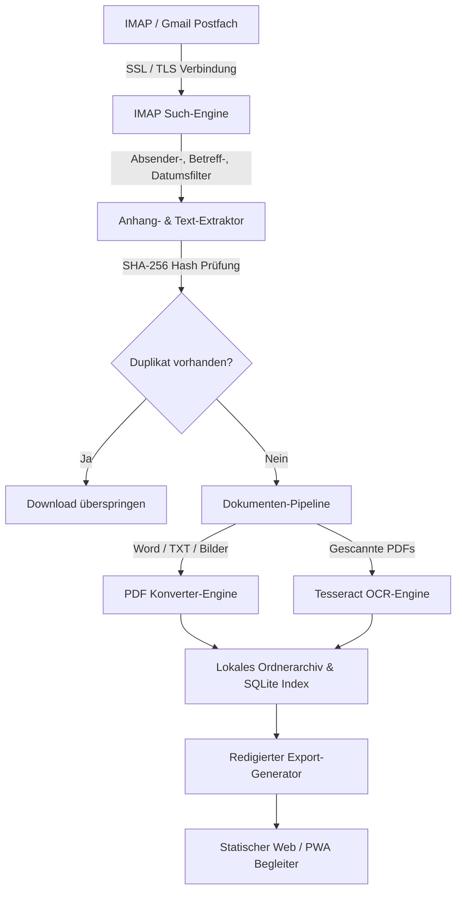
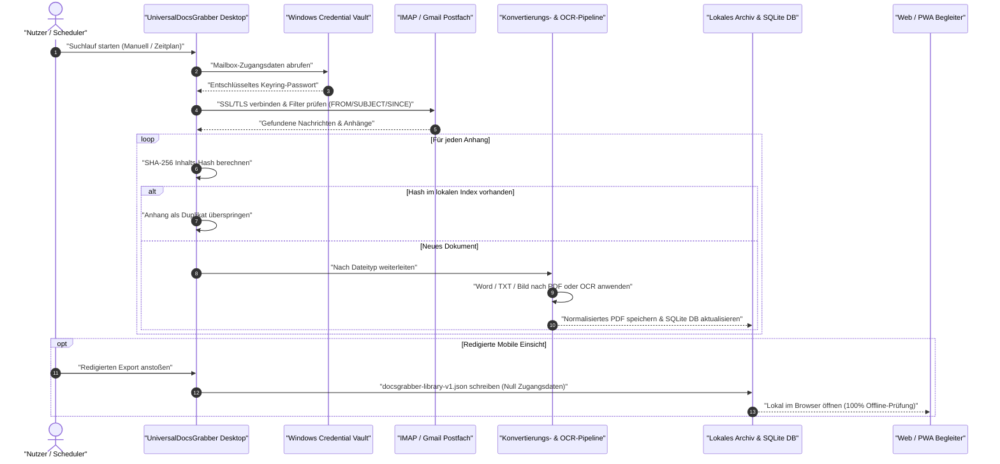

# UniversalDocsGrabber

**Automatischer Download und Verwaltung von Dokumenten aus IMAP-E-Mails**

UniversalDocsGrabber ist ein lokaler E-Mail-Anhang-Downloader und
Dokumenten-Organizer für Windows. Das Tool verbindet sich mit IMAP- oder
Gmail-kompatiblen Postfächern, lädt PDF-, Office-, Bild- und Mail-Body-Dokumente
herunter, konvertiert sie bei Bedarf nach PDF, erkennt Duplikate per
SHA-256-Hash und hält den Dokumentindex auf dem eigenen Rechner.

Ideal für die automatische Rechnungsablage, Vertragsarchivierung, Versicherungspost,
Bewerbungsunterlagen, Steuerordner, Versandbenachrichtigungen und wiederkehrende
Postfach-zu-Ordner-Prozesse, bei denen ein schweres Cloud-DMS überdimensioniert wäre.

> **English documentation:** [README.md](README.md)

[](pyproject.toml)
[](https://github.com/doc-bricks/UniversalDocsGrabber/actions/workflows/ci.yml)
[](tests/)
[](LICENSE)
[](NOTICE)
[](https://github.com/doc-bricks/UniversalDocsGrabber)
[](https://www.python.org/)
[](llms.txt)
[](README-DE.md#sec-11)
[](SECURITY.md)
[](SECURITY.md)
[](THIRD_PARTY_LICENSES.md)
[](MARKETING-LOG.txt)
[](https://github.com/doc-bricks)
[](https://github.com/open-bricks)
[](MARKETING-LOG.txt)
[](llms.txt)

---

### 🧭 Schnellnavigation

- [1. Überblick & Zweck](#1-ueberblick--zweck)
- [2. Kernfunktionen & Architektur](#2-kernfunktionen--architektur)
- [3. Zielgruppen & Suchintentionen](#3-zielgruppen--suchintentionen)
- [4. Vergleichsmatrix gegenüber Alternativen](#4-vergleichsmatrix-gegenueber-alternativen)
- [5. Governance- & Laufzeit-Invarianten](#5-governance--laufzeit-invarianten)
- [6. Visuelle Systemarchitektur & Ablaufdiagramm](#6-visuelle-systemarchitektur--ablaufdiagramm)
- [7. End-to-End Dokumenten-Lebenszyklus](#7-end-to-end-dokumenten-lebenszyklus)
- [8. Typischer Arbeitsablauf & Ausführung](#8-typischer-arbeitsablauf--ausfuehrung)
- [9. Installation & Systemvoraussetzungen](#9-installation--systemvoraussetzungen)
- [10. Funktionen im Detail & Dokumenten-Normalisierung](#10-funktionen-im-detail--dokumenten-normalisierung)
- [11. Datenschutzmodell, Keyring-Tresor & Lokale Daten](#11-datenschutzmodell-keyring-tresor--lokale-daten)
- [12. Web/PWA-Begleiter & Redigierte Mobile Einsicht](#12-web-pwa-begleiter--redigierte-mobile-einsicht)
- [13. Ökosystem & Geschwister-Werkzeuge](#13-oekosystem--geschwister-werkzeuge)
- [14. CLI, LLM-Kontext & Maschinenlesbare Verträge](#14-cli-llm-kontext--maschinenlesbare-vertraege)
- [15. Bekannte Einschränkungen & Sonderfälle](#15-bekannte-einschraenkungen--sonderfaelle)
- [16. Entwicklung, Toolchain & Automatisierte Testsuite](#16-entwicklung-toolchain--automatisierte-testsuite)
- [17. Drittanbieter-Lizenzen, Zero-Copyleft & Level 1 SBOM](#17-drittanbieter-lizenzen-zero-copyleft--level-1-sbom)
- [18. Roadmap, Änderungsprotokoll & Gesetzlicher Haftungsausschluss (§ 521 BGB)](#18-roadmap-aenderungsprotokoll--gesetzlicher-haftungsausschluss--521-bgb)

Aktueller Contract-Readback (2026-09-28): 84 Pytest-Tests und 32 Node-Tests des Web-Companions sind grün (116 Contract-Tests gesamt, 100% bestanden). Installation, Offline-Start und Lesbarkeit auf Android/iOS bleiben getrennte Geräte-/Emulator-Gates. Die plattformübergreifende Statusmatrix steht in [`PORTIERUNGSPLAN.md`](PORTIERUNGSPLAN.md).

> [!NOTE]
> **KI / LLM Integration & Lokales Datenschutzmodell**: UniversalDocsGrabber arbeitet 100 % lokal. Zugangsdaten liegen sicher im Windows Credential Vault. Der statische Web/PWA-Companion nutzt ein redigiertes Exportformat (`docsgrabber-library-v1.json`), das Zugangsdaten, E-Mail-Texte und PDF-Inhalte strikt ausschließt — ideal für mobilen Review oder KI-gestützte Dokumenten-Audits. Das vollständige KI-Schema ist in [`llms.txt`](llms.txt) und [`EXPORTFORMAT.md`](EXPORTFORMAT.md) beschrieben.


---

<a id="sec-01"></a><a id="1-ueberblick--zweck"></a><a id="ueberblick--zweck"></a><a id="einstieg"></a><a id="1-overview--why-this-exists"></a><a id="overview--why-this-exists"></a><a id="start-here"></a>
## 1. Überblick & Zweck

Kleine Unternehmen, Selbstständige, Steuerfachleute und Privatanwender verbringen monatlich viel Zeit damit, Rechnungen, Verträge und Nachweise aus verschiedenen E-Mail-Postfächern zusammenzusuchen. Das manuelle Speichern, Konvertieren von Office-Formaten, Durchführen von Texterkennung (OCR) und Einsortieren in Ordner ist fehleranfällig und aufwendig.

Kommerzielle Cloud-Dienste (DocuWare, Dext, Rossum) verlangen Vollzugriff auf vertrauliche Postfächer, speichern sensible Geschäftsunterlagen auf Fremdservern und erzwingen teure Abonnements.

**UniversalDocsGrabber** bietet eine kompromisslose, **100 % lokale** Lösung:
- **Maßgeschneidert für E-Mail-Dokumente:** IMAP-Profile, Gmail-Direktabfragen, Absender-/Betreff-/Datumsfilter, Anhang-Download, PDF-Konvertierung, OCR und Kategorisierung in einem einzigen Desktop-Workflow.
- **Datenschutz als Standard:** Kontoeinstellungen und indizierte Metadaten verbleiben lokal; Exporte für den Web/PWA-Begleiter sind redigiert und enthalten weder Zugangsdaten noch E-Mail-Texte oder Originaldateien.
- **Flexibel über den Desktop hinaus:** Der statische Web/PWA-Begleiter öffnet den redigierten `docsgrabber-library-v1.json`-Export zur mobilen Einsicht, Suche und Statusprüfung, ohne den Browser in einen Mail-Client zu verwandeln.

### Einstieg

| Bedarf | Einstieg |
|--------|----------|
| Wiederkehrende Rechnungs-, Versicherungs-, Steuer-, Vertrags- oder Versanddokumente aus Postfächern sammeln | `python UniversalDocsGrabberV1.py` |
| Eine redigierte Dokumentbibliothek auf einem anderen Gerät prüfen, ohne Mail-Zugangsdaten offenzulegen | `web_companion/index.html?demo=1` |
| Das Companion-Exportformat integrieren oder prüfen | [EXPORTFORMAT.md](EXPORTFORMAT.md) |
| Am Projekt mitwirken | [CONTRIBUTING.md](CONTRIBUTING.md) |

---

<a id="sec-02"></a><a id="2-kernfunktionen--architektur"></a><a id="kernfunktionen--architektur"></a><a id="funktionen"></a><a id="2-key-capabilities--architecture"></a><a id="key-capabilities--architecture"></a><a id="features"></a>
## 2. Kernfunktionen & Architektur

| Kernfunktion | Technische Umsetzung | Nutzen |
|---|---|---|
| **Multi-Konto IMAP & Gmail** | IMAP4_SSL mit `X-GM-RAW`-Unterstützung für Gmail und Standard-IMAP-Fallback | Erfassung von Anhängen aus beliebig vielen geschäftlichen und privaten Postfächern. |
| **Präzise Suchfilter** | Absender-, Betreff-, Datumsfilter und serverseitige Suchbegriffe | Gezielter Dokumentendownload ohne Überflutung durch irrelevante E-Mails. |
| **Universelle Dokumentenpipeline** | Lädt PDF, DOCX, DOC, JPG, PNG, TIFF sowie reine Text- und HTML-Nachrichten | Lückenlose Erfassung aller gängigen Dokumentformate. |
| **Automatische PDF-Normalisierung** | Word via `win32com` / `docx2pdf`, TXT via ReportLab, Bilder via Pillow | Einheitliche, revisionssichere PDF-Dateien ohne Cloud-Dienste. |
| **Lokale Tesseract-OCR** | Integrierte Tesseract-OCR-Engine mit `pypdfium2`- und Poppler-Unterstützung | Volltext-Suchbarkeit für gescannte Belege und Bildanhänge. |
| **Kryptografische Deduplizierung** | SHA-256-Inhalts-Hash über lokale Zieldateien | Verhindert doppelte Speicherung und redundante Downloads. |
| **Integrierter Scheduler** | Eigener Hintergrund-Scheduler (15 Minuten bis 24 Stunden) mit Konfliktsperre | Automatisierte Erfassung ohne Prozessabstürze bei parallelen Läufen. |
| **Regelbasierte Kategorisierung** | Automatische Zuordnung für Rechnungen, Versand, Verträge, Steuern, Versicherung | Strukturierte Ordnerablage nach Themenbereichen. |
| **Redigierter PWA-Begleiter** | Statische Web-App (`web_companion/`) auf Basis bereinigter JSON-Exporte | Durchsicht von Belegen auf Tablets oder Smartphones ohne Cloud-Zwang. |
| **DPAPI-Schlüsselspeicher** | Windows Credential Manager über OS-Standard `keyring` | Keine Passwörter oder Tokens im Klartext auf der Festplatte. |

---

<a id="sec-03"></a><a id="3-zielgruppen--suchintentionen"></a><a id="zielgruppen--suchintentionen"></a><a id="marketing--zielgruppen"></a><a id="3-target-personas--high-intent-discoverability"></a><a id="target-personas--high-intent-discoverability"></a><a id="marketing--target-personas"></a>
## 3. Zielgruppen & Suchintentionen

UniversalDocsGrabber löst gezielt akute Automations- und Compliance-Engpässe vier zentraler Zielgruppen:

### [PERSONA-1] Solo-Unternehmer & Kleinbetrieb-Buchhaltung
- **Profil:** Freelancer, Agenturinhaber, Handwerksbetriebe und Buchhaltungskräfte mit hohem monatlichen Belegaufkommen.
- **Akuter Schmerzpunkt:** Rechnungen, Quittungen und Belege treffen über mehrere E-Mail-Konten ein; das manuelle Heraussuchen und Einsortieren kostet Stunden.
- **Angewandte Lösung:** Automatisierte, zeitgesteuerte Postfach-Abfrage mit automatischer Vorsortierung nach `Rechnungen`, `Steuer` und `Bank` in strukturierte Jahresordner.
- **Typischer Ablauf:** Täglicher Scan um 08:00 Uhr -> Belege landen sortiert in `Downloads/UnivDocs/Rechnungen/2026/` -> sofort bereit für den Steuerberater.

### [PERSONA-2] Rechts-, Steuer- & Compliance-Fachkräfte
- **Profil:** Kanzleien, Notariate, Steuerberatungspraxen und Datenschutzbeauftragte mit strengsten Vertraulichkeitsanforderungen.
- **Akuter Schmerzpunkt:** Cloud-SaaS-Tools verletzen gesetzliche Schweigepflichten (§ 203 StGB, DSGVO) durch den Upload vertraulicher Mandantendaten auf Fremdserver.
- **Angewandte Lösung:** 100 % lokale Offline-Verarbeitung (`INV-LOCAL-01`), Betriebssystem-Keyring (`INV-CRED-03`) und lokale Tesseract-OCR ohne jegliche externe Telemetrie.
- **Typischer Ablauf:** Automatisierte Erfassung aus verschlüsselten Postfächern -> lokale Texterkennung für Volltextsuche -> null ausgehende Datenpakete.

### [PERSONA-3] Datenschutzbewusste Power-User & Dokumenten-Archivare
- **Profil:** Datensouveräne Heimanwender, Archivare und Finanzoptimierer, die volle Kontrolle über ihre Dokumente behalten wollen.
- **Akuter Schmerzpunkt:** Komplexe DMS-Lösungen (Docker, Datenbanken, Celery) erfordern hohen Einrichtungs- und Wartungsaufwand; reguläre Mail-Programme beherrschen keine automatische PDF-Normalisierung.
- **Angewandte Lösung:** Schlanke Desktop-Applikation mit SHA-256-Deduplizierung (`INV-HASH-05`) und statischem, abhängigkeitsfreiem Web/PWA-Begleiter (`INV-PWA-07`) zur sicheren Offline-Prüfung ohne Cloud-Zwang.
- **Typischer Ablauf:** Export mit einem Klick erzeugen -> `docsgrabber-library-v1.json` aufs Tablet/Smartphone übertragen -> Dokumente vollständig offline durchsehen.

### [PERSONA-4] Local-First KI- & Automations-Entwickler
- **Profil:** Entwickler und KI-Agenten-Betreiber, die lokale LLM/RAG-Pipelines und Wissensbasen aufbauen.
- **Akuter Schmerzpunkt:** Ingestion-Pipelines benötigen strukturierte, bereinigte Metadaten, ohne Zugangsdaten preiszugeben oder durch korrupte Anhänge zu kollabieren.
- **Angewandte Lösung:** Standardisiertes `docsgrabber-library-v1.json`-Exportschema, maschinenlesbarer `llms.txt`-Kontext und robuste Fehlerbehandlung.
- **Typischer Ablauf:** Desktop-App läuft im Hintergrund -> schreibt bereinigten JSON-Index -> lokale KI-Agenten nutzen den Index für semantische Recherchen.

### Relevante Suchbegriffe

**DACH-spezifische Suchbegriffe mit hoher Absicht (Deutsch):**
`E-Mail Anhänge automatisch herunterladen lokal`, `IMAP Dokumenten Downloader Open Source`, `Rechnungen aus E-Mails extrahieren Software`, `Rechnungsablage automatisieren Windows`, `Mail Anhang PDF Konverter OCR Tesseract`, `DSGVO konforme Dokumentenablage E-Mail`, `Lokales E-Mail Archiv ohne Cloud`, `Duplikate Erkennung E-Mail Anhänge SHA-256`, `PWA Dokumenten Übersicht offline`, `UniversalDocsGrabber doc-bricks`.

**Globale Suchbegriffe mit hoher Absicht (Englisch):**
`email attachment downloader windows`, `local-first IMAP document organizer`, `automatic invoice email extractor python`, `gmail attachment archive tool offline`, `pyside6 mail attachment grabber`, `email to pdf ocr tesseract batch`, `open source document grabber no cloud`, `sha256 email attachment deduplicator`, `offline pwa document review companion`, `zero egress mailbox document scanner`.

---

<a id="sec-04"></a><a id="4-vergleichsmatrix-gegenueber-alternativen"></a><a id="vergleichsmatrix-gegenueber-alternativen"></a><a id="vergleichsmatrix-gegenüber-alternativen"></a><a id="4-comparative-matrix-vs-alternatives"></a><a id="comparative-matrix-vs-alternatives"></a>
## 4. Vergleichsmatrix gegenüber Alternativen

UniversalDocsGrabber schließt die Lücke zwischen fehleranfälligen Ad-hoc-Skripten, ressourcenhungrigen Enterprise-DMS-Suiten und datenschutzbedenklichen Cloud-SaaS-Plattformen:

| Architektur- & Betriebsdimension | UniversalDocsGrabber | Cloud SaaS (DocuWare / Dext / Rossum) | Enterprise DMS (Paperless-ngx / Mayan) | Klassische Mail-Clients (Thunderbird / Outlook Regeln) | Eigene Skripte (Fetchmail / Python CLI) |
|---|---|---|---|---|---|
| **1. Datenspeicherung & Betrieb** | **100% Lokal** (`INV-LOCAL-01`), Zero-Egress, Air-Gap-fähig | Cloud Mandantenserver, zwingender Dokumenten-Upload | Eigener Server / Docker-Daemon, erfordert Infrastruktur | Lokaler Client, aber keine Extraktions-Pipeline | Lokale Workstation, manuelle Ausführung |
| **2. Sicherheits- & Rechtegrenze** | **Unprivilegierter Modus** (`INV-SEC-02`, `RunAsInvoker`) | Drittanbieter-Vertrauensgrenze, Shared Multi-Tenant | Root-/Docker-Rechte erforderlich, offene Ports | Unprivilegierter Desktop-Modus | Abhängig von Skript-Berechtigungen |
| **3. Passwort- & Tresorverwaltung** | **Windows Credential Vault** via `keyring` (`INV-CRED-03`) | Zentrale SaaS-Datenbank, Cloud-Token-Exposition | Server-Umgebungsvariablen oder Datenbank | Passwortspeicher im Profilordner | Klartextdateien (`.netrc`, `.fetchmailrc`) |
| **4. OCR-Engine & Texterkennung** | **Integriertes Tesseract & Poppler** lokal | Cloud Vision API / proprietäre SaaS-OCR | Celery-Container mit Tesseract auf Server | Keine (erfordert manuelle Bearbeitung) | Manuelle CLI-Verkettung (`tesseract` CLI) |
| **5. PDF-Normalisierung** | **Automatisch** (Word via `win32com`/`docx2pdf`, TXT, Bilder) | Proprietäre Konverter auf Cloud-Servern | LibreOffice / ImageMagick Daemon auf Server | Keine (speichert nur Roh-Anhang) | Keine oder instabile Bash-Skripte |
| **6. Deduplizierungs-Engine** | **Kryptografischer SHA-256** Inhalts-Hash (`INV-HASH-05`) | Datenbank-Index & Heuristik | Prüfsummen-Index in Datenbank | Keine (überschreibt Dateien oder nummeriert) | Keine oder manuelle Skripte |
| **7. Mobiler Prüf-Begleiter** | **Redigierte statische PWA** (`INV-PWA-07`, 0 Zugangsdaten) | Proprietäre App mit dauerhaftem Cloud-Zwang | Web-Portal (erfordert VPN oder offenen Port) | Mobiler Mail-Client (volle Zugangsdaten) | Keine |
| **8. Automatisierung & Zeitplan** | **Integrierter Scheduler** (15m–24h) mit Sperre | Kontinuierliche Cloud-Abfragen & Webhooks | Cronjob oder Celery-Worker auf Server | Nur aktiv, solange Mail-Programm geöffnet ist | Task Scheduler / Crontab |
| **9. Datenschutz & DSGVO** | **DSGVO-konform durch Design** (0 externe Auftragsverarbeiter) | Erfordert Auftragsverarbeitungsvertrag (AVV) | DSGVO-konform bei abgesichertem Server | Abhängig vom Mail-Provider | Lokal, aber unstrukturierte Logs |
| **10. Softwarefreiheit & Lizenz** | **100% Permissiv MIT** + LGPLv3 dynamisch (`INV-LIC-08`) | Proprietäres Abo ($$$/Monat) | Open Source (GPLv3 / AGPLv3) oder Open Core | MPL 2.0 (Thunderbird) / Proprietär (Outlook) | Open Source / Ungepflegt |

---

<a id="sec-05"></a><a id="5-governance--laufzeit-invarianten"></a><a id="governance--laufzeit-invarianten"></a><a id="governance--und-laufzeit-invarianten"></a><a id="5-governance--runtime-invariants"></a><a id="governance--runtime-invariants"></a>
## 5. Governance- & Laufzeit-Invarianten

Die Software folgt zehn verbindlichen Architektur- und Betriebsinvarianten:

| ID | Invariante | Beschreibung & Architekturgrenze | Durchsetzung & Audit-Nachweis |
|---|---|---|---|
| `INV-LOCAL-01` | **Local-First & Zero-Egress** | 100 % lokale Verarbeitung, Texterkennung und PDF-Generierung. Null ausgehender Netzwerkverkehr oder Telemetrie. | Keine Web-Sockets bei Erfassung; Offline-Betrieb geprüft |
| `INV-SEC-02` | **RunAsInvoker-Rechtegrenze** | Läuft ausschließlich im unprivilegierten Standard-Benutzermodus. Fordert keine Administrator-Rechte an. | Unprivilegiertes Ausführungsprofil |
| `INV-CRED-03` | **Betriebssystem-Tresor** | Mailbox-Zugangsdaten werden verschlüsselt im Windows Credential Vault abgelegt; niemals im Klartext. | `keyring`-Integration |
| `INV-REDACT-04` | **Redigiertes Export-Schema** | Mobiler Export `docsgrabber-library-v1.json` schließt Passwörter, Tokens, Mail-Texte und PDF-Inhalte strikt aus. | `test_export_format.py` & Schemaprüfung |
| `INV-HASH-05` | **SHA-256-Deduplizierung** | Kryptografischer Datei-Hash verhindert wiederholtes Herunterladen und Speichern identischer Dokumente. | `hashlib.sha256`-Inhaltsabgleich |
| `INV-FALL-06` | **Fehlertolerante Fallbacks** | Saubere Behandlung fehlender Konverter (Word OLE, Poppler, Tesseract) ohne Prozessabstürze. | `tests/source_platform_smoke.py` |
| `INV-PWA-07` | **Abhängigkeitsfreie PWA** | Statischer Web-Begleiter läuft rein über native Browser-APIs, Service Worker und 0 Fremd-Pakete/CDNs. | `web_companion/package.json` (0 Abhängigkeiten) |
| `INV-LIC-08` | **100% Permissive Open Source** | MIT-Lizenz mit dynamischer LGPLv3-Bindung für Qt/PySide6; kein virales Copyleft. | `THIRD_PARTY_LICENSES.md` Audit |
| `INV-SLA-09` | **48h Sicherheits-SLA** | Meldungen von Sicherheitslücken werden binnen 48 Stunden bestätigt; Triage binnen 5 Werktagen. | `SECURITY.md` SLA-Richtlinie |
| `INV-PAR-10` | **Zweisprachige Parität** | Vollständige strukturelle Symmetrie zwischen deutscher und englischer Dokumentation und Navigation. | `tests/test_metadata.py` Verifikation |

---

<a id="sec-06"></a><a id="6-visuelle-systemarchitektur--ablaufdiagramm"></a><a id="visuelle-systemarchitektur--ablaufdiagramm"></a><a id="systemarchitektur--datenfluss"></a><a id="6-visual-architecture--flowchart"></a><a id="visual-architecture--flowchart"></a><a id="system-architecture--data-flow"></a>
## 6. Visuelle Systemarchitektur & Ablaufdiagramm


```mermaid
graph TD
    A["IMAP / Gmail Postfach"] -->|SSL / TLS Verbindung| B["IMAP Such-Engine"]
    B -->|Absender-, Betreff-, Datumsfilter| C["Anhang- & Text-Extraktor"]
    C -->|SHA-256 Hash Prüfung| D{"Duplikat vorhanden?"}
    D -->|Ja| E["Download überspringen"]
    D -->|Nein| F["Dokumenten-Pipeline"]
    F -->|Word / TXT / Bilder| G["PDF Konverter-Engine"]
    F -->|Gescannte PDFs| H["Tesseract OCR-Engine"]
    G --> I["Lokales Ordnerarchiv & SQLite Index"]
    H --> I
    I --> J["Redigierter Export-Generator"]
    J --> K["Statischer Web / PWA Begleiter"]
```

---

<a id="sec-07"></a><a id="7-end-to-end-dokumenten-lebenszyklus"></a><a id="end-to-end-dokumenten-lebenszyklus"></a><a id="7-document-lifecycle-flow"></a><a id="document-lifecycle-flow"></a>
## 7. End-to-End Dokumenten-Lebenszyklus


```mermaid
sequenceDiagram
    autonumber
    actor User as "Nutzer / Scheduler"
    participant App as "UniversalDocsGrabber Desktop"
    participant Vault as "Windows Credential Vault"
    participant IMAP as "IMAP / Gmail Postfach"
    participant Pipeline as "Konvertierungs- & OCR-Pipeline"
    participant Storage as "Lokales Archiv & SQLite DB"
    participant PWA as "Web / PWA Begleiter"

    User->>App: "Suchlauf starten (Manuell / Zeitplan)"
    App->>Vault: "Mailbox-Zugangsdaten abrufen"
    Vault-->>App: "Entschlüsseltes Keyring-Passwort"
    App->>IMAP: "SSL/TLS verbinden & Filter prüfen (FROM/SUBJECT/SINCE)"
    IMAP-->>App: "Gefundene Nachrichten & Anhänge"
    loop Für jeden Anhang
        App->>App: "SHA-256 Inhalts-Hash berechnen"
        alt Hash im lokalen Index vorhanden
            App->>App: "Anhang als Duplikat überspringen"
        else Neues Dokument
            App->>Pipeline: "Nach Dateityp weiterleiten"
            Pipeline->>Pipeline: "Word / TXT / Bild nach PDF oder OCR anwenden"
            Pipeline-->>Storage: "Normalisiertes PDF speichern & SQLite DB aktualisieren"
        end
    end
    opt Redigierte Mobile Einsicht
        User->>App: "Redigierten Export anstoßen"
        App->>Storage: "docsgrabber-library-v1.json schreiben (Null Zugangsdaten)"
        Storage-->>PWA: "Lokal im Browser öffnen (100% Offline-Prüfung)"
    end
```

---

<a id="sec-08"></a><a id="8-typischer-arbeitsablauf--ausfuehrung"></a><a id="typischer-arbeitsablauf--ausfuehrung"></a><a id="typischer-arbeitsablauf"></a><a id="8-typical-workflow--execution-guide"></a><a id="typical-workflow--execution-guide"></a>
## 8. Typischer Arbeitsablauf & Ausführung

1. **Postfächer einrichten**: Im Reiter `Accounts` die IMAP-Zugangsdaten eintragen (Server, Port, Benutzername, Passwort/App-Token). Zugangsdaten werden sofort verschlüsselt im Windows Credential Vault abgelegt.
2. **Suchprofile definieren**: Profile mit Zielverzeichnis, Betreff-Filtern, Absender-Filtern und Zeiträumen anlegen.
3. **Dokumentensuche ausführen**: Einzelnes Profil manuell starten oder über `START` alle aktiven Profile über alle Konten stapelweise abarbeiten.
4. **Erfasste Dokumente prüfen**: Heruntergeladene Belege im Reiter `Documents` nach Kategorie, Datum und Hash sichten.
5. **Begleiter-Export erzeugen**: Über `Einstellungen -> Companion-Export -> Redigierten Export speichern...` eine bereinigte `docsgrabber-library-v1.json` schreiben.
6. **Mobile Offline-Prüfung**: `web_companion/index.html` oder `?demo=1` in einem beliebigen Browser aufrufen oder als PWA auf dem Mobilgerät installieren, um Belege offline zu durchsuchen.

---

<a id="sec-09"></a><a id="9-installation--systemvoraussetzungen"></a><a id="installation--systemvoraussetzungen"></a><a id="installation--einrichtung"></a><a id="9-installation--prerequisites"></a><a id="installation--prerequisites"></a><a id="installation--setup"></a>
## 9. Installation & Systemvoraussetzungen

### Voraussetzungen

- Python 3.8+ (Windows, macOS oder Linux)
- Microsoft Word für Word-nach-PDF-Konvertierung über `win32com` unter Windows, oder `docx2pdf` falls vorhanden
- Optional: Tesseract OCR (für gescannte Belege)
- Optional: Poppler (`pdftoppm` für Bilddarstellung von PDF-Seiten)

### Einrichtung

```bash
pip install -r requirements.txt
```

### Optional: Poppler-Installation (Windows)

1. Herunterladen von: <https://github.com/oschwartz10612/poppler-windows/releases>
2. Entpacken nach `C:\Program Files\poppler\`
3. Gegebenenfalls `POPPLER_PATH` in `UniversalDocsGrabberV1.py` anpassen

### Optional: Tesseract-Installation (Windows)

1. Installer herunterladen von: <https://github.com/UB-Mannheim/tesseract/wiki>
2. Installieren nach `C:\Program Files\Tesseract-OCR\`
3. Den Pfad zur Systemvariable `PATH` hinzufügen

### Anwendung ausführen

```bash
python UniversalDocsGrabberV1.py
```

oder per Doppelklick auf `START.bat`.

---

<a id="sec-10"></a><a id="10-funktionen-im-detail--dokumenten-normalisierung"></a><a id="funktionen-im-detail--dokumenten-normalisierung"></a><a id="funktionen-im-detail"></a><a id="10-features-in-detail--document-normalization"></a><a id="features-in-detail--document-normalization"></a>
## 10. Funktionen im Detail & Dokumenten-Normalisierung

### Suchprofile
- Gruppenbasierte Strukturierung für thematische Ordnung
- Drag-and-Drop-Verschiebung zwischen Profilgruppen
- Profilspezifische Einstellungen und individuelle Zielverzeichnisse
- Flexible Datumsfilter (`SINCE` / `BEFORE`) pro Durchlauf

### Konvertierungs-Pipeline
- Word nach PDF über Windows `win32com`, mit `docx2pdf` als unabhängigem Fallback
- TXT nach PDF über ReportLab
- Bilder nach PDF über Pillow
- Automatische Texterkennung für textlose PDFs über Tesseract

### Scheduler & Auto-Kategorisierung
- Zeitgesteuerte Abfragen von 15 Minuten bis 24 Stunden
- Automatische Kollisionsprüfung: Läufe werden übersprungen, falls bereits ein Scan aktiv ist
- Stapelverarbeitung aller aktiven Profile, gruppiert nach Konto
- Regelbasierte Kategorisierung für Rechnungen, Versand, Verträge, Kündigungen, Steuern, Versicherungen und Banking

### Deduplizierung
- SHA-256-Inhaltsprüfung vor dem Schreiben auf die Festplatte
- Konfigurierbar pro Profil zur Vermeidung doppelter Downloads

---

<a id="sec-11"></a><a id="11-datenschutzmodell-keyring-tresor--lokale-daten"></a><a id="datenschutzmodell-keyring-tresor--lokale-daten"></a><a id="datenschutzmodell"></a><a id="11-privacy-model-keyring-vault--local-data"></a><a id="privacy-model-keyring-vault--local-data"></a><a id="privacy-model"></a>
## 11. Datenschutzmodell, Keyring-Tresor & Lokale Daten

UniversalDocsGrabber arbeitet ausschließlich auf dem lokalen Rechner. Zugangsdaten werden über den Betriebssystem-Schlüsselspeicher verschlüsselt, während Profil- und Dokumentmetadaten im Benutzerverzeichnis liegen. Die Anwendung enthält keinerlei Telemetrie, Analyse-Tracking oder Cloud-Synchronisation.

Lokale Verzeichnisse:
- `%USERPROFILE%\.univ_docs_grabber\config_v1.json` (Konten und Suchprofile)
- `%USERPROFILE%\.univ_docs_grabber\documents.json` (Indizierte Dokumente und Prüfsummen)
- `%USERPROFILE%\Downloads\UnivDocs\` (Standard-Downloadverzeichnis)

Diese Pfade sind von der Versionsverwaltung ausgeschlossen, um absolute Vertraulichkeit privater Kontonamen und Dokumente sicherzustellen.

---

<a id="sec-12"></a><a id="12-web-pwa-begleiter--redigierte-mobile-einsicht"></a><a id="web-pwa-begleiter--redigierte-mobile-einsicht"></a><a id="plattform-strategie"></a><a id="12-web-pwa-companion--redacted-mobile-review"></a><a id="web-pwa-companion--redacted-mobile-review"></a><a id="platform-strategy"></a>
## 12. Web/PWA-Begleiter & Redigierte Mobile Einsicht

Die Windows-Desktop-Anwendung ist die vollständige Arbeitsumgebung für IMAP-Abruf, OCR, Konvertierung, Zeitsteuerung und lokale Dateiablage. Zur sekundären Einsicht auf mobilen Geräten (Tablets, Smartphones) bietet UniversalDocsGrabber einen statischen Begleiter in `web_companion/`:

- **Redigiertes Schema (`docsgrabber-library-v1.json`)**: Enthält Profildaten, Kategorien, Dokumentmetadaten und Zähler, aber **strikt null Passwörter, Tokens, Mail-Texte oder PDF-Dateiinhalte**.
- **100 % Offline-Fähig**: Realisiert mit reinem HTML5, CSS3, JavaScript und Service Worker (`sw.js`). Null externe NPM-Pakete, null CDNs, null Fremdskripte.
- **Einweg-Architektur**: Daten fließen ausschließlich in eine Richtung (Desktop -> Begleiter). Der Begleiter sendet keine Daten ins Netz und verändert die Desktop-Datenbank nicht.
- **Demo-Modus**: Sofort testbar über `web_companion/index.html?demo=1`.

Plattformübergreifende Smoke-Tests sichern den fensterlosen Start und Fallback-Pfade auf macOS/Linux ab (siehe `tests/source_platform_smoke.py`).

---

<a id="sec-13"></a><a id="13-oekosystem--geschwister-werkzeuge"></a><a id="oekosystem--geschwister-werkzeuge"></a><a id="ökosystem--geschwister-tools"></a><a id="13-sibling-ecosystem-matrix--integration"></a><a id="sibling-ecosystem-matrix--integration"></a><a id="ecosystem--sibling-tools"></a>
## 13. Ökosystem & Geschwister-Werkzeuge

UniversalDocsGrabber ist Teil des [doc-bricks](https://github.com/doc-bricks) Dokumenten- und [open-bricks](https://github.com/open-bricks) Desktop-Ökosystems:

### doc-bricks — Dokumenten- & Mail-Werkzeuge
| Werkzeug | Beschreibung |
|---|---|
| [MailProcessor](https://github.com/doc-bricks/MailProcessor) | Infobereich-Starter und Koordinator für alle Universal Mail Tools |
| [UniversalMailCleaner](https://github.com/doc-bricks/UniversalMailCleaner) | Regelbasierte Postfach-Bereinigung mit sicherem Vorschaumodus |
| [UniversalInvoiceMail](https://github.com/doc-bricks/UniversalInvoiceMail) | Spezialisierte Rechnungs- und Belegextraktion mit DATEV-Export |
| [CleanMarkdown](https://github.com/doc-bricks/CleanMarkdown) | Markdown-Qualitätssicherung, Dialekt-Linter und AST-Bereinigung |
| [PDFtoPDFocr](https://github.com/doc-bricks/PDFtoPDFocr) | Stapel-OCR zur Einbettung durchsuchbarer Textebenen in PDFs |
| [MediaBrain](https://github.com/doc-bricks/MediaBrain) | Lokaler Medienkatalogisierer und Metadaten-Extraktor |

### file-bricks & dev-bricks — Datei- & Entwicklerwerkzeuge
| Werkzeug | Beschreibung |
|---|---|
| [WinStorePackager](https://github.com/file-bricks/WinStorePackager) | MSIX-Paketierung und Windows Store Veröffentlichung |
| [ProFiler](https://github.com/file-bricks/ProFiler) | Schnelle lokale Dateisuche und Duplikaterkennung |
| [ExplorerPro](https://github.com/file-bricks/ExplorerPro) | Moderner Zweifenster-Dateimanager für Windows |
| [DevCenter](https://github.com/dev-bricks/DevCenter) | Entwickler-Arbeitsplatz und Werkzeug-Starter |
| [WikiStub-Seed](https://github.com/dev-bricks/WikiStub-Seed) | Markdown-Dokumentationsgerüste und Strukturprüfungen |

### ellmos-ai — Agenten- & MCP-Infrastruktur
| Werkzeug | Beschreibung |
|---|---|
| [ellmos-filecommander-mcp](https://github.com/ellmos-ai/ellmos-filecommander-mcp) | 47-Tool-MCP-Server für lokale Dateioperationen und sicheren Papierkorb |
| [ellmos-codecommander-mcp](https://github.com/ellmos-ai/ellmos-codecommander-mcp) | Code-Intelligenz, AST-Refaktorisierung und JSON-Reparaturwerkzeuge |
| [n8n-manager-mcp](https://github.com/ellmos-ai/n8n-manager-mcp) | Workflow-Orchestrierung und Ausführungsüberwachung via MCP |
| [system-explorer](https://github.com/ellmos-ai/system-explorer) | System- und Berechtigungsinspektion für autonome Agenten |
| [workflowhooker-provenance](https://github.com/ellmos-ai/workflowhooker-provenance) | Agenten-Briefings, Scope-Überwachung und Drift-Warnungen |
| [lock-master](https://github.com/ellmos-ai/lock-master) | Multi-Agenten-Sperren und Dateisperren-Schlichtung |
| [build-your-users-mind](https://github.com/ellmos-ai/build-your-users-mind) | Lokales Nutzermodellierungs- und Präferenz-System |

---

<a id="sec-14"></a><a id="14-cli-llm-kontext--maschinenlesbare-vertraege"></a><a id="cli-llm-kontext--maschinenlesbare-vertraege"></a><a id="14-cli-llm-context--machine-readable-contracts"></a><a id="cli-llm-context--machine-readable-contracts"></a>
## 14. CLI, LLM-Kontext & Maschinenlesbare Verträge

UniversalDocsGrabber stellt klare Schnittstellen für Automatisierungen und lokale Sprachmodelle bereit:
- **Headless CLI (`cli.py` / `UniversalDocsGrabberV1.py`)**: Vollwertige Kommandozeilenschnittstelle für Hintergrund-Abfragen, Bestandsübersichten und Exporte ohne Qt-GUI-Fenster:
  ```bash
  # Version und Stack-Diagnose prüfen
  python cli.py --version
  python cli.py --diagnose --json

  # Suchprofile und E-Mail-Konten auflisten (Passwörter strikt maskiert)
  python cli.py --list-profiles --json
  python cli.py --list-accounts

  # Indexierte Dokumente auflisten und filtern
  python cli.py --list-documents --profile "Rechnungen 2026" --limit 20 --json

  # Redigierten Companion-Katalog oder CSV exportieren
  python cli.py --export-library ./library_export.json
  python cli.py --export-csv ./dokumente_export.csv --json
  ```
- **`llms.txt`**: Standardisierter RAG- und LLM-Kontextindex mit Systemübersichten, Parameterdefinitionen und Sicherheitsgrenzen.
- **`EXPORTFORMAT.md`**: Formaler JSON-Exportvertrag für `docsgrabber-library-v1.json` mit Pflichtfeldern und Redaktionsgarantien.
- **Python-Integration**: Modularer Aufbau erlaubt den direkten Import der Kernroutinen für Filterung und Normalisierung.

---

<a id="sec-15"></a><a id="15-bekannte-einschraenkungen--sonderfaelle"></a><a id="bekannte-einschraenkungen--sonderfaelle"></a><a id="bekannte-einschränkungen"></a><a id="15-known-limitations--edge-cases"></a><a id="known-limitations--edge-cases"></a><a id="known-limitations"></a>
## 15. Bekannte Einschränkungen & Sonderfälle

- **OCR-Voraussetzungen**: OCR erfordert eine installierte Tesseract- und Poppler-Umgebung.
- **Word-Konvertierung**: Word-nach-PDF setzt Microsoft Word über `win32com` unter Windows oder `docx2pdf` voraus; fehlt beides, wird die Konvertierung mit klarer Protokollmeldung übersprungen.
- **LibreOffice-Fallback**: Ein LibreOffice-basierter Fallback für Linux/macOS ist geplant, aber noch nicht integriert.
- **Postfach-Drosselung**: Abfragen werden defensiv getaktet, um serverseitige Ratenbegrenzungen zu vermeiden.

---

<a id="sec-16"></a><a id="16-entwicklung-toolchain--automatisierte-testsuite"></a><a id="entwicklung-toolchain--automatisierte-testsuite"></a><a id="entwicklung"></a><a id="16-development-toolchain--automated-test-suite"></a><a id="development-toolchain--automated-test-suite"></a><a id="development"></a>
## 16. Entwicklung, Toolchain & Automatisierte Testsuite

```bash
# Gesamte Python-Vertrags- und Komponententests ausführen
PYTHONIOENCODING=utf-8 python -m pytest -ra -q

# Headless UI-Smoketests ausführen
QT_QPA_PLATFORM=offscreen python tests/source_platform_smoke.py

# Web/PWA-Begleiter-Tests ausführen (Node.js Test-Runner)
node --test web_companion/tests/*.test.mjs

# Ruff Linter ausführen
ruff check .

# Bytecode-Kompilierung prüfen
python -m compileall -q .
```

---

<a id="sec-17"></a><a id="17-drittanbieter-lizenzen-zero-copyleft--level-1-sbom"></a><a id="drittanbieter-lizenzen-zero-copyleft--level-1-sbom"></a><a id="drittanbieter-lizenzen--transparenz"></a><a id="17-third-party-licenses-zero-copyleft--level-1-sbom"></a><a id="third-party-licenses-zero-copyleft--level-1-sbom"></a><a id="third-party-licenses--transparency"></a>
## 17. Drittanbieter-Lizenzen, Zero-Copyleft & Level 1 SBOM

UniversalDocsGrabber basiert ausnahmslos auf permissiven Open-Source-Bausteinen:
- Die Anwendung selbst steht unter der [MIT-Lizenz](LICENSE) (Lukas Geiger).
- Alle direkten Laufzeitabhängigkeiten (pypdf, reportlab, Pillow, xhtml2pdf, keyring, pytesseract, pdf2image, pywin32, docx2pdf) nutzen zulässige Lizenzen (MIT, BSD-3-Clause, Apache-2.0, PSF).
- PySide6 ist unter der LGPL-3.0 dynamisch verlinkt; Endanwender behalten gemäß LGPLv3 §4 die Freiheit zum Austausch der Qt-Bibliotheken.
- Die vollständige Konformitätsprüfung und die Level 1 SBOM Invarianten-Kreuzreferenzmatrix (INV-LOCAL-01 bis INV-SLA-10) stehen in [THIRD_PARTY_LICENSES.md](THIRD_PARTY_LICENSES.md).
- Kanonische Projekt-Attribution und Urheberrechtshinweise sind in [NOTICE](NOTICE) dokumentiert.

---

<a id="sec-18"></a><a id="18-roadmap-aenderungsprotokoll--gesetzlicher-haftungsausschluss--521-bgb"></a><a id="roadmap-aenderungsprotokoll--gesetzlicher-haftungsausschluss--521-bgb"></a><a id="18-roadmap-changelog--german-statutory-notice--521-bgb"></a><a id="roadmap-changelog--german-statutory-notice--521-bgb"></a>
## 18. Roadmap, Änderungsprotokoll & Gesetzlicher Haftungsausschluss (§ 521 BGB)

- [x] **v1.1.7 Release**: IMAP- & Gmail-Direktsuche, SHA-256-Deduplizierung, Tesseract-OCR und redigierter PWA-Begleiter.
- [x] **Pfad A Technische Hygiene & CI-Härtung**: Automatisierte Stale-/Welcome-Workflows, Concurrency-Begrenzung, Level 1 SBOM Audit, NOTICE-Attribution und Lock-Abwehr.
- [x] **Pfad B Marketing, Discoverability & Navigation**: 18-Punkte-Schnellnavigation, duale reziproke Anker (`sec-01`..`sec-18`), 4 Zielgruppen, 5-Wege-Vergleichsmatrix, 20-Topic-Metadatensättigung und § 521 BGB Konformität.
- [ ] **Windows Store Paketierung**: MSIX-Manifest-Bereitstellung und Windows Store Packaging.

Vollständige Release-Notizen stehen in [CHANGELOG.md](CHANGELOG.md), Meilensteine in [ROADMAP.txt](ROADMAP.txt).

### Gesetzlicher Haftungsausschluss (§ 521 BGB Gefälligkeitsrecht)

Die Bereitstellung dieser Software und der zugehörigen Dokumentation erfolgt unentgeltlich. Nach den gesetzlichen Vorschriften des deutschen Rechts über Gefälligkeitsverhältnisse (**§ 521 BGB** — *Haftung des Schenkers*) ist die Haftung für Sach- und Rechtsmängel ausdrücklich auf Fälle von **Vorsatz** und **grober Fahrlässigkeit** beschränkt. Jegliche weitergehende Haftung oder Gewährleistung für einfache oder leichte Fahrlässigkeit ist im rechtlich weitestmöglichen Umfang ausgeschlossen.

### Sicherheits-SLA

Sicherheitsrelevante Hinweise können vertraulich an `security@open-bricks.org`, `security@ellmos.ai` oder `support@lukasgeiger.com` gesendet werden. Eingänge werden innerhalb von **48 Stunden** bestätigt; die Risikobewertung erfolgt binnen **5 Werktagen**.