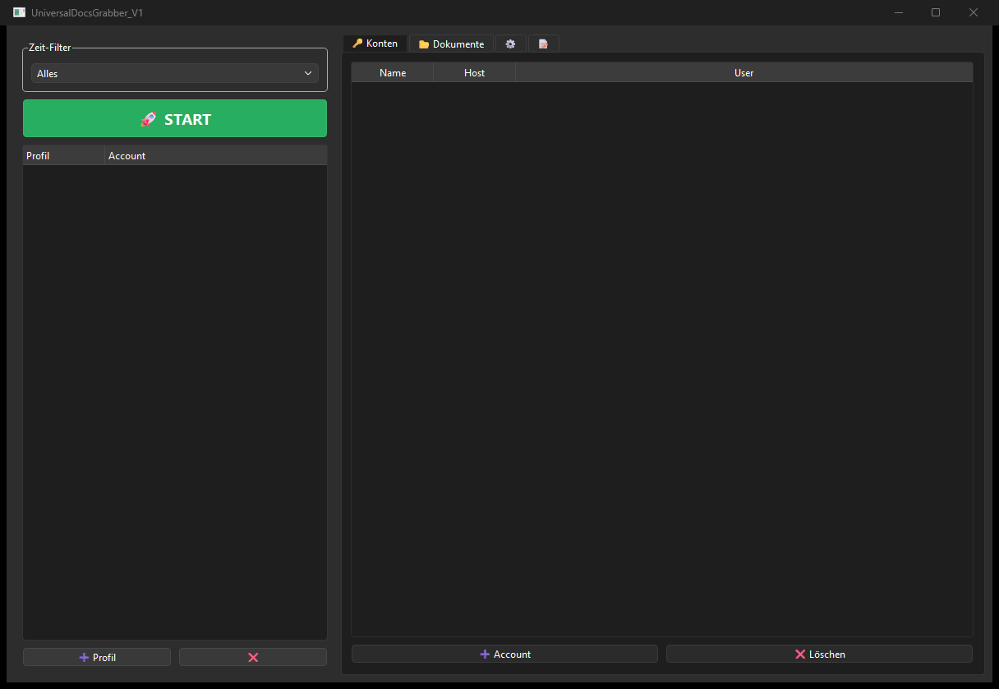
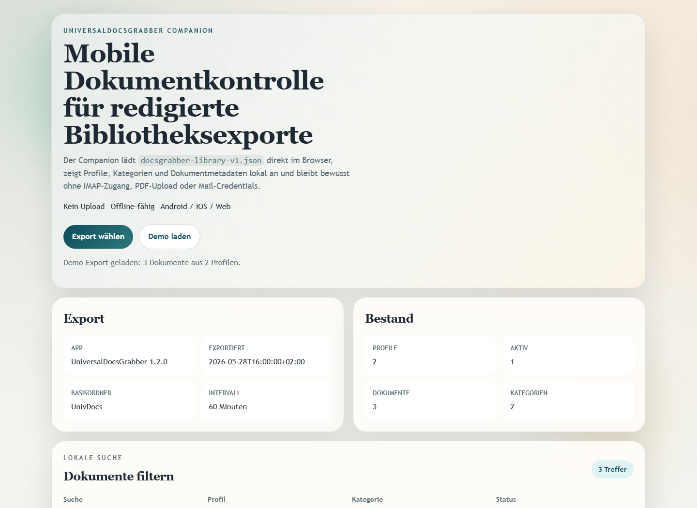

# UniversalDocsGrabber

Local-first email attachment downloader and document organizer for Windows.
UniversalDocsGrabber connects to IMAP or Gmail-compatible mailboxes, downloads
PDF, Office, image, and mail-body documents, converts them to PDF when useful,
deduplicates files with SHA-256 hashes, and keeps the indexed archive on your
own machine.

Use it for invoice collection, contract archiving, insurance mail, application
documents, tax folders, shipping notices, and other recurring mailbox-to-folder
workflows where a full cloud document system would be too heavy.

> **Deutsche Dokumentation:** [README-DE.md](README-DE.md)






## Start Here

| Need | Start with |
|------|------------|
| Collect recurring invoice, insurance, tax, contract, or shipping documents from mailboxes | `python UniversalDocsGrabberV1.py` |
| Review a redacted document library on another device without exposing mail credentials | `web_companion/index.html?demo=1` |
| Integrate or audit the companion export format | [EXPORTFORMAT.md](EXPORTFORMAT.md) |
| Contribute to the project | [CONTRIBUTING.md](CONTRIBUTING.md) |

## Why UniversalDocsGrabber

- **Purpose-built for mailbox documents:** IMAP profiles, Gmail raw queries,
  sender/subject/date filters, attachment download, PDF conversion, OCR, and
  categorization are handled in one desktop workflow.
- **Private by default:** account settings and indexed document metadata stay
  local; exports for the Web/PWA companion are redacted and do not include
  credentials, mail bodies, or document files.
- **Useful beyond the desktop:** the static Web/PWA companion opens a redacted
  `docsgrabber-library-v1.json` export for mobile review, search, and status
  checks without turning the browser into a mail client.

## Features

- Multi-account IMAP support
- Search profiles with sender, subject, and date filters
- Downloads PDF, DOCX, DOC, JPG, PNG, and other document types
- Automatic PDF conversion for documents, images, and text bodies
- OCR support for scanned PDFs via Tesseract
- SHA-256 hash-based duplicate detection
- Built-in scheduler for recurring scans from 15 minutes to 24 hours
- Rule-based auto-categorization for invoices, shipping, contracts, taxes, insurance, and related mail
- Drag-and-drop profile ordering and batch runs for all active profiles
- Gmail raw queries now combine with sender/subject/date filters on servers
  with `X-GM-RAW`; other IMAP servers fall back to classic
  `FROM`/`SUBJECT`/`SINCE` searches
- Local-first storage for account settings and indexed document metadata
- Redacted `docsgrabber-library-v1.json` export for the local Web/PWA companion
- Clearer tab/button labels and tooltips reduce ambiguity for destructive
  actions and download-path selection

## Privacy Model

UniversalDocsGrabber runs locally on your Windows machine. Mail credentials are stored through the operating system keyring when available, while project metadata is kept in the user profile. The application does not ship with telemetry, cloud sync, or a hosted backend.

## Installation

### Requirements

- Python 3.8+
- Microsoft Word for Word-to-PDF conversion via `win32com` on Windows, or
  `docx2pdf` when available
- Optional: Tesseract OCR
- Optional: Poppler

### Setup

```bash
pip install -r requirements.txt
```

### Optional: Poppler

1. Download from <https://github.com/oschwartz10612/poppler-windows/releases>
2. Extract to `C:\Program Files\poppler\`
3. Adjust `POPPLER_PATH` in `UniversalDocsGrabberV1.py` if needed

### Optional: Tesseract

1. Download from <https://github.com/UB-Mannheim/tesseract/wiki>
2. Install to `C:\Program Files\Tesseract-OCR\`
3. Add to `PATH`

## Run

```bash
python UniversalDocsGrabberV1.py
```

or double-click `START.bat`.

## Typical Workflow

1. Add an IMAP account in the `Accounts` tab
2. Create a search profile with group, filters, and target folder
3. Set a date range
4. Start a single profile or scan all active profiles with `START`
5. Browse results in the `Documents` tab
6. Use `Settings -> Companion-Export -> Redigierten Export speichern...` for a redacted library snapshot
7. Optionally open `web_companion/index.html` or `?demo=1` to review the export in the local browser companion

## Features in Detail

### Search Profiles

- Group-based organization for thematic sorting
- Drag-and-drop sorting between groups
- Profile-specific override settings
- Per-run date filters

### Conversion

- Word to PDF via Windows `win32com`, with `docx2pdf` kept as an independent
  fallback when available
- TXT to PDF via `reportlab`
- Images to PDF via Pillow
- OCR for PDFs without a text layer

### Scheduler & Auto-Categorization

- Recurring scans from 15 minutes to 24 hours
- Runs skipped if another scan is already active
- Batch execution processes all active profiles grouped by account
- Rule-based auto-categorization for invoices, shipping, contracts, cancellations, taxes, insurance, applications, and banking

### Deduplication

- SHA-256 hash check
- Configurable per profile

## Local Data

- `%USERPROFILE%\.univ_docs_grabber\config_v1.json`
- `%USERPROFILE%\.univ_docs_grabber\documents.json`
- `%USERPROFILE%\Downloads\UnivDocs\`

These files are intentionally ignored by Git because they can contain account names, local paths, document metadata, and downloaded documents.

## Known Limitations

- OCR requires Tesseract and Poppler
- Word conversion requires Microsoft Word through Windows `win32com` or
  `docx2pdf`; if neither path is available, Office conversion is skipped with a
  clear log message
- No LibreOffice-based Office-to-PDF fallback is implemented yet for macOS/Linux
- Search is intentionally conservative and limits the mail count per profile

## Platform Strategy

The Windows desktop app remains the full version for IMAP access, OCR,
conversion, scheduling, and local file storage. macOS and Linux are planned as
source smoke-test targets. Web, Android, and iOS should use the local PWA
companion in `web_companion/` based on a redacted `docsgrabber-library-v1.json`
export instead of a native mail-fetching clone.

The export contains profiles, categories, document metadata, profile statistics,
and redacted path hints, but no credentials, document bodies, or PDF contents.

See [EXPORTFORMAT.md](EXPORTFORMAT.md).

The current companion already supports local import, search, profile/category
overview, document status filters, and a PWA-ready offline shell.

Open the companion locally with `web_companion/index.html?demo=1` to inspect the
demo library, or serve the folder through a simple local HTTP server for PWA
testing.

Source smoke coverage for macOS/Linux is now tracked in
`tests/source_platform_smoke.py` and `.github/workflows/source-platform-smoke.yml`.
The smoke verifies offscreen startup, temporary config roundtrips, graceful
handling when Office converters are unavailable, the `docx2pdf` fallback path
without `win32com`, and clear OCR-runtime reporting when Tesseract/Poppler are
unavailable.

## Development

```bash
python tests/source_platform_smoke.py
python -m pytest -q
python -m py_compile UniversalDocsGrabberV1.py
```

## Related Tools

Part of the [doc-bricks](https://github.com/doc-bricks) mail suite:

| Tool | Description |
|------|-------------|
| [MailProcessor](https://github.com/doc-bricks/MailProcessor) | System tray launcher for all Universal Mail Tools |
| [UniversalMailCleaner](https://github.com/doc-bricks/UniversalMailCleaner) | Rule-based IMAP mailbox cleaner with safe mode |
| [UniversalInvoiceMail](https://github.com/doc-bricks/UniversalInvoiceMail) | Extract invoices and receipts from IMAP mail |

## Discovery Keywords

`email attachment downloader`, `IMAP document downloader`, `Gmail attachment
archive`, `invoice email extraction`, `local-first document management`,
`Windows OCR document organizer`, `PySide6 mail tool`, `offline PWA document
review`.

## Search & Disambiguation

Use the exact name **UniversalDocsGrabber** or the repository path
`doc-bricks/UniversalDocsGrabber` when searching. The project is an email
document downloader and local archive companion, not a generic document viewer,
RAG parser, cloud OCR service, or documentation generator.

Machine-readable project context for crawlers and LLM tools is available in
[llms.txt](llms.txt).

## License

[MIT](LICENSE) - Lukas Geiger
