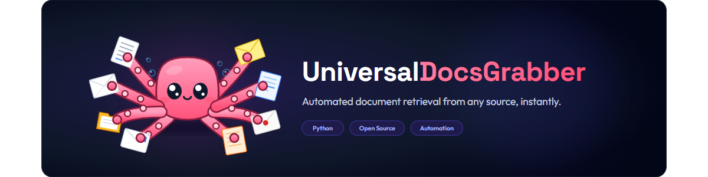
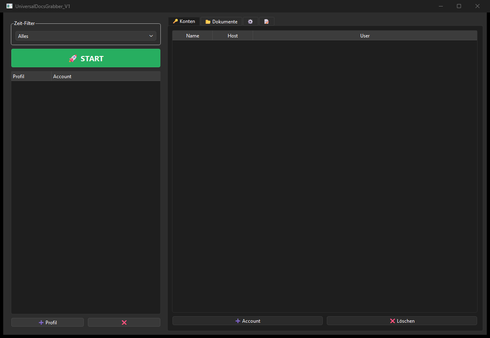
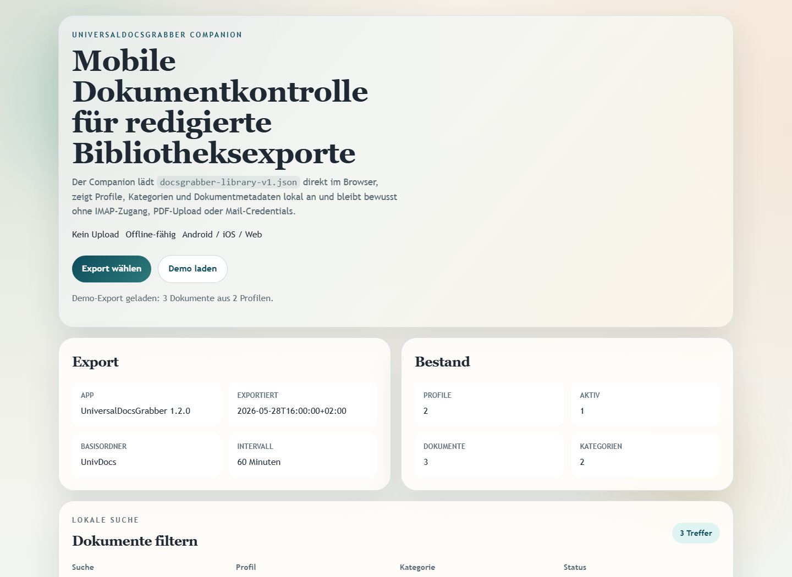
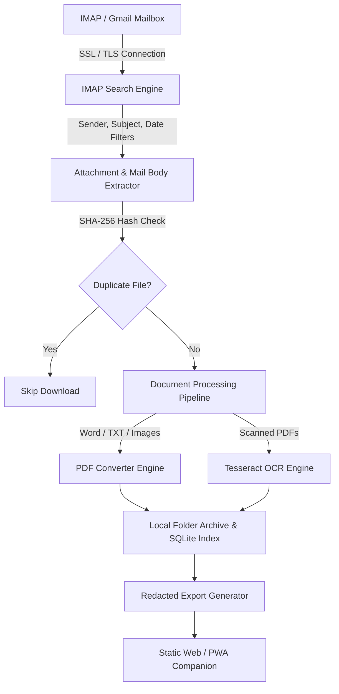
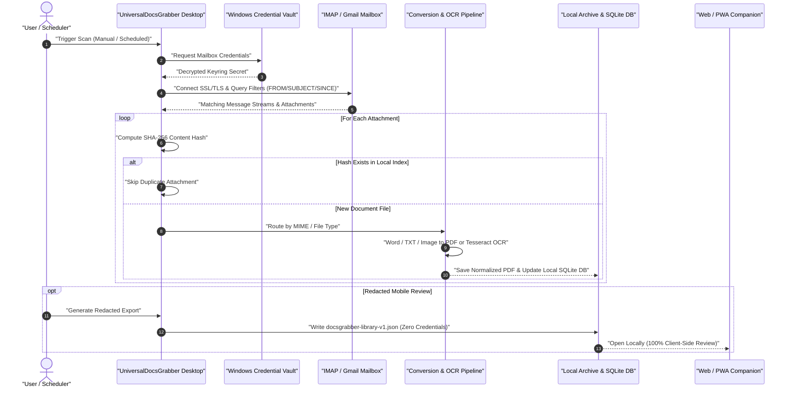

# UniversalDocsGrabber

Local-first email attachment downloader and document organizer for Windows.
UniversalDocsGrabber connects to IMAP or Gmail-compatible mailboxes, downloads
PDF, Office, image, and mail-body documents, converts them to PDF when useful,
deduplicates files with SHA-256 hashes, and keeps the indexed archive on your
own machine.

Use it for invoice collection, contract archiving, insurance mail, application
documents, tax folders, shipping notices, and other recurring mailbox-to-folder
workflows where a full cloud document system would be too heavy.

> **Deutsche Dokumentation:** [README-DE.md](README-DE.md)

[](pyproject.toml)
[](https://github.com/doc-bricks/UniversalDocsGrabber/actions/workflows/ci.yml)
[](tests/)
[](LICENSE)
[](https://github.com/doc-bricks/UniversalDocsGrabber)
[](https://www.python.org/)
[](llms.txt)
[](README.md#privacy-model)
[](SECURITY.md)
[](SECURITY.md)
[](THIRD_PARTY_LICENSES.md)
[](MARKETING-LOG.txt)
[](https://github.com/doc-bricks)
[](https://github.com/open-bricks)
[](llms.txt)

| [⚡ Quick Start](#start-here) | [🏗️ Architecture & Pipeline](#system-architecture--data-flow) | [🔄 Lifecycle Flow](#end-to-end-document-lifecycle) | [📋 Governance & Invariants](#governance--runtime-invariants) | [✨ Features in Detail](#features-in-detail) | [⚙️ Installation & Setup](#installation--setup) | [🔄 Typical Workflow](#typical-workflow) | [🔒 Privacy & Security](#privacy-model) | [📱 Web/PWA Companion](#platform-strategy) | [🧩 Sibling Tools](#ecosystem--sibling-tools) | [⚖️ Comparative Matrix](#comparative-matrix-vs-alternatives) | [🎯 Target Personas](#marketing--target-personas) | [📜 Third-Party Licenses](#third-party-licenses--transparency) | [⚠️ Limitations](#known-limitations) | [🛡️ Security Policy](SECURITY.md) | [🤖 LLM Context](llms.txt) |

Current contract readback (2026-09-14): 78 Pytest tests and 32 Web Companion
Node tests pass (110 total contract tests, 100% green). Android/iOS installation,
offline-start and readability remain separate device/emulator gates. The
cross-platform status matrix is maintained in
[`PORTIERUNGSPLAN.md`](PORTIERUNGSPLAN.md).

The `110 passed` badge counts the 78 Python and 32 Node contract tests; full CI
matrix testing across Windows, Ubuntu, and macOS runs on every commit.

> [!NOTE]
> **AI / LLM Integration & Local Privacy Model**: UniversalDocsGrabber operates 100% locally. Account credentials are stored securely via the Windows Credential Vault. The static Web/PWA companion works off a redacted export format (`docsgrabber-library-v1.json`) that strictly omits credentials, mail bodies, and raw PDF contents, making it safe for cross-device mobile review or LLM-assisted document auditing. For complete AI indexing schema, refer to [`llms.txt`](llms.txt) and [`EXPORTFORMAT.md`](EXPORTFORMAT.md).






## Start Here

| Need | Start with |
|------|------------|
| Collect recurring invoice, insurance, tax, contract, or shipping documents from mailboxes | `python UniversalDocsGrabberV1.py` |
| Review a redacted document library on another device without exposing mail credentials | `web_companion/index.html?demo=1` |
| Integrate or audit the companion export format | [EXPORTFORMAT.md](EXPORTFORMAT.md) |
| Contribute to the project | [CONTRIBUTING.md](CONTRIBUTING.md) |

## Why UniversalDocsGrabber

- **Purpose-built for mailbox documents:** IMAP profiles, Gmail raw queries,
  sender/subject/date filters, attachment download, PDF conversion, OCR, and
  categorization are handled in one desktop workflow.
- **Private by default:** account settings and indexed document metadata stay
  local; exports for the Web/PWA companion are redacted and do not include
  credentials, mail bodies, or document files.
- **Useful beyond the desktop:** the static Web/PWA companion opens a redacted
  `docsgrabber-library-v1.json` export for mobile review, search, and status
  checks without turning the browser into a mail client.

## Features

- Multi-account IMAP support
- Search profiles with sender, subject, and date filters
- Downloads PDF, DOCX, DOC, JPG, PNG, and other document types
- Automatic PDF conversion for documents, images, and text bodies
- OCR support for scanned PDFs via Tesseract
- SHA-256 hash-based duplicate detection
- Built-in scheduler for recurring scans from 15 minutes to 24 hours
- Rule-based auto-categorization for invoices, shipping, contracts, taxes, insurance, and related mail
- Drag-and-drop profile ordering and batch runs for all active profiles
- Gmail raw queries now combine with sender/subject/date filters on servers
  with `X-GM-RAW`; other IMAP servers fall back to classic
  `FROM`/`SUBJECT`/`SINCE` searches
- Local-first storage for account settings and indexed document metadata
- Redacted `docsgrabber-library-v1.json` export for the local Web/PWA companion
- Clearer tab/button labels and tooltips reduce ambiguity for destructive
  actions and download-path selection

## System Architecture & Data Flow


```mermaid
graph TD
    A["IMAP / Gmail Mailbox"] -->|SSL / TLS Connection| B["IMAP Search Engine"]
    B -->|Sender, Subject, Date Filters| C["Attachment & Mail Body Extractor"]
    C -->|SHA-256 Hash Check| D{"Duplicate File?"}
    D -->|Yes| E["Skip Download"]
    D -->|No| F["Document Processing Pipeline"]
    F -->|Word / TXT / Images| G["PDF Converter Engine"]
    F -->|Scanned PDFs| H["Tesseract OCR Engine"]
    G --> I["Local Folder Archive & SQLite Index"]
    H --> I
    I --> J["Redacted Export Generator"]
    J --> K["Static Web / PWA Companion"]
```

### End-to-End Document Lifecycle


```mermaid
sequenceDiagram
    autonumber
    actor User as "User / Scheduler"
    participant App as "UniversalDocsGrabber Desktop"
    participant Vault as "Windows Credential Vault"
    participant IMAP as "IMAP / Gmail Mailbox"
    participant Pipeline as "Conversion & OCR Pipeline"
    participant Storage as "Local Archive & SQLite DB"
    participant PWA as "Web / PWA Companion"

    User->>App: "Trigger Scan (Manual / Scheduled)"
    App->>Vault: "Request Mailbox Credentials"
    Vault-->>App: "Decrypted Keyring Secret"
    App->>IMAP: "Connect SSL/TLS & Query Filters (FROM/SUBJECT/SINCE)"
    IMAP-->>App: "Matching Message Streams & Attachments"
    loop For Each Attachment
        App->>App: "Compute SHA-256 Content Hash"
        alt Hash Exists in Local Index
            App->>App: "Skip Duplicate Attachment"
        else New Document File
            App->>Pipeline: "Route by MIME / File Type"
            Pipeline->>Pipeline: "Word / TXT / Image to PDF or Tesseract OCR"
            Pipeline-->>Storage: "Save Normalized PDF & Update Local SQLite DB"
        end
    end
    opt Redacted Mobile Review
        User->>App: "Generate Redacted Export"
        App->>Storage: "Write docsgrabber-library-v1.json (Zero Credentials)"
        Storage-->>PWA: "Open Locally (100% Client-Side Review)"
    end
```

## Governance & Runtime Invariants

The application adheres to ten architectural and operational invariants:

| ID | Invariant | Description & Architectural Boundary | Enforcement & Audit Evidence |
|---|---|---|---|
| `INV-LOCAL-01` | **Local-First & Zero-Egress** | 100% offline document parsing, OCR, and PDF generation. Zero outbound network traffic or telemetry. | Zero HTTP sockets during ingestion; air-gap capable |
| `INV-SEC-02` | **RunAsInvoker Privilege Boundary** | Operates strictly in unprivileged user space. Never requests administrative elevation. | Non-elevated execution profile |
| `INV-CRED-03` | **OS Keyring Vaulting** | Mail passwords and OAuth secrets are encrypted in Windows Credential Vault; never in plaintext. | `keyring` integration |
| `INV-REDACT-04` | **Sanitized Export Schema** | Mobile export `docsgrabber-library-v1.json` strictly excludes credentials, tokens, mail bodies, and raw PDFs. | `test_export_format.py` & JSON schema validation |
| `INV-HASH-05` | **SHA-256 Deduplication** | Cryptographic content hash prevents re-downloading and storing duplicate documents across profiles. | `hashlib.sha256` digest match |
| `INV-FALL-06` | **Graceful Fallbacks** | Clean error handling when optional converters (Word OLE, Poppler, Tesseract) are missing without fatal crashes. | `tests/source_platform_smoke.py` |
| `INV-PWA-07` | **Zero-Dependency PWA** | Static web companion runs purely on native browser APIs, Service Workers, and zero external CDN/NPM libraries. | `web_companion/package.json` (0 dependencies) |
| `INV-LIC-08` | **100% Permissive Open Source** | MIT base with LGPLv3 dynamic linking transparency and user library replacement freedom. | `THIRD_PARTY_LICENSES.md` audit |
| `INV-SLA-09` | **48h Security Response SLA** | Vulnerability reports acknowledged within 48 hours; triage completed within 5 business days. | `SECURITY.md` SLA policy |
| `INV-PAR-10` | **Bilingual Contract Parity** | 100% symmetry across English and German documentation, navigation anchors, and contract tests. | `tests/test_metadata.py` verification |

## Features in Detail

### Search Profiles

- Group-based organization for thematic sorting
- Drag-and-drop sorting between groups
- Profile-specific override settings
- Per-run date filters

### Conversion

- Word to PDF via Windows `win32com`, with `docx2pdf` kept as an independent
  fallback when available
- TXT to PDF via `reportlab`
- Images to PDF via Pillow
- OCR for PDFs without a text layer

### Scheduler & Auto-Categorization

- Recurring scans from 15 minutes to 24 hours
- Runs skipped if another scan is already active
- Batch execution processes all active profiles grouped by account
- Rule-based auto-categorization for invoices, shipping, contracts, cancellations, taxes, insurance, applications, and banking

### Deduplication

- SHA-256 hash check
- Configurable per profile

<a name="installation--setup"></a>
## Installation & Setup

### Requirements

- Python 3.8+
- Microsoft Word for Word-to-PDF conversion via `win32com` on Windows, or
  `docx2pdf` when available
- Optional: Tesseract OCR
- Optional: Poppler

### Setup

```bash
pip install -r requirements.txt
```

### Optional: Poppler

1. Download from <https://github.com/oschwartz10612/poppler-windows/releases>
2. Extract to `C:\Program Files\poppler\`
3. Adjust `POPPLER_PATH` in `UniversalDocsGrabberV1.py` if needed

### Optional: Tesseract

1. Download from <https://github.com/UB-Mannheim/tesseract/wiki>
2. Install to `C:\Program Files\Tesseract-OCR\`
3. Add to `PATH`

## Run

```bash
python UniversalDocsGrabberV1.py
```

or double-click `START.bat`.

## Typical Workflow

1. Add an IMAP account in the `Accounts` tab
2. Create a search profile with group, filters, and target folder
3. Set a date range
4. Start a single profile or scan all active profiles with `START`
5. Browse results in the `Documents` tab
6. Use `Settings -> Companion-Export -> Redigierten Export speichern...` for a redacted library snapshot
7. Optionally open `web_companion/index.html` or `?demo=1` to review the export in the local browser companion

<a name="privacy-model"></a>
## Privacy Model & Local Data

UniversalDocsGrabber runs locally on your Windows machine. Mail credentials are stored through the operating system keyring when available, while project metadata is kept in the user profile. The application does not ship with telemetry, cloud sync, or a hosted backend.

- `%USERPROFILE%\.univ_docs_grabber\config_v1.json`
- `%USERPROFILE%\.univ_docs_grabber\documents.json`
- `%USERPROFILE%\Downloads\UnivDocs\`

These files are intentionally ignored by Git because they can contain account names, local paths, document metadata, and downloaded documents.

<a name="platform-strategy"></a>
## Platform Strategy & Web/PWA Companion

The Windows desktop app remains the full version for IMAP access, OCR,
conversion, scheduling, and local file storage. macOS and Linux have source
smoke coverage. Web, Android, and iOS use the local PWA
companion in `web_companion/` based on a redacted `docsgrabber-library-v1.json`
export instead of a native mail-fetching clone.

The export contains profiles, categories, document metadata, profile statistics,
and redacted path hints, but no credentials, document bodies, or PDF contents.

See [EXPORTFORMAT.md](EXPORTFORMAT.md).

The current companion supports local import, search, profile/category overview,
document status filters, and a PWA-ready offline shell. Its manifest,
service-worker, and iOS source requirements are covered by Node tests; actual
Android/iOS install and offline-start evidence remains a separate, open device
or emulator check.

The transfer is intentionally one-way: the desktop creates the redacted export,
the companion reads it locally, and it neither imports edits back into the
desktop app nor creates cloud sync.

Open the companion locally with `web_companion/index.html?demo=1` to inspect the
demo library, or serve the folder through a simple local HTTP server for PWA
testing.

Source smoke coverage for macOS/Linux is now tracked in
`tests/source_platform_smoke.py` and `.github/workflows/source-platform-smoke.yml`.
The smoke verifies offscreen startup, temporary config roundtrips, graceful
handling when Office converters are unavailable, the `docx2pdf` fallback path
without `win32com`, and clear OCR-runtime reporting when Tesseract/Poppler are
unavailable.

## Development

```bash
python tests/source_platform_smoke.py
python -m pytest -q
python -m py_compile UniversalDocsGrabberV1.py
```

## Ecosystem & Sibling Tools

UniversalDocsGrabber is part of the [doc-bricks](https://github.com/doc-bricks) document automation and [open-bricks](https://github.com/open-bricks) desktop ecosystem:

### doc-bricks — Document & Mail Utilities
| Tool | Description |
|------|-------------|
| [MailProcessor](https://github.com/doc-bricks/MailProcessor) | System tray launcher and orchestrator for all Universal Mail Tools |
| [UniversalMailCleaner](https://github.com/doc-bricks/UniversalMailCleaner) | Rule-based IMAP mailbox cleaner with safe preview mode |
| [UniversalInvoiceMail](https://github.com/doc-bricks/UniversalInvoiceMail) | Extract invoices, receipts, and financial documents from IMAP mail |
| [CleanMarkdown](https://github.com/doc-bricks/CleanMarkdown) | Markdown hygiene, dialect linting, and AST cleanup engine |
| [PDFtoPDFocr](https://github.com/doc-bricks/PDFtoPDFocr) | Batch OCR processor adding searchable text layers to scanned PDFs |
| [MediaBrain](https://github.com/doc-bricks/MediaBrain) | Multi-format local media organizer and metadata extractor |

### file-bricks & dev-bricks — Desktop File & Developer Tools
| Tool | Description |
|------|-------------|
| [WinStorePackager](https://github.com/file-bricks/WinStorePackager) | MSIX packaging and Windows Store release preparation |
| [ProFiler](https://github.com/file-bricks/ProFiler) | Fast multi-criteria file search and deduplication suite |
| [ExplorerPro](https://github.com/file-bricks/ExplorerPro) | Enhanced dual-pane local-first file manager for Windows |
| [DevCenter](https://github.com/dev-bricks/DevCenter) | Developer workspace hub and command launcher |
| [WikiStub-Seed](https://github.com/dev-bricks/WikiStub-Seed) | Markdown wiki scaffolding, stub generation, and linting suite |

### ellmos-ai — Autonomous Agent & MCP Infrastructure
| Tool | Description |
|------|-------------|
| [ellmos-filecommander-mcp](https://github.com/ellmos-ai/ellmos-filecommander-mcp) | Production-ready 47-tool MCP server for local filesystem operations, OCR, and safe mode trash routing |
| [ellmos-codecommander-mcp](https://github.com/ellmos-ai/ellmos-codecommander-mcp) | Code intelligence, AST refactoring, JSON fixing, and structural editing MCP tools |
| [n8n-manager-mcp](https://github.com/ellmos-ai/n8n-manager-mcp) | Workflow orchestration, credential governance, and execution lifecycle MCP server |
| [system-explorer](https://github.com/ellmos-ai/system-explorer) | Evidence-based authority resolution, capability binding, and schema audit engine |
| [workflowhooker-provenance](https://github.com/ellmos-ai/workflowhooker-provenance) | Agentic pre-execution briefings, scope guarding, drift warnings, and closing gates |
| [lock-master](https://github.com/ellmos-ai/lock-master) | Multi-agent team locks, file claims, and concurrency dispute resolution |
| [build-your-users-mind](https://github.com/ellmos-ai/build-your-users-mind) | Local user preference modeling and cognitive state tracking engine |

<a name="comparative-matrix-vs-alternatives"></a>
## Comparative Matrix vs Alternatives

UniversalDocsGrabber occupies a distinct operational niche between fragile ad-hoc scripts, resource-heavy enterprise DMS suites, and privacy-invasive cloud SaaS pipelines:

| Architectural & Operational Dimension | UniversalDocsGrabber | Cloud SaaS (DocuWare / Dext / Rossum) | Heavy Enterprise DMS (Paperless-ngx / Mayan) | Traditional Mail Clients (Thunderbird / Outlook Rules) | Ad-Hoc Scripts (Fetchmail / Custom Python) |
|---|---|---|---|---|---|
| **1. Execution & Data Residency** | **100% Local-First** (`INV-LOCAL-01`), Zero-Egress, Air-Gap Capable | Cloud multi-tenant servers, mandatory remote document upload | Self-hosted server / Docker daemon, requires dedicated infra | Local client, but lacks document extraction pipeline | Local workstation, manual CLI execution |
| **2. Security & Privilege Boundary** | **Unprivileged User Mode** (`INV-SEC-02`, `RunAsInvoker`) | Third-party provider trust boundary, shared multitenant risk | Root/Docker daemon permissions, web-exposed attack surface | Unprivileged desktop app space | Depends on execution script permissions |
| **3. Credential Storage & Vaulting** | **Windows Credential Vault** via `keyring` (`INV-CRED-03`) | Centralized SaaS database, cloud OAuth / token exposure | Server environment variables or local SQLite/Postgres secrets | Profile folder password store | Plaintext files (`.netrc`, `.fetchmailrc`) |
| **4. OCR Engine & Text Extraction** | **Integrated Local Tesseract & Poppler** pipeline | Cloud Vision API / Proprietary SaaS OCR engines | Server-side Celery container with Tesseract | None (requires external manual processing) | Manual external CLI piping (`tesseract` CLI) |
| **5. Multi-Format PDF Normalization** | **Automated** (Word via `win32com`/`docx2pdf`, TXT, Images) | Server-side proprietary document converters | Server LibreOffice / ImageMagick daemon | None (saves raw attachment only) | None or brittle shell script chaining |
| **6. Deduplication Engine** | **Cryptographic SHA-256** content hash (`INV-HASH-05`) | Database indexing & heuristic similarity checks | Checksum database index across archive | None (overwrites files or appends numeric suffix) | None or manual `md5sum` scripting |
| **7. Mobile Review Companion** | **Sanitized Redacted Static PWA** (`INV-PWA-07`, 0 credentials) | Proprietary mobile app requiring continuous cloud sync | Web frontend (requires VPN, reverse proxy, or open port) | Mobile IMAP client (exposes full mailbox credentials) | None |
| **8. Automation & Scheduling** | **Native Background Scheduler** (15m–24h) with conflict locks | Continuous cloud polling & webhook triggers | Linux system cron or Celery worker schedule | Active only while desktop mail client GUI is open | Crontab or Windows Task Scheduler |
| **9. Compliance & Privacy Governance** | **GDPR / DSGVO Compliant by Design** (zero external processors) | Requires complex Data Processing Agreements (DPA / AVV) | GDPR compliant if self-hosted infrastructure is secured | Mail host dependent | Local, but unmanaged log auditability |
| **10. Software Freedom & Licensing** | **100% Permissive MIT** + LGPLv3 dynamic linking (`INV-LIC-08`) | Proprietary commercial subscription ($$$/month SaaS) | Open Source (GPLv3 / AGPLv3) or commercial open-core | MPL 2.0 (Thunderbird) / Proprietary (Outlook) | Open Source / Unmaintained scripts |

<a name="marketing--target-personas"></a>
## Marketing & Target Personas

UniversalDocsGrabber is purpose-built to solve acute automation and compliance bottlenecks across four primary personas:

### [PERSONA-1] Solo Entrepreneurs & Small Business Bookkeepers
- **Profile:** Freelancers, agency owners, craftspeople, and bookkeeping teams managing high-volume recurring vendor communications.
- **Acute Pain Point:** Invoices, tax receipts, and payment confirmations arrive across multiple accounts; manually locating, opening, downloading, and sorting them into tax folders consumes hours each month.
- **Applied Solution:** Automated scheduled polling with rule-based auto-categorization for `Rechnungen`, `Steuer`, and `Bank` directly into structured date-organized folders.
- **Typical Workflow:** Daily automated scan at 08:00 -> auto-sorts vendor invoices to `Downloads/UnivDocs/Rechnungen/2026/` -> ready for accounting import.

### [PERSONA-2] Legal, Tax & Compliance Assistants
- **Profile:** Law firms, tax advisory offices, compliance officers, and medical practices handling strictly confidential client records.
- **Acute Pain Point:** Cloud SaaS ingestion tools violate strict confidentiality mandates (e.g., § 203 StGB, GDPR/DSGVO) by uploading privileged documents to third-party servers.
- **Applied Solution:** 100% offline local processing (`INV-LOCAL-01`), OS keyring credential storage (`INV-CRED-03`), and local Tesseract OCR with zero external telemetry.
- **Typical Workflow:** Scheduled ingestion from encrypted client mailboxes -> local OCR for full-text searchability -> zero outbound network packets.

### [PERSONA-3] Privacy-Conscious Power Users & Document Archivists
- **Profile:** Home lab enthusiasts, personal finance archivists, and security researchers demanding absolute data sovereignty.
- **Acute Pain Point:** Heavy self-hosted DMS stacks (Docker, Celery, PostgreSQL) require extensive maintenance; traditional mail clients lack automated PDF normalization.
- **Applied Solution:** Lightweight desktop application with SHA-256 deduplication (`INV-HASH-05`) and a static, zero-dependency Web/PWA companion (`INV-PWA-07`) for offline mobile library review without cloud exposure.
- **Typical Workflow:** One-click companion export -> transfer `docsgrabber-library-v1.json` to tablet/phone -> triage documents completely offline.

### [PERSONA-4] Local-First AI & Automation Engineers
- **Profile:** Developers and agentic AI operators building local LLM/RAG pipelines and autonomous desktop workflows.
- **Acute Pain Point:** Ingestion pipelines require structured, sanitized metadata feeds without risking credential leaks or large binary payload crashes.
- **Applied Solution:** Standardized `docsgrabber-library-v1.json` schema, machine-readable `llms.txt`, and clean local CLI / Python invocation hooks.
- **Typical Workflow:** Desktop app runs in background -> writes sanitized JSON library -> local AI agents ingest document index for semantic search.

For detailed keyword search maps, competitive matrices, and strategic roadmaps, see [MARKETING-LOG.txt](MARKETING-LOG.txt).

<a name="third-party-licenses--transparency"></a>
## Third-Party Licenses & Transparency

UniversalDocsGrabber is built strictly on permissive and open-source foundations:
- The application itself is licensed under [MIT](LICENSE).
- All direct runtime dependencies (pypdf, reportlab, Pillow, xhtml2pdf, keyring, pytesseract, pdf2image, pywin32, docx2pdf) use permissive licenses (MIT, BSD, Apache-2.0, PSF).
- PySide6 is dynamically linked under LGPL-3.0 in strict compliance with Section 4 of LGPLv3, ensuring end-user replacement freedom.
- For complete audit details, upstream links, and compliance declarations, see [THIRD_PARTY_LICENSES.md](THIRD_PARTY_LICENSES.md).

<a name="known-limitations"></a>
## Known Limitations

- OCR requires Tesseract and Poppler
- Word conversion requires Microsoft Word through Windows `win32com` or
  `docx2pdf`; if neither path is available, Office conversion is skipped with a
  clear log message
- No LibreOffice-based Office-to-PDF fallback is implemented yet for macOS/Linux
- Search is intentionally conservative and limits the mail count per profile

## Discovery Keywords

**Global High-Intent Search Phrases (English):**
`email attachment downloader windows`, `local-first IMAP document organizer`, `automatic invoice email extractor python`, `gmail attachment archive tool offline`, `pyside6 mail attachment grabber`, `email to pdf ocr tesseract batch`, `open source document grabber no cloud`, `sha256 email attachment deduplicator`, `offline pwa document review companion`, `zero egress mailbox document scanner`.

**DACH-Region High-Intent Search Phrases (German):**
`E-Mail Anhänge automatisch herunterladen lokal`, `IMAP Dokumenten Downloader Open Source`, `Rechnungen aus E-Mails extrahieren Software`, `Rechnungsablage automatisieren Windows`, `Mail Anhang PDF Konverter OCR Tesseract`, `DSGVO konforme Dokumentenablage E-Mail`, `Lokales E-Mail Archiv ohne Cloud`, `Duplikate Erkennung E-Mail Anhänge SHA-256`, `PWA Dokumenten Übersicht offline`, `UniversalDocsGrabber doc-bricks`.

## Search & Disambiguation

Use the exact name **UniversalDocsGrabber** or the repository path
`doc-bricks/UniversalDocsGrabber` when searching. The project is an email
document downloader and local archive companion, not a generic document viewer,
RAG parser, cloud OCR service, or documentation generator.

Machine-readable project context for crawlers and LLM tools is available in
[llms.txt](llms.txt).

## License

[MIT](LICENSE) - Lukas Geiger