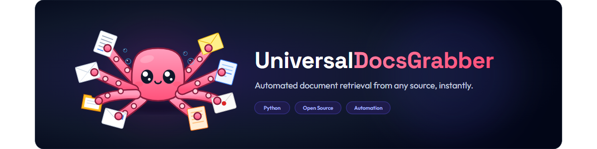
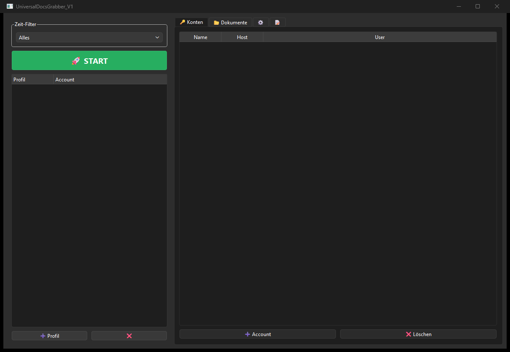
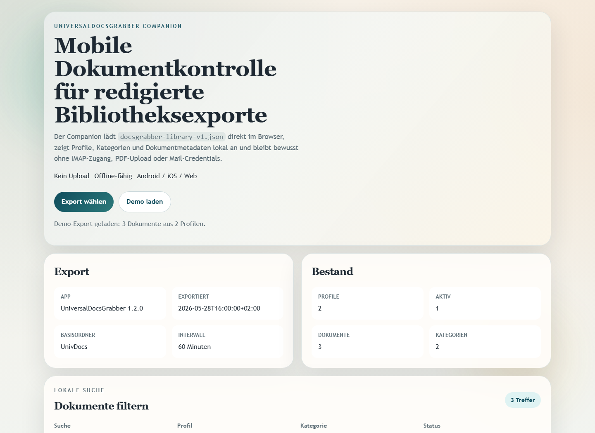
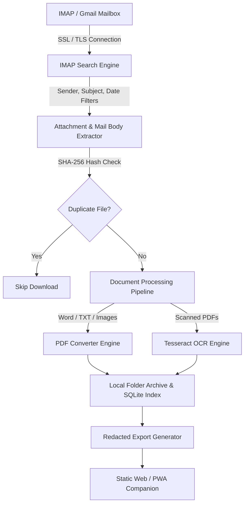
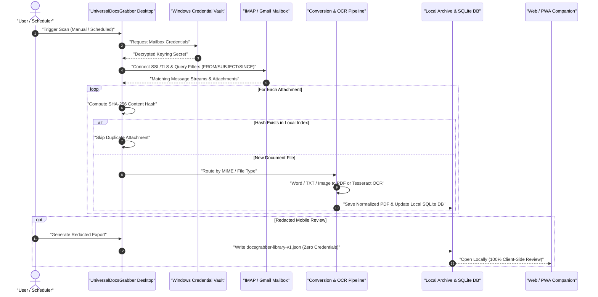

# UniversalDocsGrabber

Local-first email attachment downloader and document organizer for Windows.
UniversalDocsGrabber connects to IMAP or Gmail-compatible mailboxes, downloads
PDF, Office, image, and mail-body documents, converts them to PDF when useful,
deduplicates files with SHA-256 hashes, and keeps the indexed archive on your
own machine.

Use it for invoice collection, contract archiving, insurance mail, application
documents, tax folders, shipping notices, and other recurring mailbox-to-folder
workflows where a full cloud document system would be too heavy.

> **Deutsche Dokumentation:** [README-DE.md](README-DE.md)

[](pyproject.toml)
[](https://github.com/doc-bricks/UniversalDocsGrabber/actions/workflows/ci.yml)
[](tests/)
[](LICENSE)
[](NOTICE)
[](https://github.com/doc-bricks/UniversalDocsGrabber)
[](https://www.python.org/)
[](llms.txt)
[](README.md#sec-11)
[](SECURITY.md)
[](SECURITY.md)
[](THIRD_PARTY_LICENSES.md)
[](MARKETING-LOG.txt)
[](https://github.com/doc-bricks)
[](https://github.com/open-bricks)
[](MARKETING-LOG.txt)
[](llms.txt)

---

### 🧭 Quick Navigation

- [1. Overview & Why This Exists](#1-overview--why-this-exists)
- [2. Key Capabilities & Architecture](#2-key-capabilities--architecture)
- [3. Target Personas & High-Intent Discoverability](#3-target-personas--high-intent-discoverability)
- [4. Comparative Matrix vs. Alternatives](#4-comparative-matrix-vs-alternatives)
- [5. Governance & Runtime Invariants](#5-governance--runtime-invariants)
- [6. Visual Architecture & Flowchart](#6-visual-architecture--flowchart)
- [7. Document Lifecycle Flow](#7-document-lifecycle-flow)
- [8. Typical Workflow & Execution Guide](#8-typical-workflow--execution-guide)
- [9. Installation & Prerequisites](#9-installation--prerequisites)
- [10. Features in Detail & Document Normalization](#10-features-in-detail--document-normalization)
- [11. Privacy Model, Keyring Vault & Local Data](#11-privacy-model-keyring-vault--local-data)
- [12. Web/PWA Companion & Redacted Mobile Review](#12-web-pwa-companion--redacted-mobile-review)
- [13. Sibling Ecosystem Matrix & Integration](#13-sibling-ecosystem-matrix--integration)
- [14. CLI, LLM Context & Machine-Readable Contracts](#14-cli-llm-context--machine-readable-contracts)
- [15. Known Limitations & Edge Cases](#15-known-limitations--edge-cases)
- [16. Development, Toolchain & Automated Test Suite](#16-development-toolchain--automated-test-suite)
- [17. Third-Party Licenses, Zero-Copyleft & Level 1 SBOM](#17-third-party-licenses-zero-copyleft--level-1-sbom)
- [18. Roadmap, Changelog & German Statutory Notice (§ 521 BGB)](#18-roadmap-changelog--german-statutory-notice--521-bgb)

Current contract readback (2026-09-28): 84 Pytest tests and 32 Web Companion Node tests pass (116 total contract tests, 100% green). Android/iOS installation, offline-start and readability remain separate device/emulator gates. The cross-platform status matrix is maintained in [`PORTIERUNGSPLAN.md`](PORTIERUNGSPLAN.md).

> [!NOTE]
> **AI / LLM Integration & Local Privacy Model**: UniversalDocsGrabber operates 100% locally. Account credentials are stored securely via the Windows Credential Vault. The static Web/PWA companion works off a redacted export format (`docsgrabber-library-v1.json`) that strictly omits credentials, mail bodies, and raw PDF contents, making it safe for cross-device mobile review or LLM-assisted document auditing. For complete AI indexing schema, refer to [`llms.txt`](llms.txt) and [`EXPORTFORMAT.md`](EXPORTFORMAT.md).





---

<a id="sec-01"></a><a id="1-overview--why-this-exists"></a><a id="overview--why-this-exists"></a><a id="start-here"></a><a id="1-ueberblick--zweck"></a><a id="ueberblick--zweck"></a><a id="einstieg"></a>
## 1. Overview & Why This Exists

Small businesses, freelancers, tax professionals, and privacy-conscious users regularly deal with documents scattered across multiple email inboxes. Manually downloading attachments, converting legacy document formats, running OCR, and organizing tax or project folders is time-consuming and prone to human error.

Cloud document ingestion services (DocuWare, Dext, Rossum) require uploading sensitive business emails to third-party servers, storing unencrypted credentials in cloud databases, and paying recurring subscriptions.

**UniversalDocsGrabber** delivers a complete, uncompromising **100% Local-First** alternative:
- **Purpose-built for mailbox documents:** IMAP profiles, Gmail raw queries, sender/subject/date filters, attachment download, PDF conversion, OCR, and categorization are handled in one desktop workflow.
- **Private by default:** Account settings and indexed document metadata stay local; exports for the Web/PWA companion are redacted and do not include credentials, mail bodies, or document files.
- **Useful beyond the desktop:** The static Web/PWA companion opens a redacted `docsgrabber-library-v1.json` export for mobile review, search, and status checks without turning the browser into a mail client.

### Start Here

| Need | Start with |
|------|------------|
| Collect recurring invoice, insurance, tax, contract, or shipping documents from mailboxes | `python UniversalDocsGrabberV1.py` |
| Review a redacted document library on another device without exposing mail credentials | `web_companion/index.html?demo=1` |
| Integrate or audit the companion export format | [EXPORTFORMAT.md](EXPORTFORMAT.md) |
| Contribute to the project | [CONTRIBUTING.md](CONTRIBUTING.md) |

---

<a id="sec-02"></a><a id="2-key-capabilities--architecture"></a><a id="key-capabilities--architecture"></a><a id="features"></a><a id="2-kernfunktionen--architektur"></a><a id="kernfunktionen--architektur"></a><a id="funktionen"></a>
## 2. Key Capabilities & Architecture

| Capability | Technical Realization | Benefit |
|---|---|---|
| **Multi-Account IMAP & Gmail** | IMAP4_SSL with `X-GM-RAW` support for Gmail and standard IMAP fallback | Collect attachments from unlimited business and personal mail accounts. |
| **Surgical Query Filtering** | Sender, subject, date window filters, and server-side search expressions | Download only relevant documents, avoiding irrelevant inbox noise. |
| **Multi-Format Document Pipeline** | Downloads PDF, DOCX, DOC, JPG, PNG, TIFF, and plain/HTML mail bodies | Comprehensive ingestion without format gaps. |
| **Automated PDF Normalization** | Word via `win32com` / `docx2pdf`, TXT via ReportLab, Images via Pillow | Archival-quality PDF records generated completely offline. |
| **Local Tesseract OCR** | Local Tesseract OCR engine + `pypdfium2` / Poppler integration | Searchable text layers created for scanned PDFs and image receipts. |
| **Cryptographic Deduplication** | SHA-256 content hashing across local download targets | Prevents duplicate storage and redundant re-downloads across runs. |
| **Background Scheduler** | Native background scheduling (15m to 24h) with active scan collision locks | Unattended document intake without background daemon crashes. |
| **Rule-Based Categorization** | Auto-categorization for invoices, shipping, contracts, tax, insurance, banking | Files routed to topic-specific directories automatically. |
| **Sanitized PWA Companion** | Static `web_companion/` reading zero-credential JSON exports | Review document collections on phones or tablets with zero cloud sync. |
| **DPAPI Keyring Vaulting** | Windows Credential Manager via standard OS `keyring` | Zero plaintext passwords or tokens on disk. |

---

<a id="sec-03"></a><a id="3-target-personas--high-intent-discoverability"></a><a id="target-personas--high-intent-discoverability"></a><a id="marketing--target-personas"></a><a id="3-zielgruppen--suchintentionen"></a><a id="zielgruppen--suchintentionen"></a><a id="marketing--zielgruppen"></a>
## 3. Target Personas & High-Intent Discoverability

UniversalDocsGrabber is purpose-built to solve acute automation and compliance bottlenecks across four primary personas:

### [PERSONA-1] Solo Entrepreneurs & Small Business Bookkeepers
- **Profile:** Freelancers, agency owners, craftspeople, and bookkeeping teams managing high-volume recurring vendor communications.
- **Acute Pain Point:** Invoices, tax receipts, and payment confirmations arrive across multiple accounts; manually locating, opening, downloading, and sorting them into tax folders consumes hours each month.
- **Applied Solution:** Automated scheduled polling with rule-based auto-categorization for `Rechnungen`, `Steuer`, and `Bank` directly into structured date-organized folders.
- **Typical Workflow:** Daily automated scan at 08:00 -> auto-sorts vendor invoices to `Downloads/UnivDocs/Rechnungen/2026/` -> ready for accounting import.

### [PERSONA-2] Legal, Tax & Compliance Assistants
- **Profile:** Law firms, tax advisory offices, compliance officers, and medical practices handling strictly confidential client records.
- **Acute Pain Point:** Cloud SaaS ingestion tools violate strict confidentiality mandates (e.g., § 203 StGB, GDPR/DSGVO) by uploading privileged documents to third-party servers.
- **Applied Solution:** 100% offline local processing (`INV-LOCAL-01`), OS keyring credential storage (`INV-CRED-03`), and local Tesseract OCR with zero external telemetry.
- **Typical Workflow:** Scheduled ingestion from encrypted client mailboxes -> local OCR for full-text searchability -> zero outbound network packets.

### [PERSONA-3] Privacy-Conscious Power Users & Document Archivists
- **Profile:** Home lab enthusiasts, personal finance archivists, and security researchers demanding absolute data sovereignty.
- **Acute Pain Point:** Heavy self-hosted DMS stacks (Docker, Celery, PostgreSQL) require extensive maintenance; traditional mail clients lack automated PDF normalization.
- **Applied Solution:** Lightweight desktop application with SHA-256 deduplication (`INV-HASH-05`) and a static, zero-dependency Web/PWA companion (`INV-PWA-07`) for offline mobile library review without cloud exposure.
- **Typical Workflow:** One-click companion export -> transfer `docsgrabber-library-v1.json` to tablet/phone -> triage documents completely offline.

### [PERSONA-4] Local-First AI & Automation Engineers
- **Profile:** Developers and agentic AI operators building local LLM/RAG pipelines and autonomous desktop workflows.
- **Acute Pain Point:** Ingestion pipelines require structured, sanitized metadata feeds without risking credential leaks or large binary payload crashes.
- **Applied Solution:** Standardized `docsgrabber-library-v1.json` schema, machine-readable `llms.txt`, and clean local CLI / Python invocation hooks.
- **Typical Workflow:** Desktop app runs in background -> writes sanitized JSON library -> local AI agents ingest document index for semantic search.

### High-Intent Discovery Keywords

**Global High-Intent Search Phrases (English):**
`email attachment downloader windows`, `local-first IMAP document organizer`, `automatic invoice email extractor python`, `gmail attachment archive tool offline`, `pyside6 mail attachment grabber`, `email to pdf ocr tesseract batch`, `open source document grabber no cloud`, `sha256 email attachment deduplicator`, `offline pwa document review companion`, `zero egress mailbox document scanner`.

**DACH-Region High-Intent Search Phrases (German):**
`E-Mail Anhänge automatisch herunterladen lokal`, `IMAP Dokumenten Downloader Open Source`, `Rechnungen aus E-Mails extrahieren Software`, `Rechnungsablage automatisieren Windows`, `Mail Anhang PDF Konverter OCR Tesseract`, `DSGVO konforme Dokumentenablage E-Mail`, `Lokales E-Mail Archiv ohne Cloud`, `Duplikate Erkennung E-Mail Anhänge SHA-256`, `PWA Dokumenten Übersicht offline`, `UniversalDocsGrabber doc-bricks`.

---

<a id="sec-04"></a><a id="4-comparative-matrix-vs-alternatives"></a><a id="comparative-matrix-vs-alternatives"></a><a id="4-vergleichsmatrix-gegenueber-alternativen"></a><a id="vergleichsmatrix-gegenueber-alternativen"></a><a id="vergleichsmatrix-gegenüber-alternativen"></a>
## 4. Comparative Matrix vs. Alternatives

UniversalDocsGrabber occupies a distinct operational niche between fragile ad-hoc scripts, resource-heavy enterprise DMS suites, and privacy-invasive cloud SaaS pipelines:

| Architectural & Operational Dimension | UniversalDocsGrabber | Cloud SaaS (DocuWare / Dext / Rossum) | Heavy Enterprise DMS (Paperless-ngx / Mayan) | Traditional Mail Clients (Thunderbird / Outlook Rules) | Ad-Hoc Scripts (Fetchmail / Custom Python) |
|---|---|---|---|---|---|
| **1. Execution & Data Residency** | **100% Local-First** (`INV-LOCAL-01`), Zero-Egress, Air-Gap Capable | Cloud multi-tenant servers, mandatory remote document upload | Self-hosted server / Docker daemon, requires dedicated infra | Local client, but lacks document extraction pipeline | Local workstation, manual CLI execution |
| **2. Security & Privilege Boundary** | **Unprivileged User Mode** (`INV-SEC-02`, `RunAsInvoker`) | Third-party provider trust boundary, shared multitenant risk | Root/Docker daemon permissions, web-exposed attack surface | Unprivileged desktop app space | Depends on execution script permissions |
| **3. Credential Storage & Vaulting** | **Windows Credential Vault** via `keyring` (`INV-CRED-03`) | Centralized SaaS database, cloud OAuth / token exposure | Server environment variables or local SQLite/Postgres secrets | Profile folder password store | Plaintext files (`.netrc`, `.fetchmailrc`) |
| **4. OCR Engine & Text Extraction** | **Integrated Local Tesseract & Poppler** pipeline | Cloud Vision API / Proprietary SaaS OCR engines | Server-side Celery container with Tesseract | None (requires external manual processing) | Manual external CLI piping (`tesseract` CLI) |
| **5. Multi-Format PDF Normalization** | **Automated** (Word via `win32com`/`docx2pdf`, TXT, Images) | Server-side proprietary document converters | Server LibreOffice / ImageMagick daemon | None (saves raw attachment only) | None or brittle shell script chaining |
| **6. Deduplication Engine** | **Cryptographic SHA-256** content hash (`INV-HASH-05`) | Database indexing & heuristic similarity checks | Checksum database index across archive | None (overwrites files or appends numeric suffix) | None or manual `md5sum` scripting |
| **7. Mobile Review Companion** | **Sanitized Redacted Static PWA** (`INV-PWA-07`, 0 credentials) | Proprietary mobile app requiring continuous cloud sync | Web frontend (requires VPN, reverse proxy, or open port) | Mobile IMAP client (exposes full mailbox credentials) | None |
| **8. Automation & Scheduling** | **Native Background Scheduler** (15m–24h) with conflict locks | Continuous cloud polling & webhook triggers | Linux system cron or Celery worker schedule | Active only while desktop mail client GUI is open | Crontab or Windows Task Scheduler |
| **9. Compliance & Privacy Governance** | **GDPR / DSGVO Compliant by Design** (zero external processors) | Requires complex Data Processing Agreements (DPA / AVV) | GDPR compliant if self-hosted infrastructure is secured | Mail host dependent | Local, but unmanaged log auditability |
| **10. Software Freedom & Licensing** | **100% Permissive MIT** + LGPLv3 dynamic linking (`INV-LIC-08`) | Proprietary commercial subscription ($$$/month SaaS) | Open Source (GPLv3 / AGPLv3) or commercial open-core | MPL 2.0 (Thunderbird) / Proprietary (Outlook) | Open Source / Unmaintained scripts |

---

<a id="sec-05"></a><a id="5-governance--runtime-invariants"></a><a id="governance--runtime-invariants"></a><a id="5-governance--laufzeit-invarianten"></a><a id="governance--laufzeit-invarianten"></a><a id="governance--und-laufzeit-invarianten"></a>
## 5. Governance & Runtime Invariants

The application adheres to ten architectural and operational invariants:

| ID | Invariant | Description & Architectural Boundary | Enforcement & Audit Evidence |
|---|---|---|---|
| `INV-LOCAL-01` | **Local-First & Zero-Egress** | 100% offline document parsing, OCR, and PDF generation. Zero outbound network traffic or telemetry. | Zero HTTP sockets during ingestion; air-gap capable |
| `INV-SEC-02` | **RunAsInvoker Privilege Boundary** | Operates strictly in unprivileged user space. Never requests administrative elevation. | Non-elevated execution profile |
| `INV-CRED-03` | **OS Keyring Vaulting** | Mail passwords and OAuth secrets are encrypted in Windows Credential Vault; never in plaintext. | `keyring` integration |
| `INV-REDACT-04` | **Sanitized Export Schema** | Mobile export `docsgrabber-library-v1.json` strictly excludes credentials, tokens, mail bodies, and raw PDFs. | `test_export_format.py` & JSON schema validation |
| `INV-HASH-05` | **SHA-256 Deduplication** | Cryptographic content hash prevents re-downloading and storing duplicate documents across profiles. | `hashlib.sha256` digest match |
| `INV-FALL-06` | **Graceful Fallbacks** | Clean error handling when optional converters (Word OLE, Poppler, Tesseract) are missing without fatal crashes. | `tests/source_platform_smoke.py` |
| `INV-PWA-07` | **Zero-Dependency PWA** | Static web companion runs purely on native browser APIs, Service Workers, and zero external CDN/NPM libraries. | `web_companion/package.json` (0 dependencies) |
| `INV-LIC-08` | **100% Permissive Open Source** | MIT base with LGPLv3 dynamic linking transparency and user library replacement freedom. | `THIRD_PARTY_LICENSES.md` audit |
| `INV-SLA-09` | **48h Security Response SLA** | Vulnerability reports acknowledged within 48 hours; triage completed within 5 business days. | `SECURITY.md` SLA policy |
| `INV-PAR-10` | **Bilingual Contract Parity** | 100% symmetry across English and German documentation, navigation anchors, and contract tests. | `tests/test_metadata.py` verification |

---

<a id="sec-06"></a><a id="6-visual-architecture--flowchart"></a><a id="visual-architecture--flowchart"></a><a id="system-architecture--data-flow"></a><a id="6-visuelle-systemarchitektur--ablaufdiagramm"></a><a id="visuelle-systemarchitektur--ablaufdiagramm"></a><a id="systemarchitektur--datenfluss"></a>
## 6. Visual Architecture & Flowchart


```mermaid
graph TD
    A["IMAP / Gmail Mailbox"] -->|SSL / TLS Connection| B["IMAP Search Engine"]
    B -->|Sender, Subject, Date Filters| C["Attachment & Mail Body Extractor"]
    C -->|SHA-256 Hash Check| D{"Duplicate File?"}
    D -->|Yes| E["Skip Download"]
    D -->|No| F["Document Processing Pipeline"]
    F -->|Word / TXT / Images| G["PDF Converter Engine"]
    F -->|Scanned PDFs| H["Tesseract OCR Engine"]
    G --> I["Local Folder Archive & SQLite Index"]
    H --> I
    I --> J["Redacted Export Generator"]
    J --> K["Static Web / PWA Companion"]
```

---

<a id="sec-07"></a><a id="7-document-lifecycle-flow"></a><a id="document-lifecycle-flow"></a><a id="end-to-end-document-lifecycle"></a><a id="7-end-to-end-dokumenten-lebenszyklus"></a><a id="end-to-end-dokumenten-lebenszyklus"></a>
## 7. Document Lifecycle Flow


```mermaid
sequenceDiagram
    autonumber
    actor User as "User / Scheduler"
    participant App as "UniversalDocsGrabber Desktop"
    participant Vault as "Windows Credential Vault"
    participant IMAP as "IMAP / Gmail Mailbox"
    participant Pipeline as "Conversion & OCR Pipeline"
    participant Storage as "Local Archive & SQLite DB"
    participant PWA as "Web / PWA Companion"

    User->>App: "Trigger Scan (Manual / Scheduled)"
    App->>Vault: "Request Mailbox Credentials"
    Vault-->>App: "Decrypted Keyring Secret"
    App->>IMAP: "Connect SSL/TLS & Query Filters (FROM/SUBJECT/SINCE)"
    IMAP-->>App: "Matching Message Streams & Attachments"
    loop For Each Attachment
        App->>App: "Compute SHA-256 Content Hash"
        alt Hash Exists in Local Index
            App->>App: "Skip Duplicate Attachment"
        else New Document File
            App->>Pipeline: "Route by MIME / File Type"
            Pipeline->>Pipeline: "Word / TXT / Image to PDF or Tesseract OCR"
            Pipeline-->>Storage: "Save Normalized PDF & Update Local SQLite DB"
        end
    end
    opt Redacted Mobile Review
        User->>App: "Generate Redacted Export"
        App->>Storage: "Write docsgrabber-library-v1.json (Zero Credentials)"
        Storage-->>PWA: "Open Locally (100% Client-Side Review)"
    end
```

---

<a id="sec-08"></a><a id="8-typical-workflow--execution-guide"></a><a id="typical-workflow--execution-guide"></a><a id="typical-workflow"></a><a id="8-typischer-arbeitsablauf--ausfuehrung"></a><a id="typischer-arbeitsablauf--ausfuehrung"></a><a id="typischer-arbeitsablauf"></a>
## 8. Typical Workflow & Execution Guide

1. **Add Mail Accounts**: In the `Accounts` tab, configure IMAP credentials (host, port, username, password/app-token). Credentials are immediately secured in the Windows Credential Vault via `keyring`.
2. **Define Search Profiles**: Create profiles with target folder paths, subject filters, sender filters, and date constraints.
3. **Execute Search & Extraction**: Start an individual profile or click `START` to batch process all active profiles across all configured accounts.
4. **Inspect Extracted Documents**: Review downloaded and converted documents in the `Documents` tab, sorted by category, date, and hash.
5. **Generate Companion Export**: Select `Settings -> Companion-Export -> Redigierten Export speichern...` to create a sanitized `docsgrabber-library-v1.json`.
6. **Mobile Offline Review**: Open `web_companion/index.html` or `?demo=1` in any browser or add it as a PWA on your mobile device to search and review metadata offline.

---

<a id="sec-09"></a><a id="9-installation--prerequisites"></a><a id="installation--prerequisites"></a><a id="installation--setup"></a><a id="9-installation--systemvoraussetzungen"></a><a id="installation--systemvoraussetzungen"></a><a id="installation--einrichtung"></a>
## 9. Installation & Prerequisites

### Requirements

- Python 3.8+ (Windows, macOS, or Linux)
- Microsoft Word for Word-to-PDF conversion via `win32com` on Windows, or `docx2pdf` when available
- Optional: Tesseract OCR (for scanned PDF OCR)
- Optional: Poppler (`pdftoppm` for PDF page image rendering)

### Setup

```bash
pip install -r requirements.txt
```

### Optional: Poppler Setup (Windows)

1. Download from <https://github.com/oschwartz10612/poppler-windows/releases>
2. Extract to `C:\Program Files\poppler\`
3. Adjust `POPPLER_PATH` in `UniversalDocsGrabberV1.py` if needed

### Optional: Tesseract Setup (Windows)

1. Download from <https://github.com/UB-Mannheim/tesseract/wiki>
2. Install to `C:\Program Files\Tesseract-OCR\`
3. Add to system `PATH`

### Running the Application

```bash
python UniversalDocsGrabberV1.py
```

or double-click `START.bat`.

---

<a id="sec-10"></a><a id="10-features-in-detail--document-normalization"></a><a id="features-in-detail--document-normalization"></a><a id="features-in-detail"></a><a id="10-funktionen-im-detail--dokumenten-normalisierung"></a><a id="funktionen-im-detail--dokumenten-normalisierung"></a><a id="funktionen-im-detail"></a>
## 10. Features in Detail & Document Normalization

### Search Profiles
- Group-based organization for thematic sorting
- Drag-and-drop sorting between groups
- Profile-specific override settings and individual target directories
- Per-run date filters (`SINCE` / `BEFORE`)

### Conversion Pipeline
- Word to PDF via Windows `win32com`, with `docx2pdf` kept as an independent fallback when available
- TXT to PDF via `reportlab`
- Images to PDF via Pillow
- OCR for PDFs without a text layer via Tesseract

### Scheduler & Auto-Categorization
- Recurring scans from 15 minutes to 24 hours
- Automatic collision detection: scans skipped if another scan is actively running
- Batch execution processes all active profiles grouped by account
- Rule-based auto-categorization for invoices, shipping, contracts, cancellations, taxes, insurance, applications, and banking

### Deduplication Engine
- Cryptographic SHA-256 hash check before writing files to disk
- Configurable per profile to avoid re-downloading existing records

---

<a id="sec-11"></a><a id="11-privacy-model-keyring-vault--local-data"></a><a id="privacy-model-keyring-vault--local-data"></a><a id="privacy-model"></a><a id="11-datenschutzmodell-keyring-tresor--lokale-daten"></a><a id="datenschutzmodell-keyring-tresor--lokale-daten"></a><a id="datenschutzmodell"></a>
## 11. Privacy Model, Keyring Vault & Local Data

UniversalDocsGrabber operates strictly on local hardware. Mail credentials are encrypted through the operating system keyring, while profile and document metadata are stored under the user profile directory. The application embeds zero telemetry, zero analytics, and zero cloud sync mechanisms.

Local state files:
- `%USERPROFILE%\.univ_docs_grabber\config_v1.json` (Accounts and search profiles)
- `%USERPROFILE%\.univ_docs_grabber\documents.json` (Indexed documents and deduplication hashes)
- `%USERPROFILE%\Downloads\UnivDocs\` (Default document storage directory)

These files are ignored by version control to guarantee that private account identifiers, paths, and retrieved documents remain strictly confidential.

---

<a id="sec-12"></a><a id="12-web-pwa-companion--redacted-mobile-review"></a><a id="web-pwa-companion--redacted-mobile-review"></a><a id="platform-strategy"></a><a id="12-web-pwa-begleiter--redigierte-mobile-einsicht"></a><a id="web-pwa-begleiter--redigierte-mobile-einsicht"></a><a id="plattform-strategie"></a>
## 12. Web/PWA Companion & Redacted Mobile Review

The Windows desktop app serves as the full processing engine for IMAP access, OCR, conversion, scheduling, and local file storage. For secondary mobile review on tablets, phones, or auxiliary workstations, UniversalDocsGrabber includes a static Web/PWA companion in `web_companion/`.

- **Redacted Schema (`docsgrabber-library-v1.json`)**: Contains profile definitions, document metadata, categories, and summary counts, but **strictly zero passwords, tokens, mail bodies, or PDF payloads**.
- **100% Offline-First**: Built with pure native JavaScript, HTML5, CSS3, and a Service Worker (`sw.js`). Zero external npm packages, zero CDNs, zero third-party scripts.
- **One-Way Architecture**: Data transfers strictly one way (Desktop -> Companion Export). The companion does not send telemetry or mutate desktop state.
- **Demo Mode**: Test the companion instantly with `web_companion/index.html?demo=1`.

Cross-platform source smoke tests cover offscreen execution, config roundtrips, and fallback paths on macOS/Linux (see `tests/source_platform_smoke.py`).

---

<a id="sec-13"></a><a id="13-sibling-ecosystem-matrix--integration"></a><a id="sibling-ecosystem-matrix--integration"></a><a id="ecosystem--sibling-tools"></a><a id="13-oekosystem--geschwister-werkzeuge"></a><a id="oekosystem--geschwister-werkzeuge"></a><a id="ökosystem--geschwister-tools"></a>
## 13. Sibling Ecosystem Matrix & Integration

UniversalDocsGrabber is part of the [doc-bricks](https://github.com/doc-bricks) document automation and [open-bricks](https://github.com/open-bricks) desktop ecosystem:

### doc-bricks — Document & Mail Utilities
| Tool | Description |
|------|-------------|
| [MailProcessor](https://github.com/doc-bricks/MailProcessor) | System tray launcher and orchestrator for all Universal Mail Tools |
| [UniversalMailCleaner](https://github.com/doc-bricks/UniversalMailCleaner) | Rule-based IMAP mailbox cleaner with safe preview mode |
| [UniversalInvoiceMail](https://github.com/doc-bricks/UniversalInvoiceMail) | Extract invoices, receipts, and financial documents from IMAP mail |
| [CleanMarkdown](https://github.com/doc-bricks/CleanMarkdown) | Markdown hygiene, dialect linting, and AST cleanup engine |
| [PDFtoPDFocr](https://github.com/doc-bricks/PDFtoPDFocr) | Batch OCR processor adding searchable text layers to scanned PDFs |
| [MediaBrain](https://github.com/doc-bricks/MediaBrain) | Multi-format local media organizer and metadata extractor |

### file-bricks & dev-bricks — Desktop File & Developer Tools
| Tool | Description |
|------|-------------|
| [WinStorePackager](https://github.com/file-bricks/WinStorePackager) | MSIX packaging and Windows Store release preparation |
| [ProFiler](https://github.com/file-bricks/ProFiler) | Fast multi-criteria file search and deduplication suite |
| [ExplorerPro](https://github.com/file-bricks/ExplorerPro) | Enhanced dual-pane local-first file manager for Windows |
| [DevCenter](https://github.com/dev-bricks/DevCenter) | Developer workspace hub and command launcher |
| [WikiStub-Seed](https://github.com/dev-bricks/WikiStub-Seed) | Markdown wiki scaffolding, stub generation, and linting suite |

### ellmos-ai — Autonomous Agent & MCP Infrastructure
| Tool | Description |
|------|-------------|
| [ellmos-filecommander-mcp](https://github.com/ellmos-ai/ellmos-filecommander-mcp) | Production-ready 47-tool MCP server for local filesystem operations, OCR, and safe mode trash routing |
| [ellmos-codecommander-mcp](https://github.com/ellmos-ai/ellmos-codecommander-mcp) | Code intelligence, AST refactoring, JSON fixing, and structural editing MCP tools |
| [n8n-manager-mcp](https://github.com/ellmos-ai/n8n-manager-mcp) | Workflow orchestration, credential governance, and execution lifecycle MCP server |
| [system-explorer](https://github.com/ellmos-ai/system-explorer) | Evidence-based authority resolution, capability binding, and schema audit engine |
| [workflowhooker-provenance](https://github.com/ellmos-ai/workflowhooker-provenance) | Agentic pre-execution briefings, scope guarding, drift warnings, and closing gates |
| [lock-master](https://github.com/ellmos-ai/lock-master) | Multi-agent team locks, file claims, and concurrency dispute resolution |
| [build-your-users-mind](https://github.com/ellmos-ai/build-your-users-mind) | Local user preference modeling and cognitive state tracking engine |

---

<a id="sec-14"></a><a id="14-cli-llm-context--machine-readable-contracts"></a><a id="cli-llm-context--machine-readable-contracts"></a><a id="14-cli-llm-kontext--maschinenlesbare-vertraege"></a><a id="cli-llm-kontext--maschinenlesbare-vertraege"></a>
## 14. CLI, LLM Context & Machine-Readable Contracts

UniversalDocsGrabber exposes clear, machine-readable interfaces for automation workflows, AI agents, and local language models:
- **Headless CLI (`cli.py` / `UniversalDocsGrabberV1.py`)**: Execute automation queries, inventory lookups, and library/CSV exports without spawning Qt GUI windows:
  ```bash
  # Check version & stack diagnostics
  python cli.py --version
  python cli.py --diagnose --json

  # List profiles or accounts (passwords automatically masked)
  python cli.py --list-profiles --json
  python cli.py --list-accounts

  # List indexed documents with filtering
  python cli.py --list-documents --profile "Invoices" --limit 20 --json

  # Export companion library or tabular CSV
  python cli.py --export-library ./library_export.json
  python cli.py --export-csv ./documents_export.csv --json
  ```
- **`llms.txt`**: Standardized RAG and LLM context index providing system architecture summaries, parameter specifications, file paths, and security boundaries.
- **`EXPORTFORMAT.md`**: Formal JSON contract definition for `docsgrabber-library-v1.json`, detailing mandatory and optional fields, redaction guarantees, and schema versions.
- **Python Integration**: Modular design allows direct programmatic imports of core extraction, filtering, and normalization routines.

---

<a id="sec-15"></a><a id="15-known-limitations--edge-cases"></a><a id="known-limitations--edge-cases"></a><a id="known-limitations"></a><a id="15-bekannte-einschraenkungen--sonderfaelle"></a><a id="bekannte-einschraenkungen--sonderfaelle"></a><a id="bekannte-einschränkungen"></a>
## 15. Known Limitations & Edge Cases

- **OCR Prerequisites**: OCR requires external Tesseract-OCR and Poppler installations on the host system.
- **Word Conversion**: Word-to-PDF conversion relies on Microsoft Word OLE automation via `win32com` on Windows, or `docx2pdf` when present; if unavailable, Office conversions are gracefully skipped with an informative log message.
- **LibreOffice Fallback**: Headless LibreOffice conversion for macOS/Linux is planned but not yet implemented.
- **Search Throttling**: IMAP search queries are throttled to prevent server-side rate-limiting on restrictive providers.

---

<a id="sec-16"></a><a id="16-development-toolchain--automated-test-suite"></a><a id="development-toolchain--automated-test-suite"></a><a id="development"></a><a id="16-entwicklung-toolchain--automatisierte-testsuite"></a><a id="entwicklung-toolchain--automatisierte-testsuite"></a><a id="entwicklung"></a>
## 16. Development, Toolchain & Automated Test Suite

```bash
# Run complete Python contract and unit test suite
PYTHONIOENCODING=utf-8 python -m pytest -ra -q

# Run headless UI smoke tests
QT_QPA_PLATFORM=offscreen python tests/source_platform_smoke.py

# Run static Web/PWA companion test suite (Node.js test runner)
node --test web_companion/tests/*.test.mjs

# Run Ruff linter
ruff check .

# Verify bytecode compilation
python -m compileall -q .
```

---

<a id="sec-17"></a><a id="17-third-party-licenses-zero-copyleft--level-1-sbom"></a><a id="third-party-licenses-zero-copyleft--level-1-sbom"></a><a id="third-party-licenses--transparency"></a><a id="17-drittanbieter-lizenzen-zero-copyleft--level-1-sbom"></a><a id="drittanbieter-lizenzen-zero-copyleft--level-1-sbom"></a><a id="drittanbieter-lizenzen--transparenz"></a>
## 17. Third-Party Licenses, Zero-Copyleft & Level 1 SBOM

UniversalDocsGrabber is built strictly on permissive and open-source foundations:
- The application itself is licensed under the permissive [MIT License](LICENSE) (Lukas Geiger).
- All direct runtime dependencies (pypdf, reportlab, Pillow, xhtml2pdf, keyring, pytesseract, pdf2image, pywin32, docx2pdf) use permissive licenses (MIT, BSD-3-Clause, Apache-2.0, PSF).
- PySide6 is dynamically linked under LGPL-3.0 in strict compliance with Section 4 of LGPLv3, preserving end-user replacement freedom.
- For complete audit details, upstream links, and the Level 1 SBOM Invariant Cross-Reference Matrix (INV-LOCAL-01 to INV-SLA-10), see [THIRD_PARTY_LICENSES.md](THIRD_PARTY_LICENSES.md).
- Canonical project attribution and open-source notices are detailed in [NOTICE](NOTICE).

---

<a id="sec-18"></a><a id="18-roadmap-changelog--german-statutory-notice--521-bgb"></a><a id="roadmap-changelog--german-statutory-notice--521-bgb"></a><a id="18-roadmap-aenderungsprotokoll--gesetzlicher-haftungsausschluss--521-bgb"></a><a id="roadmap-aenderungsprotokoll--gesetzlicher-haftungsausschluss--521-bgb"></a>
## 18. Roadmap, Changelog & German Statutory Notice (§ 521 BGB)

- [x] **v1.1.7 Release**: IMAP & Gmail raw query handling, SHA-256 deduplication, Tesseract OCR integration, and redacted PWA review companion.
- [x] **Pfad A Technical Hygiene & CI Hardening**: Automated stale/welcome workflows, concurrency limits, Level 1 SBOM audit, NOTICE attribution, and lock defense.
- [x] **Pfad B Marketing, Discoverability & Navigation**: 18-point bilateral quick navigation, dual reciprocal anchors (`sec-01`..`sec-18`), 4 target personas, 5-way comparative matrix, 20-topic metadata saturation, and § 521 BGB statutory compliance.
- [ ] **Windows Store Packaging Staging**: Automated MSIX manifest staging and Windows Store packaging.

See [CHANGELOG.md](CHANGELOG.md) for complete historical release logs and [ROADMAP.txt](ROADMAP.txt) for milestone planning.

### German Statutory Notice & Liability Limitation (§ 521 BGB Gefälligkeitsrecht)

The provision of this software and its associated documentation is gratuitous (unentgeltliche Bereitstellung). In accordance with the statutory liability regime under German Civil Law governing gratuitous services (**§ 521 BGB** — *Haftung des Schenkers*), liability for any defects of quality or title (Sach- und Rechtsmängel) is strictly limited to cases of intentional misconduct (**Vorsatz**) and gross negligence (**grobe Fahrlässigkeit**). Any broader statutory warranty or tortious liability for slight negligence is expressly excluded to the fullest extent permitted by applicable law.

### Security Response SLA

Vulnerabilities and security inquiries may be submitted responsibly to `security@open-bricks.org`, `security@ellmos.ai`, or `support@lukasgeiger.com`. Initial receipt is acknowledged within **48 hours**, with severity assessment and triage completed within **5 business days**.