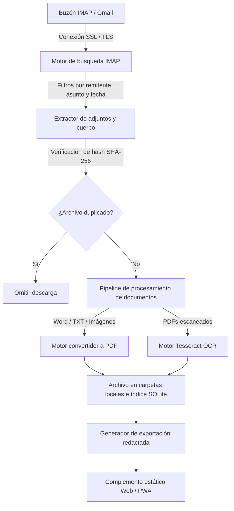
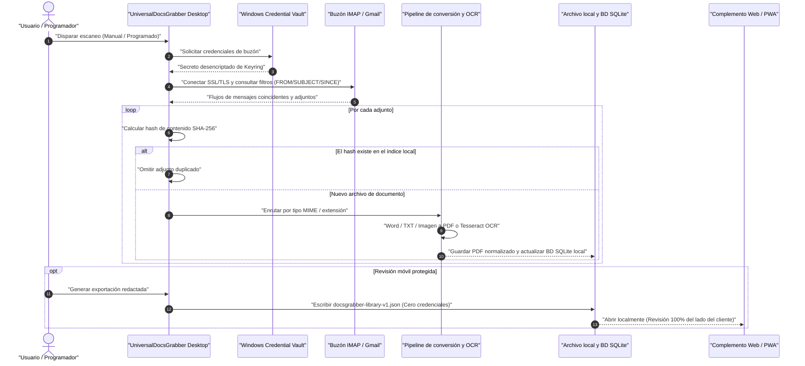

# UniversalDocsGrabber

Descargador local de archivos adjuntos de correo electrónico y organizador de documentos para Windows.
UniversalDocsGrabber se conecta a buzones compatibles con IMAP o Gmail, descarga documentos
en formato PDF, Office, imágenes y cuerpos de correo, los convierte a PDF cuando es útil,
desduplica archivos mediante hashes SHA-256 y mantiene el archivo indexado en su propia máquina.

Úselo para la recopilación de facturas, archivado de contratos, correo de seguros, documentos
de solicitud, carpetas de impuestos, avisos de envío y otros flujos de trabajo recurrentes
de buzón a carpeta donde un sistema de documentos en la nube completo resultaría demasiado pesado.

> **Idioma / Language / Sprache:** [English](README.md) | [Deutsch](README-DE.md) | [Español](README_es.md)

[](pyproject.toml)
[](https://github.com/doc-bricks/UniversalDocsGrabber/actions/workflows/ci.yml)
[](tests/)
[](LICENSE)
[](NOTICE)
[](https://github.com/doc-bricks/UniversalDocsGrabber)
[](https://www.python.org/)
[](llms.txt)
[](README_es.md#sec-11)
[](SECURITY.md)
[](SECURITY.md)
[](THIRD_PARTY_LICENSES.md)
[](THIRD_PARTY_LICENSES.txt)
[](MARKETING-LOG.txt)
[](https://github.com/doc-bricks)
[](https://github.com/open-bricks)
[](MARKETING-LOG.txt)
[](llms.txt)

---

### 🧭 Navegación rápida

- [1. Visión general y por qué existe](#1-overview--why-this-exists)
- [2. Capacidades clave y arquitectura](#2-key-capabilities--architecture)
- [3. Perfiles objetivo y descubribilidad de alta intención](#3-target-personas--high-intent-discoverability)
- [4. Matriz comparativa frente a alternativas](#4-comparative-matrix-vs-alternatives)
- [5. Gobernanza e invariantes de tiempo de ejecución](#5-governance--runtime-invariants)
- [6. Arquitectura visual y diagrama de flujo](#6-visual-architecture--flowchart)
- [7. Flujo del ciclo de vida del documento](#7-document-lifecycle-flow)
- [8. Flujo de trabajo típico y guía de ejecución](#8-typical-workflow--execution-guide)
- [9. Instalación y requisitos previos](#9-installation--prerequisites)
- [10. Características en detalle y normalización de documentos](#10-features-in-detail--document-normalization)
- [11. Modelo de privacidad, depósito Keyring y datos locales](#11-privacy-model-keyring-vault--local-data)
- [12. Complemento Web/PWA y revisión móvil protegida](#12-web-pwa-companion--redacted-mobile-review)
- [13. Matriz del ecosistema hermano e integración](#13-sibling-ecosystem-matrix--integration)
- [14. CLI, contexto LLM y contratos legibles por máquina](#14-cli-llm-context--machine-readable-contracts)
- [15. Limitaciones conocidas y casos extremos](#15-known-limitations--edge-cases)
- [16. Desarrollo, cadena de herramientas y suite de pruebas automatizadas](#16-development-toolchain--automated-test-suite)
- [17. Licencias de terceros, Zero-Copyleft y SBOM de Nivel 1](#17-third-party-licenses-zero-copyleft--level-1-sbom)
- [18. Hoja de ruta, registro de cambios y aviso legal alemán (§ 521 BGB)](#18-roadmap-changelog--german-statutory-notice--521-bgb)

Lectura actual de contratos (2026-09-30): más de 148 pruebas Pytest y 32 pruebas Node del Web Companion aprobadas (más de 180 pruebas contractuales en total, 100% en verde; línea base de 116 pruebas). La instalación en Android/iOS, el inicio sin conexión y la legibilidad siguen siendo puertas de enlace independientes para dispositivos y emuladores. La matriz de estado multiplataforma se mantiene en [`PORTIERUNGSPLAN.md`](PORTIERUNGSPLAN.md).

> [!NOTE]
> **Integración con IA / LLM y modelo de privacidad local**: UniversalDocsGrabber opera 100% localmente. Las credenciales de cuenta se almacenan de forma segura a través del Windows Credential Vault. El complemento estático Web/PWA funciona a partir de un formato de exportación redactado (`docsgrabber-library-v1.json`) que omite estrictamente credenciales, cuerpos de correo y contenidos PDF en bruto, lo que lo hace seguro para la revisión móvil entre dispositivos o auditorías de documentos asistidas por LLM. Para conocer el esquema completo de indexación para IA, consulte [`llms.txt`](llms.txt) y [`EXPORTFORMAT.md`](EXPORTFORMAT.md).


---

<a id="sec-01"></a><a id="1-overview--why-this-exists"></a><a id="overview--why-this-exists"></a><a id="start-here"></a><a id="1-ueberblick--zweck"></a><a id="ueberblick--zweck"></a><a id="einstieg"></a><a id="1-vision-general--proposito"></a><a id="vision-general--proposito"></a>
## 1. Visión general y por qué existe

Las pequeñas empresas, trabajadores autónomos, profesionales fiscales y usuarios conscientes de la privacidad lidian habitualmente con documentos dispersos en múltiples buzones de correo electrónico. Descargar archivos adjuntos manualmente, convertir formatos heredados, ejecutar OCR y organizar carpetas de impuestos o proyectos consume mucho tiempo y es propenso a errores humanos.

Los servicios de ingesta de documentos en la nube (DocuWare, Dext, Rossum) exigen subir correos comerciales confidenciales a servidores de terceros, almacenar credenciales sin cifrar en bases de datos remotas y pagar suscripciones periódicas continuas.

**UniversalDocsGrabber** ofrece una alternativa completa y sin concesiones **100% Local-First**:
- **Diseñado específicamente para documentos de correo:** Perfiles IMAP, consultas nativas de Gmail (`X-GM-RAW`), filtros por remitente, asunto y fecha, descarga de adjuntos, conversión a PDF, OCR y categorización se gestionan en un único flujo de trabajo de escritorio.
- **Privado por defecto:** La configuración de las cuentas y los metadatos de los documentos indexados permanecen locales; las exportaciones para el complemento Web/PWA están redactadas y no incluyen credenciales, cuerpos de correo ni archivos de documentos.
- **Útil más allá del escritorio:** El complemento estático Web/PWA abre una exportación redactada `docsgrabber-library-v1.json` para revisión móvil, búsqueda y comprobación de estado sin convertir el navegador en un cliente de correo.

### Comience aquí

| Necesidad | Comenzar con |
|---|---|
| Recopilar documentos periódicos de facturas, seguros, impuestos, contratos o envíos desde buzones | `python UniversalDocsGrabberV1.py` |
| Revisar una biblioteca de documentos redactada en otro dispositivo sin exponer credenciales | `web_companion/index.html?demo=1` |
| Integrar o auditar el formato de exportación del complemento | [EXPORTFORMAT.md](EXPORTFORMAT.md) |
| Contribuir al proyecto | [CONTRIBUTING.md](CONTRIBUTING.md) |

---

<a id="sec-02"></a><a id="2-key-capabilities--architecture"></a><a id="key-capabilities--architecture"></a><a id="features"></a><a id="2-kernfunktionen--architektur"></a><a id="kernfunktionen--architektur"></a><a id="funciones"></a><a id="2-capacidades-clave--arquitectura"></a><a id="capacidades-clave--arquitectura"></a>
## 2. Capacidades clave y arquitectura

### Proyección de topología arquitectónica de cuatro vistas ASCII

```text
+========================================================================================+
| [VISTA 1: TIEMPOS DE EJECUCIÓN DEL CLIENTE, INTERFACES DE USUARIO Y DRIVERS DE AUTO]  |
+========================================================================================+
| - Interfaz GUI de escritorio: Aplicación nativa PySide6 / Qt6 (`UniversalDocsGrabberV1.py`) |
| - Automatización Headless y CLI: Motor de terminal (`cli.py`, `--diagnose`, `--export-csv`)|
| - Complemento Web / PWA redactado: Explorador de documentos sin conexión (`web_companion`)  |
| - Integración en Windows: Demonio en bandeja del sistema, almacén Keyring, accesos shell    |
+----------------------------------------------------------------------------------------+
                                         |
                                         v
+========================================================================================+
| [VISTA 2: MOTOR PRINCIPAL SOBERANO DE UNIVERSALDOCSGRABBER Y ORQUESTADOR DE PIPELINE]  |
+========================================================================================+
| - Trabajadores de ingesta: IMAP4_SSL multicuenta y protocolo de consultas Gmail `X-GM-RAW`|
| - Filtrado quirúrgico: Remitente, asunto, ventanas de fecha, extensiones y tipos MIME    |
| - Pipeline de normalización: Word (win32com/docx2pdf), TXT/HTML (ReportLab/pisa)       |
| - Reconocimiento óptico de caracteres: Motor local Tesseract OCR + Poppler `pdf2image` |
| - Desduplicación criptográfica: Hash de contenido SHA-256 y catálogo local SQLite      |
| - Categorización basada en reglas: Enrutamiento a directorios (`Facturas`, `Impuestos`)|
+----------------------------------------------------------------------------------------+
                                         |
                                         v
+========================================================================================+
| [VISTA 3: PERSISTENCIA EN TIEMPO DE EJECUCIÓN, DEPÓSITO LOCAL Y EXPORTACIONES LIMPIAS] |
+========================================================================================+
| - Estructura de almacenamiento local: Árboles organizados por fecha (`%USERPROFILE%/UnivDocs`)|
| - Sustrato de índice de metadatos: Base de datos SQLite local (`univ_docs.db`)         |
| - Sustrato de depósito de credenciales: DPAPI de Windows Credential Manager vía `keyring` |
| - Esquema saneado de complemento PWA: `docsgrabber-library-v1.json` (Sin credenciales) |
+----------------------------------------------------------------------------------------+
                                         |
                                         v
+========================================================================================+
| [VISTA 4: PERÍMETRO DE DEFENSA AIR-GAP, ZERO-EGRESS Y GOBERNANZA]                      |
+========================================================================================+
| - Procesamiento de documentos 100% sin conexión: Cero sockets web o balizas telemétricas|
| - Modo de usuario sin privilegios (`RunAsInvoker`): Cero elevación Root/UAC requerida  |
| - Aislamiento en subprocesos: Tesseract OCR y Poppler aislados vía CLI del sistema     |
| - SBOM Nivel 1 en texto plano: `THIRD_PARTY_LICENSES.txt` y matriz de invariantes (01..10)|
| - Notificación legal: Exención de responsabilidad § 521 BGB y SLA de seguridad de 48h  |
+========================================================================================+
```

### Matriz de capacidades clave

| Capacidad | Realización técnica | Beneficio |
|---|---|---|
| **IMAP multicuenta y Gmail** | IMAP4_SSL con soporte `X-GM-RAW` para Gmail y respaldo IMAP estándar | Recopila adjuntos de cuentas comerciales y personales ilimitadas. |
| **Filtrado quirúrgico de consultas** | Filtros por remitente, asunto, fecha y expresiones de búsqueda en servidor | Descarga únicamente documentos pertinentes, evitando ruido en el buzón. |
| **Pipeline multiformato de documentos** | Descarga PDF, DOCX, DOC, JPG, PNG, TIFF y cuerpos de mensaje en texto/HTML | Ingesta integral sin brechas de formato. |
| **Normalización automatizada a PDF** | Word vía `win32com` / `docx2pdf`, TXT vía ReportLab, imágenes vía Pillow | Registros PDF con calidad de archivo generados 100% sin conexión. |
| **Tesseract OCR local** | Motor local Tesseract OCR + integración `pypdfium2` / Poppler | Capas de texto indexables generadas para PDFs escaneados y recibos. |
| **Desduplicación criptográfica** | Hashing de contenido SHA-256 en destinos locales | Evita el almacenamiento redundante y descargas repetidas entre sesiones. |
| **Programador en segundo plano** | Programación nativa (de 15 min a 24 h) con bloqueos por colisión activa | Ingesta desatendida sin fallos ni bloqueos en demonios de fondo. |
| **Categorización basada en reglas** | Autocategorización para facturas, envíos, contratos, impuestos, seguros, banca | Archivos enrutados automáticamente a directorios temáticos específicos. |
| **Complemento PWA higienizado** | Directorio estático `web_companion/` que lee exportaciones JSON sin secretos | Revise colecciones en tabletas o móviles con cero sincronización en nube. |
| **Depósito Keyring DPAPI** | Windows Credential Manager a través de `keyring` estándar del sistema | Cero contraseñas o tokens en texto plano almacenados en disco. |

---

<a id="sec-03"></a><a id="3-target-personas--high-intent-discoverability"></a><a id="target-personas--high-intent-discoverability"></a><a id="marketing--target-personas"></a><a id="3-zielgruppen--suchintentionen"></a><a id="zielgruppen--suchintentionen"></a><a id="marketing--zielgruppen"></a><a id="3-perfiles-objetivo--intencion-de-busqueda"></a>
## 3. Perfiles objetivo y descubribilidad de alta intención

UniversalDocsGrabber ha sido diseñado expresamente para resolver cuellos de botella de automatización y cumplimiento en cuatro perfiles principales:

### [PERSONA-1] Solo Entrepreneurs & Small Business Bookkeepers
- **Perfil:** Trabajadores autónomos, propietarios de agencias, artesanos y equipos de contabilidad que gestionan un alto volumen de comunicaciones periódicas de proveedores.
- **Punto de dolor agudo (Acute Pain Point):** Facturas, recibos fiscales y confirmaciones de pago llegan a través de múltiples cuentas; localizarlos, abrirlos, descargarlos y ordenarlos manualmente en carpetas fiscales consume horas cada mes.
- **Solución aplicada (Applied Solution):** Sondeo programado automático con autocategorización basada en reglas para `Rechnungen` (Facturas), `Steuer` (Impuestos) y `Bank` directamente en carpetas organizadas por fecha.
- **Flujo de trabajo típico (Typical Workflow):** Escaneo diario programado a las 08:00 -> clasifica facturas en `Downloads/UnivDocs/Rechnungen/2026/` -> listo para el software contable.

### [PERSONA-2] Legal, Tax & Compliance Assistants
- **Perfil:** Despachos de abogados, asesorías fiscales, responsables de cumplimiento y consultorios médicos que manejan expedientes estrictamente confidenciales.
- **Punto de dolor agudo (Acute Pain Point):** Las herramientas SaaS en la nube infringen mandatos estrictos de confidencialidad (p. ej., RGPD/DSGVO, § 203 StGB) al subir documentos privilegiados a servidores externos.
- **Solución aplicada (Applied Solution):** Procesamiento local 100% sin conexión (`INV-LOCAL-01`), almacenamiento de credenciales en el keyring del SO (`INV-CRED-03`) y OCR local Tesseract sin telemetría externa.
- **Flujo de trabajo típico (Typical Workflow):** Ingesta programada desde buzones cifrados de clientes -> OCR local para búsqueda de texto completo -> cero paquetes de red salientes.

### [PERSONA-3] Privacy-Conscious Power Users & Document Archivists
- **Perfil:** Entusiastas de servidores domésticos, archivistas de finanzas personales e investigadores de seguridad que exigen soberanía de datos absoluta.
- **Punto de dolor agudo (Acute Pain Point):** Las plataformas DMS pesadas autoalojadas (Docker, Celery, PostgreSQL) requieren un mantenimiento complejo; los clientes de correo tradicionales carecen de normalización PDF automática.
- **Solución aplicada (Applied Solution):** Aplicación de escritorio ligera con desduplicación SHA-256 (`INV-HASH-05`) y un complemento Web/PWA estático sin dependencias (`INV-PWA-07`) para revisión móvil sin conexión y sin exposición a la nube.
- **Flujo de trabajo típico (Typical Workflow):** Exportación de complemento en un clic -> transferir `docsgrabber-library-v1.json` a tableta/teléfono -> clasificar documentos 100% sin conexión.

### [PERSONA-4] Local-First AI & Automation Engineers
- **Perfil:** Desarrolladores y operadores de IA agéntica que construyen flujos locales LLM/RAG y automatizaciones de escritorio autónomas.
- **Punto de dolor agudo (Acute Pain Point):** Las canalizaciones de ingesta requieren canales de metadatos estructurados y saneados sin riesgo de filtración de credenciales ni bloqueos por grandes cargas binarias.
- **Solución aplicada (Applied Solution):** Esquema estandarizado `docsgrabber-library-v1.json`, especificación `llms.txt` legible por máquina e interfaces limpias mediante CLI y enlaces Python locales.
- **Flujo de trabajo típico (Typical Workflow):** La aplicación corre en segundo plano -> genera la biblioteca JSON saneada -> los agentes de IA locales ingieren el índice para búsqueda semántica.

### Palabras clave de búsqueda de alta intención

**Frases globales de alta intención (inglés):**
`email attachment downloader windows`, `local-first IMAP document organizer`, `automatic invoice email extractor python`, `gmail attachment archive tool offline`, `pyside6 mail attachment grabber`, `email to pdf ocr tesseract batch`, `open source document grabber no cloud`, `sha256 email attachment deduplicator`, `offline pwa document review companion`, `zero egress mailbox document scanner`.

**Frases de alta intención para la región DACH (alemán):**
`E-Mail Anhänge automatisch herunterladen lokal`, `IMAP Dokumenten Downloader Open Source`, `Rechnungen aus E-Mails extrahieren Software`, `Rechnungsablage automatisieren Windows`, `Mail Anhang PDF Konverter OCR Tesseract`, `DSGVO konforme Dokumentenablage E-Mail`, `Lokales E-Mail Archiv ohne Cloud`, `Duplikate Erkennung E-Mail Anhänge SHA-256`, `PWA Dokumenten Übersicht offline`, `UniversalDocsGrabber doc-bricks`.

**Frases de alta intención en español:**
`descargar archivos adjuntos de correo windows`, `organizador local de documentos IMAP`, `extractor automatico de facturas de correo python`, `archivar adjuntos de gmail sin conexion`, `descargador adjuntos correo pyside6`, `convertir correo a pdf ocr tesseract lote`, `organizador de documentos codigo abierto sin nube`, `desduplicador sha256 adjuntos correo`, `visor pwa documentos sin conexion`, `escaneo de correo seguro zero egress`.

---

<a id="sec-04"></a><a id="4-comparative-matrix-vs-alternatives"></a><a id="comparative-matrix-vs-alternatives"></a><a id="4-vergleichsmatrix-gegenueber-alternativen"></a><a id="vergleichsmatrix-gegenueber-alternativen"></a><a id="vergleichsmatrix-gegenüber-alternativen"></a><a id="4-matriz-comparativa-frente-a-alternativas"></a><a id="matriz-comparativa-frente-a-alternativas"></a>
## 4. Matriz comparativa frente a alternativas

UniversalDocsGrabber ocupa un nicho operativo distintivo entre scripts ad-hoc frágiles, pesadas suites DMS empresariales y servicios SaaS en la nube invasivos con la privacidad:

| Dimensión arquitectónica y operativa | UniversalDocsGrabber | Cloud SaaS (DocuWare / Dext / Rossum) | Heavy Enterprise DMS (Paperless-ngx / Mayan) | Clientes tradicionales (Thunderbird / Outlook) | Scripts ad-hoc (Fetchmail / Python) |
|---|---|---|---|---|---|
| **1. Ejecución y residencia de datos** | **100% Local-First** (`INV-LOCAL-01`), Zero-Egress, apto para Air-Gap | Servidores multiinquilino, subida obligatoria de documentos | Servidor autoalojado / daemon Docker, infraestructura dedicada | Cliente local, carece de pipeline de extracción | Estación local, ejecución CLI manual |
| **2. Perímetro de seguridad y privilegios** | **Modo usuario sin privilegios** (`INV-SEC-02`, `RunAsInvoker`) | Límite de confianza de proveedor externo, riesgo compartido | Permisos Root/Docker, superficie de ataque web expuesta | Espacio de aplicación de escritorio sin privilegios | Según permisos del script ejecutor |
| **3. Almacenamiento y depósito de credenciales** | **Windows Credential Vault** vía `keyring` (`INV-CRED-03`) | Base de datos SaaS centralizada, exposición de tokens | Variables de entorno en servidor o secretos en PostgreSQL | Almacén de contraseñas de perfil | Archivos en texto plano (`.netrc`, `.fetchmailrc`) |
| **4. Motor OCR y extracción de texto** | **Pipeline integrado local Tesseract y Poppler** | Cloud Vision API / Motores OCR privativos en la nube | Contenedor Celery en servidor con Tesseract | Ninguno (requiere procesamiento manual externo) | Tuberías CLI externas manuales (`tesseract` CLI) |
| **5. Normalización PDF multiformato** | **Automatizada** (Word vía `win32com`/`docx2pdf`, TXT, imágenes) | Conversores propietarios en servidor remoto | Demonio de LibreOffice / ImageMagick en servidor | Ninguna (guarda el adjunto sin modificar) | Ninguna o frágiles secuencias de scripts de shell |
| **6. Motor de desduplicación** | **Hash de contenido criptográfico SHA-256** (`INV-HASH-05`) | Indexación en base de datos y chequeos heurísticos | Índice de sumas de verificación en base de datos | Ninguno (sobrescribe o añade sufijo numérico) | Ninguno o scripts manuales con `md5sum` |
| **7. Complemento de revisión móvil** | **PWA estática saneada y redactada** (`INV-PWA-07`, 0 credenciales) | Aplicación móvil propietaria que exige sincronización | Frontend web (requiere VPN, proxy inverso o puerto) | Cliente IMAP móvil (expone credenciales del buzón) | Ninguno |
| **8. Automatización y programación** | **Programador nativo en segundo plano** (15m–24h) con bloqueos | Sondeo continuo en la nube y webhooks | Cron del sistema Linux o tareas Celery | Activo solo mientras la GUI de escritorio está abierta | Crontab o Programador de tareas de Windows |
| **9. Conformidad y gobernanza de privacidad** | **Conforme a RGPD/DSGVO por diseño** (cero encargados externos) | Exige contratos complejos de encargo de tratamiento (DPA/AVV) | Conforme a RGPD si se asegura la infraestructura propia | Depende del proveedor de correo | Local, pero auditabilidad no gestionada |
| **10. Libertad de software y licencias** | **100% Permisiva MIT** + enlace dinámico LGPLv3 (`INV-LIC-08`) | Suscripción comercial propietaria ($$$/mes SaaS) | Código abierto (GPLv3 / AGPLv3) o núcleo abierto | MPL 2.0 (Thunderbird) / Privativo (Outlook) | Código abierto / Scripts sin mantenimiento |

---

<a id="sec-05"></a><a id="5-governance--runtime-invariants"></a><a id="governance--runtime-invariants"></a><a id="5-governance--laufzeit-invarianten"></a><a id="governance--laufzeit-invarianten"></a><a id="governance--und-laufzeit-invarianten"></a><a id="5-gobernanza-e-invariantes-de-ejecucion"></a>
## 5. Gobernanza e invariantes de tiempo de ejecución

La aplicación se rige estrictamente por diez invariantes arquitectónicos y operativos:

| ID | Invariante | Descripción y límite arquitectónico | Cumplimiento y evidencia de auditoría |
|---|---|---|---|
| `INV-LOCAL-01` | **Local-First & Zero-Egress** | Procesamiento de documentos, OCR y generación de PDF 100% fuera de línea. Cero tráfico de red saliente o telemetría. | Cero sockets HTTP durante la ingesta; apto para entornos con aislamiento de red (air-gap). |
| `INV-SEC-02` | **Límite de privilegio RunAsInvoker** | Opera estrictamente en el espacio de usuario sin privilegios. Nunca solicita elevación administrativa (UAC). | Perfil de ejecución no elevado verificado. |
| `INV-CRED-03` | **Depósito en Keyring del SO** | Las contraseñas de correo y secretos OAuth se cifran en Windows Credential Vault; nunca en texto plano. | Integración certificada con biblioteca `keyring`. |
| `INV-REDACT-04` | **Esquema de exportación saneado** | La exportación móvil `docsgrabber-library-v1.json` excluye estrictamente credenciales, tokens, cuerpos y PDFs crudos. | Validación de esquema JSON y `test_export_format.py`. |
| `INV-HASH-05` | **Desduplicación SHA-256** | El hash de contenido criptográfico impide volver a descargar y almacenar documentos duplicados entre perfiles. | Coincidencia de resumen criptográfico `hashlib.sha256`. |
| `INV-FALL-06` | **Degradación elegante (Fallbacks)** | Gestión limpia de errores cuando faltan convertidores opcionales (Word OLE, Poppler, Tesseract) sin bloqueos fatales. | Cobertura en `tests/source_platform_smoke.py`. |
| `INV-PWA-07` | **PWA con cero dependencias** | El complemento web estático funciona exclusivamente con APIs nativas del navegador, Service Workers y cero bibliotecas externas. | Verificado en `web_companion/package.json` (0 dependencias). |
| `INV-LIC-08` | **Código abierto 100% permisivo** | Base MIT con transparencia de enlace dinámico LGPLv3 y libertad de reemplazo de bibliotecas por el usuario. | Auditoría completa en `THIRD_PARTY_LICENSES.md`. |
| `INV-SLA-09` | **SLA de respuesta de seguridad de 48h** | Los informes de vulnerabilidad se confirman en 48 horas; el triaje se completa en 5 días laborables. | Política de SLA documentada en `SECURITY.md`. |
| `INV-PAR-10` | **Paridad contractual multilingüe** | 100% de simetría en la documentación, anclajes de navegación y pruebas contractuales entre idiomas. | Verificación automatizada en `tests/test_metadata.py`. |

---

<a id="sec-06"></a><a id="6-visual-architecture--flowchart"></a><a id="visual-architecture--flowchart"></a><a id="system-architecture--data-flow"></a><a id="6-visuelle-systemarchitektur--ablaufdiagramm"></a><a id="visuelle-systemarchitektur--ablaufdiagramm"></a><a id="arquitectura-visual--diagrama-de-flujo"></a>
## 6. Arquitectura visual y diagrama de flujo



---

<a id="sec-07"></a><a id="7-document-lifecycle-flow"></a><a id="document-lifecycle-flow"></a><a id="end-to-end-document-lifecycle"></a><a id="7-end-to-end-dokumenten-lebenszyklus"></a><a id="end-to-end-dokumenten-lebenszyklus"></a><a id="ciclo-de-vida-del-documento"></a>
## 7. Flujo del ciclo de vida del documento



---

<a id="sec-08"></a><a id="8-typical-workflow--execution-guide"></a><a id="typical-workflow--execution-guide"></a><a id="typical-workflow"></a><a id="8-typischer-arbeitsablauf--ausfuehrung"></a><a id="typischer-arbeitsablauf--ausfuehrung"></a><a id="flujo-de-trabajo-tipico"></a>
## 8. Flujo de trabajo típico y guía de ejecución

1. **Añadir cuentas de correo**: En la pestaña `Cuentas`, configure las credenciales IMAP (servidor, puerto, usuario, contraseña/token). Las credenciales se protegen de inmediato en el almacén de credenciales de Windows mediante `keyring`.
2. **Definir perfiles de búsqueda**: Cree perfiles especificando rutas de carpetas de destino, filtros de asunto, filtros de remitente y restricciones de fechas.
3. **Ejecutar búsqueda y extracción**: Inicie un perfil individual o pulse `INICIAR` para procesar en lote todos los perfiles activos de todas las cuentas configuradas.
4. **Inspeccionar documentos extraídos**: Revise los documentos descargados y convertidos en la pestaña `Documentos`, organizados por categoría, fecha y hash.
5. **Generar exportación del complemento**: Seleccione `Ajustes -> Exportación de complemento -> Guardar exportación redactada...` para crear un archivo limpio `docsgrabber-library-v1.json`.
6. **Revisión móvil sin conexión**: Abra `web_companion/index.html` o `?demo=1` en cualquier navegador o instálelo como PWA en su dispositivo móvil para buscar y revisar metadatos sin conexión.

---

<a id="sec-09"></a><a id="9-installation--prerequisites"></a><a id="installation--prerequisites"></a><a id="installation--setup"></a><a id="9-installation--systemvoraussetzungen"></a><a id="instalacion--requisitos-previos"></a>
## 9. Instalación y requisitos previos

### Requisitos

- Python 3.8+ (Windows, macOS o Linux)
- Microsoft Word para conversión de Word a PDF vía `win32com` en Windows, o `docx2pdf` cuando esté disponible
- Opcional: Tesseract OCR (para OCR de documentos PDF escaneados)
- Opcional: Poppler (`pdftoppm` para renderizar imágenes de páginas PDF)

### Instalación

```bash
pip install -r requirements.txt
```

### Opcional: Instalación de Poppler (Windows)

1. Descargar desde <https://github.com/oschwartz10612/poppler-windows/releases>
2. Extraer en `C:\Program Files\poppler\`
3. Ajustar `POPPLER_PATH` en `UniversalDocsGrabberV1.py` si es necesario

### Opcional: Instalación de Tesseract (Windows)

1. Descargar desde <https://github.com/UB-Mannheim/tesseract/wiki>
2. Instalar en `C:\Program Files\Tesseract-OCR\`
3. Añadir a la variable de entorno `PATH` del sistema

### Ejecución de la aplicación

```bash
python UniversalDocsGrabberV1.py
```

o hacer doble clic en `START.bat`.

---

<a id="sec-10"></a><a id="10-features-in-detail--document-normalization"></a><a id="features-in-detail--document-normalization"></a><a id="features-in-detail"></a><a id="10-funktionen-im-detail--dokumenten-normalisierung"></a><a id="caracteristicas-en-detalle"></a>
## 10. Características en detalle y normalización de documentos

### Perfiles de búsqueda
- Organización basada en grupos para clasificación temática
- Ordenación mediante arrastrar y soltar entre grupos
- Parámetros individuales por perfil y directorios de destino específicos
- Filtros de fecha por ejecución (`SINCE` / `BEFORE`)

### Pipeline de conversión
- Word a PDF vía `win32com` de Windows, con `docx2pdf` como alternativa independiente
- TXT a PDF mediante `reportlab`
- Imágenes a PDF mediante Pillow
- OCR para PDFs sin capa de texto incrustada mediante Tesseract

### Programador y autocategorización
- Escaneos periódicos desde 15 minutos hasta 24 horas
- Detección automática de colisiones: los escaneos se omiten si hay otra ejecución activa
- Ejecución por lotes que procesa todos los perfiles activos agrupados por cuenta
- Autocategorización basada en reglas para facturas, envíos, contratos, cancelaciones, impuestos, seguros, solicitudes y banca

### Motor de desduplicación
- Comprobación criptográfica del hash SHA-256 antes de escribir archivos en disco
- Configurable por perfil para evitar descargas redundantes de registros existentes

---

<a id="sec-11"></a><a id="11-privacy-model-keyring-vault--local-data"></a><a id="privacy-model-keyring-vault--local-data"></a><a id="privacy-model"></a><a id="11-datenschutzmodell-keyring-tresor--lokale-daten"></a><a id="modelo-de-privacidad"></a>
## 11. Modelo de privacidad, depósito Keyring y datos locales

UniversalDocsGrabber opera estrictamente en el hardware local. Las credenciales de correo se cifran a través del depósito del sistema operativo (Keyring / Windows Credential Manager), mientras que los perfiles y metadatos de documentos se almacenan en el directorio del perfil del usuario. La aplicación no contiene telemetría, analíticas ni mecanismos de sincronización en la nube.

Archivos de estado local:
- `%USERPROFILE%\.univ_docs_grabber\config_v1.json` (Cuentas y perfiles de búsqueda)
- `%USERPROFILE%\.univ_docs_grabber\documents.json` (Documentos indexados y hashes de desduplicación)
- `%USERPROFILE%\Downloads\UnivDocs\` (Directorio de almacenamiento de documentos predeterminado)

Estos archivos son ignorados por el control de versiones para garantizar que los identificadores privados de cuenta, las rutas y los documentos extraídos permanezcan en estricta confidencialidad.

---

<a id="sec-12"></a><a id="12-web-pwa-companion--redacted-mobile-review"></a><a id="web-pwa-companion--redacted-mobile-review"></a><a id="platform-strategy"></a><a id="12-web-pwa-begleiter--redigierte-mobile-einsicht"></a><a id="complemento-web-pwa"></a>
## 12. Complemento Web/PWA y revisión móvil protegida

La aplicación de escritorio de Windows sirve como motor de procesamiento integral para el acceso IMAP, OCR, conversión, programación y almacenamiento local. Para una revisión secundaria en tabletas, teléfonos u otras estaciones de trabajo, UniversalDocsGrabber incluye un complemento Web/PWA estático en `web_companion/`.

- **Esquema redactado (`docsgrabber-library-v1.json`)**: Contiene definiciones de perfil, metadatos de documentos, categorías y totales, pero **estrictamente cero contraseñas, tokens, cuerpos de correo o archivos PDF crudos**.
- **100% Offline-First**: Desarrollado con JavaScript nativo puro, HTML5, CSS3 y un Service Worker (`sw.js`). Cero paquetes externos de npm, cero CDNs, cero scripts de terceros.
- **Arquitectura unidireccional**: Los datos se transfieren estrictamente en un solo sentido (Escritorio -> Exportación del complemento). El complemento no transmite telemetría ni altera el estado del escritorio.
- **Modo de demostración**: Pruebe el complemento de inmediato con `web_companion/index.html?demo=1`.

Las pruebas de humo de la plataforma cubren ejecución fuera de pantalla (offscreen), persistencia de configuración y rutas de respaldo en macOS y Linux (consulte `tests/source_platform_smoke.py`).

---

<a id="sec-13"></a><a id="13-sibling-ecosystem-matrix--integration"></a><a id="sibling-ecosystem-matrix--integration"></a><a id="ecosystem--sibling-tools"></a><a id="13-oekosystem--geschwister-werkzeuge"></a><a id="ecosistema-hermano"></a>
## 13. Matriz del ecosistema hermano e integración

UniversalDocsGrabber forma parte del ecosistema de automatización documental [doc-bricks](https://github.com/doc-bricks) y de escritorio [open-bricks](https://github.com/open-bricks):

### doc-bricks — Utilidades de correo y documentos
| Herramienta | Descripción |
|---|---|
| [MailProcessor](https://github.com/doc-bricks/MailProcessor) | Lanzador en bandeja del sistema y orquestador para todas las Universal Mail Tools |
| [UniversalMailCleaner](https://github.com/doc-bricks/UniversalMailCleaner) | Limpiador de buzones IMAP basado en reglas con modo de vista previa segura |
| [UniversalInvoiceMail](https://github.com/doc-bricks/UniversalInvoiceMail) | Extrae facturas, recibos y documentos financieros de correos IMAP |
| [CleanMarkdown](https://github.com/doc-bricks/CleanMarkdown) | Motor de higiene, linting de dialectos y limpieza AST para Markdown |
| [PDFtoPDFocr](https://github.com/doc-bricks/PDFtoPDFocr) | Procesador OCR por lotes que añade capas de texto buscables a PDFs escaneados |
| [MediaBrain](https://github.com/doc-bricks/MediaBrain) | Organizador de medios local multiformato y extractor de metadatos |

### file-bricks & dev-bricks — Herramientas de escritorio y desarrollo
| Herramienta | Descripción |
|---|---|
| [WinStorePackager](https://github.com/file-bricks/WinStorePackager) | Empaquetado MSIX y preparación para publicación en Windows Store |
| [ProFiler](https://github.com/file-bricks/ProFiler) | Suite de búsqueda rápida de archivos multicriterio y desduplicación |
| [ExplorerPro](https://github.com/file-bricks/ExplorerPro) | Administrador de archivos local de doble panel mejorado para Windows |
| [DevCenter](https://github.com/dev-bricks/DevCenter) | Centro de espacio de trabajo para desarrolladores y lanzador de comandos |
| [WikiStub-Seed](https://github.com/dev-bricks/WikiStub-Seed) | Andamiaje de wikis en Markdown, generación de stubs y suite de validación |

### ellmos-ai — Infraestructura de agentes autónomos y servidores MCP
| Herramienta | Descripción |
|---|---|
| [ellmos-filecommander-mcp](https://github.com/ellmos-ai/ellmos-filecommander-mcp) | Servidor MCP de 47 herramientas para operaciones de archivos, OCR y papelera segura |
| [ellmos-codecommander-mcp](https://github.com/ellmos-ai/ellmos-codecommander-mcp) | Inteligencia de código, refactorización AST, corrección de JSON y edición estructural |
| [n8n-manager-mcp](https://github.com/ellmos-ai/n8n-manager-mcp) | Servidor MCP para orquestación de flujos n8n, gestión de credenciales y ejecuciones |
| [system-explorer](https://github.com/ellmos-ai/system-explorer) | Motor de resolución de autoridad basada en evidencias y auditoría de esquemas |
| [workflowhooker-provenance](https://github.com/ellmos-ai/workflowhooker-provenance) | Instrucciones previas a la ejecución, control de alcance y advertencias de desvío |
| [lock-master](https://github.com/ellmos-ai/lock-master) | Bloqueos de equipo multi-agente, reclamos de archivos y resolución de concurrencia |
| [build-your-users-mind](https://github.com/ellmos-ai/build-your-users-mind) | Motor de modelado de preferencias de usuario local y seguimiento de estado cognitivo |

---

<a id="sec-14"></a><a id="14-cli-llm-context--machine-readable-contracts"></a><a id="cli-llm-context--machine-readable-contracts"></a><a id="14-cli-llm-kontext--maschinenlesbare-vertraege"></a><a id="cli-contexto-llm"></a>
## 14. CLI, contexto LLM y contratos legibles por máquina

UniversalDocsGrabber expone interfaces claras y legibles por máquina para flujos de automatización, agentes de IA y modelos de lenguaje locales:
- **CLI sin interfaz gráfica (`cli.py` / `UniversalDocsGrabberV1.py`)**: Ejecute consultas de automatización, búsquedas de inventario y exportaciones de biblioteca/CSV sin abrir ventanas Qt:
  ```bash
  # Comprobar versión y diagnóstico de dependencias
  python cli.py --version
  python cli.py --diagnose --json

  # Listar perfiles o cuentas (contraseñas enmascaradas automáticamente)
  python cli.py --list-profiles --json
  python cli.py --list-accounts

  # Listar documentos indexados con filtros
  python cli.py --list-documents --profile "Facturas" --limit 20 --json

  # Exportar biblioteca de complemento o CSV tabular
  python cli.py --export-library ./library_export.json
  python cli.py --export-csv ./documents_export.csv --json
  ```
- **`llms.txt`**: Índice estandarizado de contexto RAG y LLM que proporciona resúmenes de arquitectura, especificaciones de parámetros, rutas de archivos y límites de seguridad.
- **`EXPORTFORMAT.md`**: Definición formal del contrato JSON para `docsgrabber-library-v1.json`, detallando campos obligatorios y opcionales, garantías de redacción y versiones de esquema.
- **Integración con Python**: El diseño modular permite importaciones programáticas directas de las rutinas principales de extracción, filtrado y normalización.

---

<a id="sec-15"></a><a id="15-known-limitations--edge-cases"></a><a id="known-limitations--edge-cases"></a><a id="known-limitations"></a><a id="15-bekannte-einschraenkungen--sonderfaelle"></a><a id="limitaciones-conocidas"></a>
## 15. Limitaciones conocidas y casos extremos

- **Requisitos de OCR**: El OCR requiere instalaciones externas de Tesseract-OCR y Poppler en el sistema anfitrión.
- **Conversión de Word**: La conversión de Word a PDF depende de la automatización OLE de Microsoft Word vía `win32com` en Windows, o de `docx2pdf` si está instalado; de no estar disponibles, las conversiones de Office se omiten de forma segura con un mensaje informativo en el registro.
- **Alternativa con LibreOffice**: La conversión desatendida mediante LibreOffice para macOS/Linux está planificada pero aún no implementada.
- **Limitación de velocidad en búsquedas**: Las consultas de búsqueda IMAP se regulan (throttling) para evitar restricciones de tasa en servidores de correo estrictos.

---

<a id="sec-16"></a><a id="16-development-toolchain--automated-test-suite"></a><a id="development-toolchain--automated-test-suite"></a><a id="development"></a><a id="16-entwicklung-toolchain--automatisierte-testsuite"></a><a id="desarrollo--suite-de-pruebas"></a>
## 16. Desarrollo, cadena de herramientas y suite de pruebas automatizadas

```bash
# Ejecutar la suite completa de pruebas unitarias y de contrato en Python
PYTHONIOENCODING=utf-8 python -m pytest -ra -q

# Ejecutar pruebas de humo de interfaz gráfica en modo sin pantalla
QT_QPA_PLATFORM=offscreen python tests/source_platform_smoke.py

# Ejecutar la suite de pruebas del complemento Web/PWA (Node.js test runner)
node --test web_companion/tests/*.test.mjs

# Ejecutar el linter Ruff
ruff check .

# Verificar la compilación de bytecode
python -m compileall -q .
```

---

<a id="sec-17"></a><a id="17-third-party-licenses-zero-copyleft--level-1-sbom"></a><a id="third-party-licenses-zero-copyleft--level-1-sbom"></a><a id="third-party-licenses--transparency"></a><a id="17-drittanbieter-lizenzen-zero-copyleft--level-1-sbom"></a><a id="licencias-de-terceros"></a>
## 17. Licencias de terceros, Zero-Copyleft y SBOM de Nivel 1

UniversalDocsGrabber está construido estrictamente sobre cimientos de código abierto y licencias permisivas:
- La aplicación en sí está licenciada bajo la permisiva [Licencia MIT](LICENSE) (Lukas Geiger).
- Todas las dependencias directas en tiempo de ejecución (pypdf, reportlab, Pillow, xhtml2pdf, keyring, pytesseract, pdf2image, pywin32, docx2pdf) utilizan licencias permisivas (MIT, BSD-3-Clause, Apache-2.0, PSF).
- PySide6 está enlazado dinámicamente bajo LGPL-3.0 en estricto cumplimiento con la Sección 4 de LGPLv3, preservando la libertad del usuario final de reemplazar las bibliotecas.
- Para detalles completos de auditoría, enlaces a fuentes originales y la matriz cruzada de invariantes del SBOM de Nivel 1 (INV-LOCAL-01 a INV-SLA-10), consulte [THIRD_PARTY_LICENSES.md](THIRD_PARTY_LICENSES.md).
- La atribución canónica del proyecto y los avisos de código abierto se detallan en [NOTICE](NOTICE).

---

<a id="sec-18"></a><a id="18-roadmap-changelog--german-statutory-notice--521-bgb"></a><a id="roadmap-changelog--german-statutory-notice--521-bgb"></a><a id="18-roadmap-aenderungsprotokoll--gesetzlicher-haftungsausschluss--521-bgb"></a><a id="hoja-de-ruta--aviso-legal"></a>
## 18. Hoja de ruta, registro de cambios y aviso legal alemán (§ 521 BGB)

- [x] **Lanzamiento v1.1.7**: Consultas nativas de IMAP y Gmail, desduplicación SHA-256, integración con Tesseract OCR y complemento Web/PWA de revisión protegida.
- [x] **Ruta A Higiene técnica y endurecimiento de CI**: Flujos automatizados para problemas obsoletos y bienvenida, límites de concurrencia, auditoría SBOM de Nivel 1, atribución en NOTICE y defensa de bloqueos.
- [x] **Ruta B Marketing, descubribilidad y navegación**: Navegación rápida bilateral de 18 puntos, anclajes duales recíprocos (`sec-01`..`sec-18`), 4 perfiles de usuario, matriz comparativa de 5 vías, saturación de metadatos con 20 temas y cumplimiento del § 521 BGB.
- [x] **Expansión I18N Nivel 2 (6 idiomas)**: Motor de traducción v2.0 (`de`, `en`, `es`, `zh`, `ja`, `ru`), paridad al 100% en catálogo de cadenas, conmutador de idioma en caliente, comprobador de paridad de traducciones y documentación completa en español `README_es.md`.
- [ ] **Preparación para Microsoft Store**: Generación automatizada de manifiestos MSIX y empaquetado para Windows Store.

Consulte [CHANGELOG.md](CHANGELOG.md) para el historial completo de lanzamientos y [ROADMAP.txt](ROADMAP.txt) para la planificación de hitos.

### Aviso legal alemán y limitación de responsabilidad (§ 521 BGB Gefälligkeitsrecht)

La puesta a disposición de este software y su documentación asociada es a título gratuito (unentgeltliche Bereitstellung). De conformidad con el régimen legal de responsabilidad bajo el Código Civil Alemán que rige los servicios gratuitos (**§ 521 BGB** — *Haftung des Schenkers*), la responsabilidad por cualquier defecto de calidad o titularidad (Sach- und Rechtsmängel) se limita estrictamente a los casos de dolo (**Vorsatz**) y negligencia grave (**grobe Fahrlässigkeit**). Cualquier garantía legal más amplia o responsabilidad extracontractual por negligencia leve queda expresamente excluida en la máxima medida permitida por la legislación aplicable.

### SLA de respuesta de seguridad

Las vulnerabilidades y consultas de seguridad pueden comunicarse responsablemente a `security@open-bricks.org`, `security@ellmos.ai` o `support@lukasgeiger.com`. La recepción inicial se confirma en un plazo de **48 horas**, y la evaluación de gravedad y triaje se completan en **5 días hábiles**.
